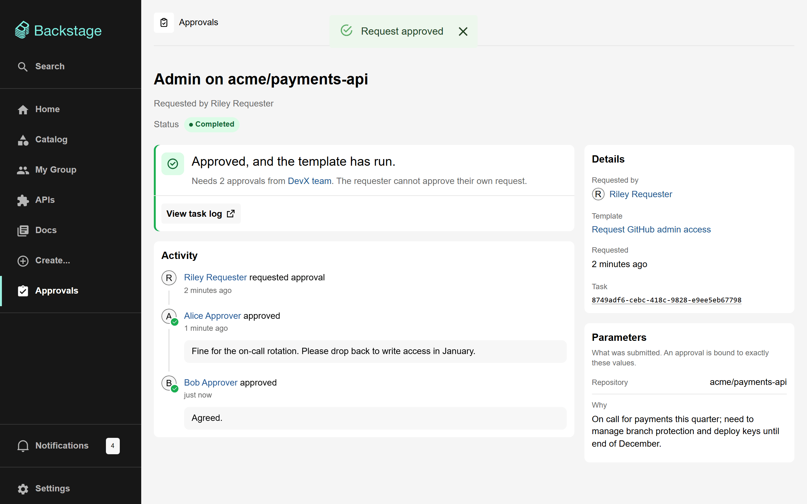
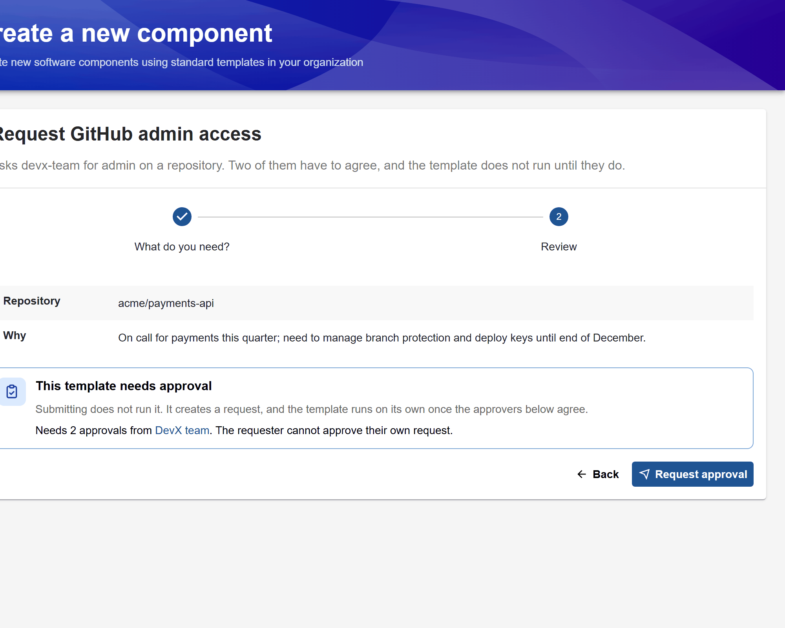
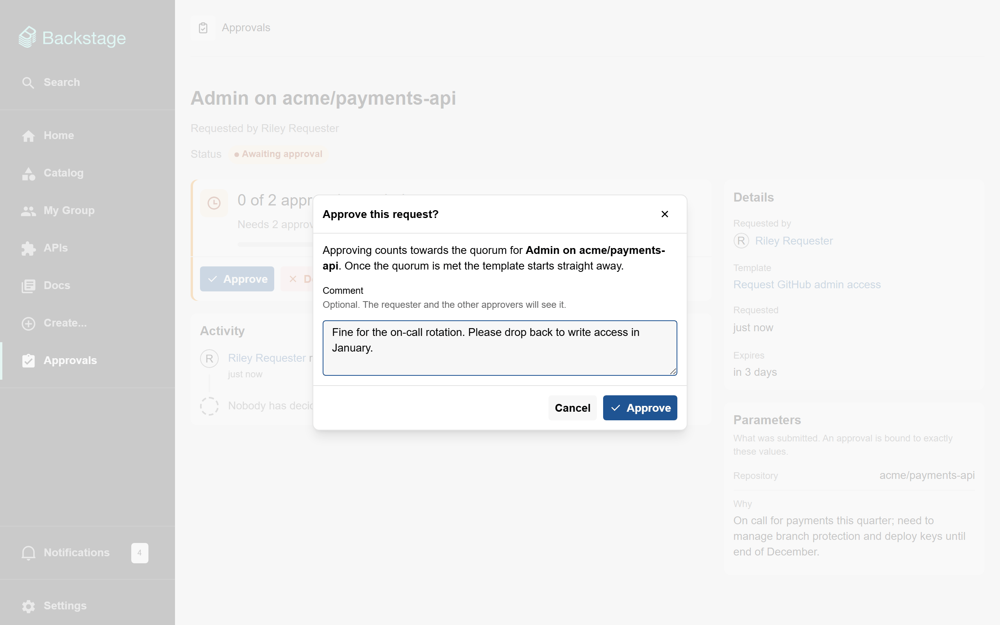
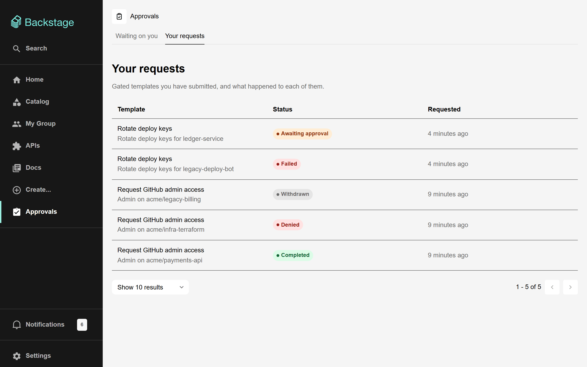
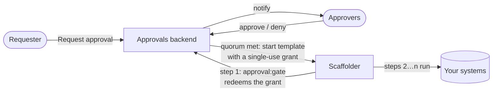

# Scaffolder Approvals for Backstage

Approval gates for [Backstage](https://backstage.io) software templates.

A gated template does not run when someone submits it. It creates an **approval request**, the people named in the template approve or deny it, and the template runs on its own once enough of them agree. If anyone denies it, it never runs.



## Features

- **One step to gate a template.** Add `approval:gate` as the first step and say who approves, how many must agree, and how long the request may wait.
- **A gate that holds.** The gate is a step in the template, so calling the scaffolder API directly does not skip it.
- **Approvals bound to what was asked.** An approval unlocks one run, of one template, with exactly the approved values.
- **An approvals inbox**, a list of your own requests, and a page per request showing who asked, who agreed and what happened.
- **Built into the scaffolder.** Gated templates name their approvers on the Create page, and the wizard ends in **Request approval** instead of **Create**.
- **A home-page card** counting the requests waiting on you.
- **Notifications, live updates and events** through Backstage's notifications, signals and events plugins.
- **An audit trail** of every request and decision, and **permissions** for narrowing who may do what.

| Ask                                                           | Decide                                                                |
| ------------------------------------------------------------- | --------------------------------------------------------------------- |
|  |           |
| **Follow**                                                    | **Know what changed**                                                 |
|                |  |

## How it works



1. A template author adds an `approval:gate` step at the top of a template.
2. A requester fills the template in as usual and presses **Request approval**.
3. Approvers are notified, and approve or deny. One denial rejects the request.
4. When enough approve, the template starts by itself with a single-use grant.
5. Its first step redeems the grant, which only works for that request, that template and those exact values, and the rest of the template runs.

Started any other way, the template has no grant: its first step fails and nothing after it runs. The [documentation](docs/README.md#how-it-works) has the full picture.

## Packages

| Package                                                                                                        | Install in         | What it does                                                        |
| -------------------------------------------------------------------------------------------------------------- | ------------------ | ------------------------------------------------------------------- |
| [`@ferin79/backstage-plugin-scaffolder-approvals`](plugins/scaffolder-approvals)                               | `packages/app`     | Approvals page, home-page card, gated review step and template card |
| [`@ferin79/backstage-plugin-scaffolder-approvals-backend`](plugins/scaffolder-approvals-backend)               | `packages/backend` | Requests, decisions and grants; starts approved templates; REST API |
| [`@ferin79/backstage-plugin-scaffolder-backend-module-approvals`](plugins/scaffolder-backend-module-approvals) | `packages/backend` | The `approval:gate` scaffolder action                               |
| [`@ferin79/backstage-plugin-catalog-backend-module-approvals`](plugins/catalog-backend-module-approvals)       | `packages/backend` | Marks gated templates in the catalog, and warns about broken gates  |
| [`@ferin79/backstage-plugin-scaffolder-approvals-common`](plugins/scaffolder-approvals-common)                 | (dependency)       | Shared types, permissions and helpers                               |
| [`@ferin79/backstage-plugin-scaffolder-approvals-node`](plugins/scaffolder-approvals-node)                     | (dependency)       | Backend helpers and permission rules                                |

Built and tested on Backstage 1.55 with the new backend system. Everything works on the legacy frontend system; on the new frontend system, the approvals page and home widget work but the gated review step and template card do not ([why](docs/getting-started.md#new-frontend-system)).

## Quick start

The [getting started guide](docs/getting-started.md) has every step with explanations. In short:

**1. Backend**

```sh
yarn --cwd packages/backend add \
  @ferin79/backstage-plugin-scaffolder-approvals-backend \
  @ferin79/backstage-plugin-scaffolder-backend-module-approvals \
  @ferin79/backstage-plugin-catalog-backend-module-approvals
```

```ts
// packages/backend/src/index.ts
backend.add(import('@ferin79/backstage-plugin-scaffolder-approvals-backend'));
backend.add(
  import('@ferin79/backstage-plugin-scaffolder-backend-module-approvals'),
);
backend.add(
  import('@ferin79/backstage-plugin-catalog-backend-module-approvals'),
);
// Needed for Template entities, if you do not have it already:
backend.add(
  import('@backstage/plugin-catalog-backend-module-scaffolder-entity-model'),
);
```

**2. Frontend** (legacy frontend system)

```sh
yarn --cwd packages/app add @ferin79/backstage-plugin-scaffolder-approvals
```

```tsx
// packages/app/src/App.tsx
import {
  ApprovalsIndexPage,
  GatedTemplateCard,
} from '@ferin79/backstage-plugin-scaffolder-approvals';
import { ReviewStep } from './components/scaffolder/ReviewStep'; // see the guide

const routes = (
  <FlatRoutes>
    {/* ...your other routes */}
    <Route
      path="/create"
      element={
        <ScaffolderPage
          components={{
            ReviewStepComponent: ReviewStep,
            TemplateCardComponent: GatedTemplateCard,
          }}
        />
      }
    />
    <Route path="/scaffolder-approvals" element={<ApprovalsIndexPage />} />
  </FlatRoutes>
);
```

Then add a sidebar item for `/scaffolder-approvals` and, optionally, `<PendingApprovalsHomePageCard />` on the home page.

**3. Gate a template**

```yaml
steps:
  - id: gate
    name: Await approval
    action: approval:gate
    input:
      approvers: [group:default/devx-team]
      quorum: 2
      timeout: { hours: 72 }
      summary: 'Admin on ${{ parameters.repository }}'
      values: ${{ parameters }} # required, exactly like this
  # ...your real steps
```

## Documentation

| Guide                                                                 | For                                                   |
| --------------------------------------------------------------------- | ----------------------------------------------------- |
| [Overview](docs/README.md)                                            | What it is, how it works, request lifecycle, packages |
| [Getting started](docs/getting-started.md)                            | Installing and checking it works                      |
| [Configuration](docs/configuration.md)                                | Grant lifetime, retention, split deployments, jobs    |
| [Writing gated templates](docs/writing-gated-templates.md)            | Template authors: gate options, rules, patterns       |
| [User guide](docs/user-guide.md)                                      | Requesters and approvers                              |
| [Security model and permissions](docs/security-model.md)              | What the gate protects, permission policies           |
| [Notifications, events and signals](docs/notifications-and-events.md) | Notifications, and integrating with other tools       |
| [API reference](docs/api-reference.md)                                | The REST API                                          |
| [Troubleshooting](docs/troubleshooting.md)                            | Symptoms, causes and fixes, and an FAQ                |

## Try it locally

This repository is a complete Backstage app with the plugins installed, two example gated templates and four example users. [Contributing](CONTRIBUTING.md#run-the-app) explains how to run it and walk through an approval as different people.

```sh
yarn install
yarn start
```

## Contributing

Issues and pull requests are welcome. See [CONTRIBUTING.md](CONTRIBUTING.md) for running the app, testing, and releasing.

## License

[Apache 2.0](LICENSE)
