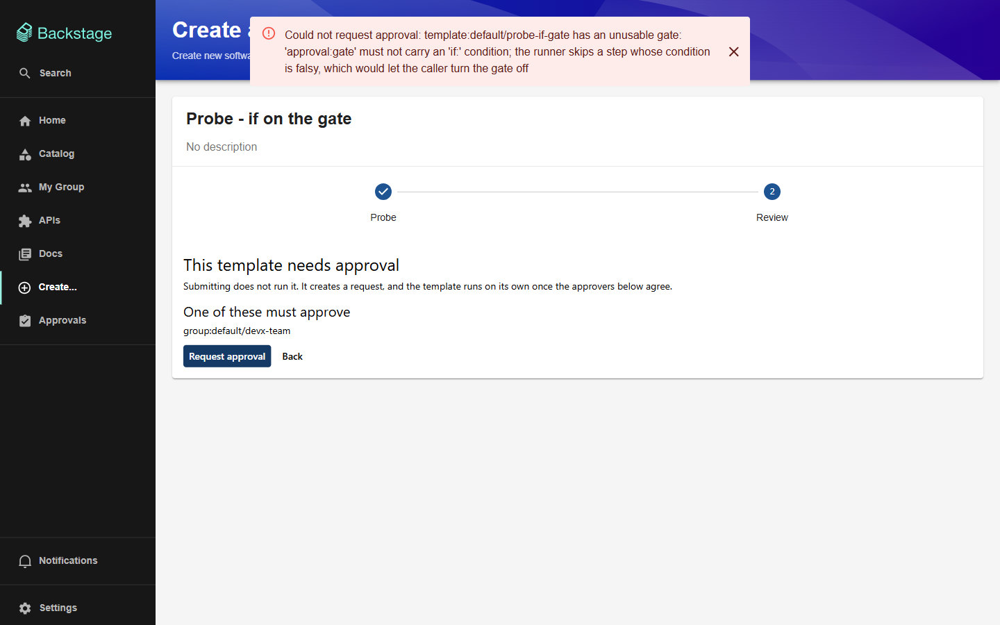
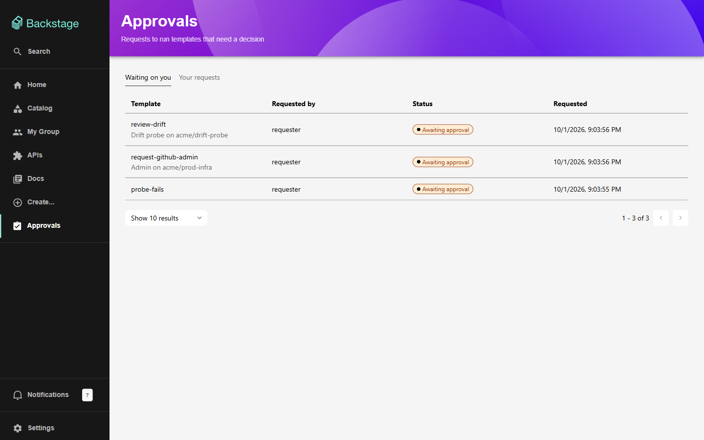
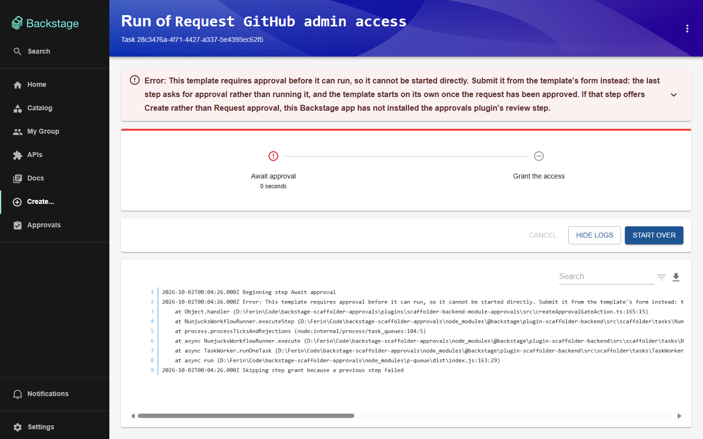
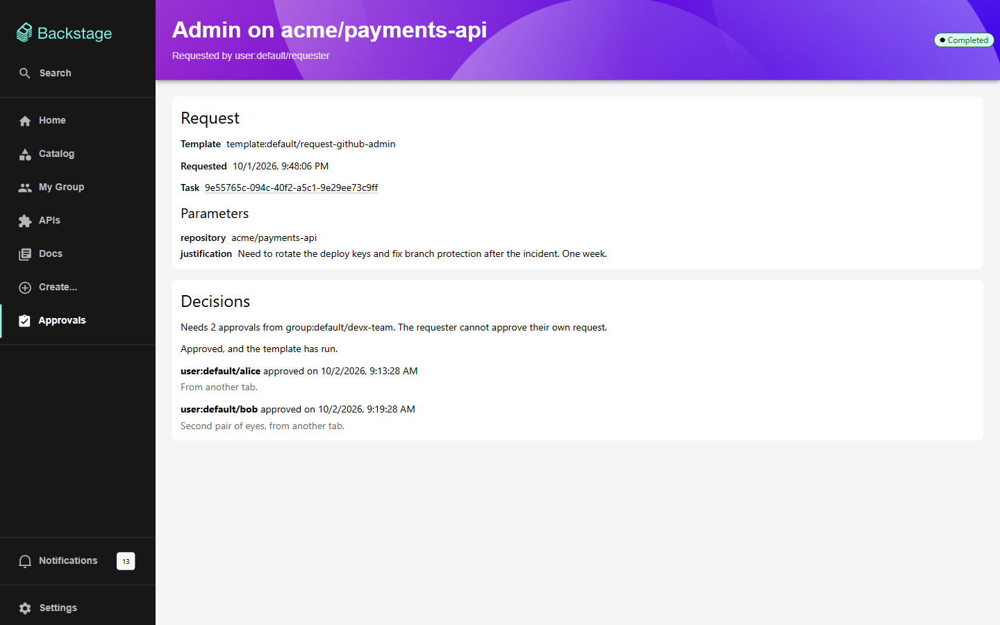
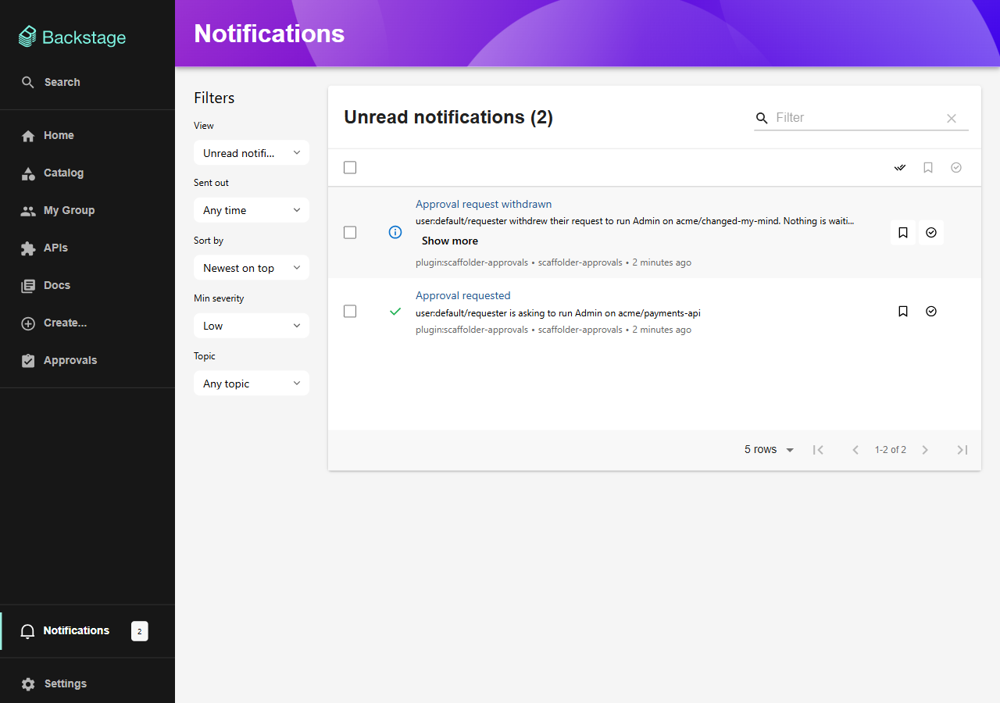
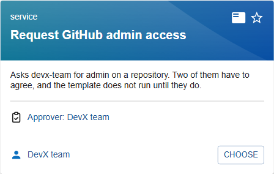

# Scaffolder Approvals — Browser Review

Until now, nobody had looked at these plugins in a browser. Phase 8 and Phase 9 of the [implementation guide](GATED_SCAFFOLDER_IMPLEMENTATION.md) and the evidence base of the [code review](GATED_SCAFFOLDER_REVIEW.md#2-evidence-base) all record "rendering in a real browser" as not verified. This review closes that gap. It drives every user-facing feature in the running app, as four different people, and keeps a screenshot of each.

|                 |                                                                                                                                                                                                                                                                                                                                                                                                  |
| --------------- | ------------------------------------------------------------------------------------------------------------------------------------------------------------------------------------------------------------------------------------------------------------------------------------------------------------------------------------------------------------------------------------------------ |
| **Reviewed**    | 1 Oct 2026, at `bc64c07` on `main`                                                                                                                                                                                                                                                                                                                                                               |
| **App**         | Backstage 1.55, legacy frontend system, SQLite. Frontend on :3000, backend on :7007                                                                                                                                                                                                                                                                                                              |
| **Browser**     | Chromium, driven through the Playwright MCP server, at 1440×900; 390×844 for the mobile checks                                                                                                                                                                                                                                                                                                   |
| **People**      | `requester`, `alice` and `bob` (all in `devx-team`), and `outsider` (in no group). Switched with `APP_CONFIG_auth_providers_guest_userEntityRef`, as the [repository README](../README.md#trying-an-approval-end-to-end) describes                                                                                                                                                               |
| **Data**        | A fresh database outside the repository, so `packages/backend/.local-db/` was not touched. Templates: the example, the four probes in `examples/scaffolder-approvals/probes.local.yaml`, and one review-only probe for template drift ([§3](#3-how-it-was-tested))                                                                                                                               |
| **Also run**    | `yarn tsc`, `yarn test` across the repository, `scripts/verify-gate.sh`, and the plugin's own dev harness                                                                                                                                                                                                                                                                                        |
| **Screenshots** | 50, in [`browser-review/`](browser-review/); 51 from the B1–B3 re-test, in [`browser-review/retest/`](browser-review/retest/); 21 from the B4–B10 re-test, in [`browser-review/b4-b10/`](browser-review/b4-b10/); 14 from the B11–B15 re-test, in [`browser-review/b11-b15/`](browser-review/b11-b15/); and 17 from the B16–B20 re-test, in [`browser-review/b16-b20/`](browser-review/b16-b20/) |
| **Fixed since** | B1–B3 ([§10](#10-fixes-and-re-test)), then B4–B10, which also settled B12 ([§11](#11-fixes-and-re-test-b4b10)), then B11 and B13–B15 ([§12](#12-fixes-and-re-test-b11b15)), then B16–B20 ([§13](#13-fixes-and-re-test-b16b20))                                                                                                                                                                   |

> **Update, 2 Oct 2026.** All of B1–B20 are now fixed: [B1](#b1)–[B3](#b3) first ([§10](#10-fixes-and-re-test)), then [B4](#b4)–[B10](#b10) ([§11](#11-fixes-and-re-test-b4b10)), which also settled [B12](#b12), then [B11](#b11) and [B13](#b13)–[B15](#b15) ([§12](#12-fixes-and-re-test-b11b15)), then [B16](#b16)–[B20](#b20) ([§13](#13-fixes-and-re-test-b16b20)). Each fix has tests that fail without it, and each was verified in the browser. B21–B23 are still open.

## Contents

1. [Verdict](#1-verdict)
2. [Does Backstage start?](#2-does-backstage-start)
3. [How it was tested](#3-how-it-was-tested)
4. [Fix now](#4-fix-now): B1–B3
5. [What works](#5-what-works), feature by feature
6. [Fix soon](#6-fix-soon): B4–B14
7. [Polish](#7-polish): B15–B23
8. [Automated checks](#8-automated-checks)
9. [Not covered](#9-not-covered)
10. [Fixes and re-test](#10-fixes-and-re-test): B1–B3 fixed, every journey walked again
11. [Fixes and re-test: B4–B10](#11-fixes-and-re-test-b4b10)
12. [Fixes and re-test: B11–B15](#12-fixes-and-re-test-b11b15)
13. [Fixes and re-test: B16–B20](#13-fixes-and-re-test-b16b20)
14. [Appendix: console noise that is not the plugin's](#appendix-console-noise-that-is-not-the-plugins)

---

## 1. Verdict

**The plugins work, and the gate holds.** Every flow the README describes ran end to end in the browser:

- a requester submits a gated template from the scaffolder's own wizard;
- two approvers each decide through a confirmation dialog;
- the template launches on its own the moment the quorum is met, and the request follows its task to `completed`;
- the task log names the real requester and approvers.

Denial, withdrawal, expiry, a failed run and Resubmit, duplicate collapse, the drift warning, notifications, the home card and the nav item also all work. So does the derived catalog annotation. Calling the scaffolder directly with a gated template fails at the gate, and every later step is skipped.

Three things needed fixing before anyone relied on it. All three are now fixed and re-tested ([§10](#10-fixes-and-re-test)):

| #         | Finding                                                                                          | Why it could not wait                                                                                                                         | Status                                     |
| --------- | ------------------------------------------------------------------------------------------------ | --------------------------------------------------------------------------------------------------------------------------------------------- | ------------------------------------------ |
| [B1](#b1) | Every refusal the backend explains reaches the user as **"Request failed with 400 Bad Request"** | The backend writes refusals for people to read, and the UI throws them away. A requester whose template is refused has no way to find out why | ✅ [Fixed](#101-b1--readable-errors)       |
| [B2](#b2) | **"Waiting on you" and the home card count requests the viewer cannot act on**                   | The card is the only reminder an approver gets, so an inflated count teaches people to ignore it. This is review finding C27                  | ✅ [Fixed](#102-b2--an-honest-inbox)       |
| [B3](#b3) | **The gate's error sends people to "the approvals page"**, which has no way to submit anything   | It is the dead end [G1](GATED_SCAFFOLDER_REVIEW.md#g1) was meant to remove. G1 built the way out, but the message still points at the wall    | ✅ [Fixed](#103-b3--a-way-out-of-the-gate) |

One finding from the code review was also open: [T6](GATED_SCAFFOLDER_REVIEW.md#t6), three tests that failed in a repository-wide run and passed on their own ([B13](#b13)). It is now fixed, and its cause found ([§12](#12-fixes-and-re-test-b11b15)).

### Scorecard

| Area                                         | Result                | Screens                                     |
| -------------------------------------------- | --------------------- | ------------------------------------------- |
| Backstage starts                             | ✅                    | —                                           |
| Sidebar item and home-page card              | ✅ B2, B19 fixed      | 01, 15, 41; R19, R25, R50; D01, D07         |
| Approvals page: both tabs, paging, row links | ✅ B2, B15, B20 fixed | 02, 12, 16, 38; R26, R49; C10–C12; D05, D08 |
| Submitting from the wizard                   | ✅ B7, B18 fixed      | 04, 05, 06; B01, B02; D03                   |
| Gated templates marked on **Create…**        | ✅ B17 fixed          | 03; D02, D06, D14                           |
| People and templates by name, linked         | ✅ B16 fixed          | D04, D05, D08–D11, D17                      |
| Non-gated templates unaffected               | ✅                    | 14                                          |
| Duplicate collapse                           | ✅                    | 07                                          |
| Value validation at submit                   | ✅ B1 fixed           | —                                           |
| Refused template shapes                      | ✅ B1, B8 fixed       | 08, 10; R10, R11; B03, B04                  |
| Self-approval, non-approver, second vote     | ✅                    | 06, 20, 36                                  |
| Approve and deny dialogs                     | ✅                    | 19, 33                                      |
| Quorum, launch, completion, task link        | ✅                    | 20, 31, 32                                  |
| Deny                                         | ✅                    | 34                                          |
| Withdraw                                     | ✅ B11 fixed          | 11; B05; C01–C04                            |
| Failed run and Resubmit                      | ✅                    | 23, 24, 39, 40                              |
| Expiry                                       | ✅ B4, B9 fixed       | 21; B10, B12, B13                           |
| Template drift warning                       | ✅                    | 25, 35                                      |
| Notifications                                | ✅ B11 fixed          | 17, 37; C03, C05                            |
| Live updates: page, inbox, home card         | ✅ B10 fixed          | B07, B14, B16, B17b, B19                    |
| Derived `gated` annotation                   | ✅                    | 26                                          |
| Direct scaffolder run blocked                | ✅ B3 fixed           | 13; R17                                     |
| Error and not-found pages                    | ✅ B6 fixed           | 43, 44; B08, B09                            |
| Dark theme                                   | ✅                    | 27–30; C04, C14; D15, D16                   |
| Mobile width                                 | ✅ B14 fixed          | 45, 46; C06–C08, C13; D12–D14               |
| Plugin dev harness                           | ⚠️ B21                | 47, 48                                      |

---

## 2. Does Backstage start?

**Yes. No fix was needed, so no start-up document was written.**

`yarn start` from the repository root, exactly as the README says, against the existing `packages/backend/.local-db/`:

```text
Rspack compiled successfully
rootHttpRouter info Listening on :7007
backstage info Plugin initialization complete, newly initialized: 'app', 'auth', 'catalog',
  'user-settings', 'scaffolder', 'notifications', 'scaffolder-approvals'
```

All 15 backend plugins initialised in about 23 seconds. The backend then started just as cleanly against a fresh database, once for each of the five identity switches in this review.

Warnings at start-up, all expected for a local SQLite setup and none from the approvals plugins:

- `search`: "Postgres search engine is not supported, skipping registration of search-backend-module-pg". The backend registers the Postgres search engine and the app runs on SQLite.
- `kubernetes`: "Failed to initialize kubernetes backend: valid kubernetes config is missing".
- `search`: "Index for techdocs was not created: indexer received 0 documents".

The catalog also logs two warnings that _are_ the approvals plugins, doing exactly their job:

```text
catalog warn template:default/probe-if-gate has an unusable gate: 'approval:gate' must not carry an
  'if:' condition; the runner skips a step whose condition is falsy, which would let the caller turn
  the gate off
catalog warn template:default/probe-secret is gated but declares secret-typed parameter(s) token. ...
  the approvals backend refuses to accept a request for this template.
```

One small inaccuracy in the README: it says to "press **Enter** to sign in as a guest". The app signs in on its own, because `App.tsx` passes `auto` to the sign-in page ([B22](#b22)).

---

## 3. How it was tested

The frontend and backend ran as separate processes, so that only the backend had to restart to change who was signed in. The backend used the repository's own config files plus one overlay, which pointed the database at a scratch directory and added the drift probe:

```sh
yarn workspace app start
# then, once per identity:
cd packages/backend
APP_CONFIG_auth_providers_guest_userEntityRef=user:default/alice \
  yarn start --config ../../app-config.yaml --config ../../app-config.local.yaml \
             --config /path/to/app-config.review.yaml
```

Identities were switched in this order: requester, alice, bob, outsider, requester, outsider. Each switch was a backend restart followed by a page reload, as the README describes, and each one took effect on the reload.

### The requests

| Request         | Template, values                              | Raised by                             | What happened                                                  | Ends as                             |
| --------------- | --------------------------------------------- | ------------------------------------- | -------------------------------------------------------------- | ----------------------------------- |
| `6b1697ef`      | `request-github-admin`, `acme/payments-api`   | requester, wizard                     | Submitted twice (collapsed); alice approved, then bob          | **Completed**                       |
| `d6c6163c`      | `probe-quick`, `acme/expiry-probe`            | requester, wizard                     | Left alone past its one-minute timeout                         | **Expired**                         |
| `1122f9c6`      | `probe-fails`, `acme/fail-probe`              | requester, API                        | alice approved; the task failed at its second step on purpose  | **Failed**                          |
| `9aabef0b`      | `request-github-admin`, `acme/withdraw-me`    | requester, API                        | The requester withdrew it                                      | **Withdrawn**                       |
| `dc172290`      | `request-github-admin`, `acme/prod-infra`     | requester, API                        | bob denied it, with a comment                                  | **Denied**                          |
| `b645b682`      | `review-drift`, `acme/drift-probe`            | requester, API                        | A step was added to the template while it waited; bob approved | **Completed**, running the new step |
| `a80d9fe9`      | `request-github-admin`, `acme/docs-site`      | outsider, wizard                      | The requester approved it as a `devx-team` member              | Pending, 1 of 2                     |
| `b66c3ed8`      | `probe-fails`, `acme/fail-probe`              | requester, **Resubmit** of `1122f9c6` | —                                                              | Pending                             |
| —               | `probe-if-gate`, `probe-secret`               | requester, wizard                     | Refused at submit                                              | Nothing stored                      |
| —               | `request-github-admin`, five-character reason | requester, API                        | Refused at submit by value validation                          | Nothing stored                      |
| task `5c9bdeb2` | `request-github-admin`, `POST /v2/tasks`      | requester, direct to the scaffolder   | No approval at all                                             | **Task failed at the gate**         |

Requests marked "API" were created with `POST /api/scaffolder-approvals/requests` from the signed-in browser session, after the wizard path itself had been exercised and screenshotted. Every decision, withdrawal and resubmission went through the UI.

The drift probe was a small gated template (quorum 1, no timeout) with one `debug:log` step after the gate. After the request was submitted, a third step was appended to its YAML and the entity was refreshed through `POST /api/catalog/refresh`. It lived in the review's scratch directory, not in the repository.

Times in this report are the local times the UI displayed (UTC−3), so they match the screenshots.

---

## 4. Fix now

### <a id="b1"></a>B1 — The backend's explanations never reach the user

> **✅ Fixed.** The client now puts the backend's sentence in the error's message. See [§10.1](#101-b1--readable-errors) for the change and the re-test.

**Every failure the UI reports reads "Request failed with _N_ _Status_".** The backend's message is accurate and written for a person, and the UI never shows it.


_08 — submitting `probe-if-gate`._ What the backend actually answered:

```json
{
  "error": {
    "name": "InputError",
    "message": "template:default/probe-if-gate has an unusable gate: 'approval:gate' must not carry an 'if:' condition; the runner skips a step whose condition is falsy, which would let the caller turn the gate off"
  }
}
```

The same happens with the secret-parameter probe ([10](browser-review/10-refused-secret-parameter.png)): the backend says "_its parameter(s) token are secret-typed, and a secret cannot survive the wait for an approval…_", and the toast says "Request failed with 400 Bad Request". On the request page, a malformed id shows only "Request failed with 400 Bad Request" ([43](browser-review/43-malformed-request-id.png)). The real message, "Invalid request id: must be a request id", appears only after expanding the panel ([43b](browser-review/43b-malformed-request-id-expanded.png)).

**Cause.** [`ApprovalsClient.ts:47-50`](../plugins/scaffolder-approvals/src/api/ApprovalsClient.ts#L47-L50) throws `ResponseError.fromResponse(response)`. That error's `message` is always the generic status line. The backend's sentence lives in `error.cause.message` (and `error.body.error.message`). Every catch site displays `error.message`:

- [`GatedReviewStep.tsx:147-148`](../plugins/scaffolder-approvals/src/components/GatedReviewStep/GatedReviewStep.tsx#L147-L148), on submit;
- [`RequestDetail.tsx:116`](../plugins/scaffolder-approvals/src/components/RequestDetail/RequestDetail.tsx#L116), [`:140`](../plugins/scaffolder-approvals/src/components/RequestDetail/RequestDetail.tsx#L140) and [`:168`](../plugins/scaffolder-approvals/src/components/RequestDetail/RequestDetail.tsx#L168), on decide, withdraw and resubmit.

The comment above the client's `throw` says it "carries the backend's own message through", and two of the catch sites carry comments promising to "show what it said". The component tests cannot see the problem, because they mock `approvalsApiRef` to throw a plain `new Error('…')`.

**What a user loses.** A requester whose template is refused cannot tell whether to fix their values, ask the template owner, or give up. An approver whose vote is refused cannot tell whether someone was faster, the request expired, or they are not an approver. Those are exactly the cases the review's C4 and S7 fixes made the backend explain.

**Fix.** Show `error.cause?.message` when the error is a `ResponseError`, in one helper that all four catch sites use. Alternatively, have the client rethrow with the backend's message while keeping the `ResponseError` as its cause. Then make one component test throw a real `ResponseError` built from a JSON body, so this cannot regress quietly.

### <a id="b2"></a>B2 — "Waiting on you" counts requests the viewer cannot decide

> **✅ Fixed.** The inbox and the card ask for `actionable` requests only, which the backend answers with the same rules as the decide buttons. See [§10.2](#102-b2--an-honest-inbox).

The inbox and the home card both list a request:

- **after the viewer has already voted on it.** Once alice approved `payments-api`, her inbox and card still counted it: 4, when 3 needed her;
- **when it is the viewer's own request and the gate forbids self-approval.** After the requester resubmitted `probe-fails`, their own card read 2 and their inbox listed their own request, although its page says "You cannot approve your own request".


_41 — the requester's home card counts their own request._


_42 — the first row is the viewer's own request._

**Cause.** The approver view filters by approver membership alone ([`ApprovalStore.ts:329-338`](../plugins/scaffolder-approvals-backend/src/database/ApprovalStore.ts#L329-L338), fed from [`router.ts:359-379`](../plugins/scaffolder-approvals-backend/src/service/router.ts#L359-L379)). It never consults the two checks that [`checkDecisionEligibility`](../plugins/scaffolder-approvals-common/src/eligibility.ts#L117-L166) applies. This is the code review's [C27](GATED_SCAFFOLDER_REVIEW.md#c27), which was rated a nit before anyone could see what it does to the home card.

**Why it matters more than it looks.** [`PendingApprovalsCard`](../plugins/scaffolder-approvals/src/components/PendingApprovalsCard/PendingApprovalsCard.tsx#L62) exists because "nothing notifies an approver a second time". A card that never reaches zero becomes background noise, and then the one request that does need someone waits until it expires.

**Fix.** For `role=approver`:

- exclude requests with a decision by the caller's user ref, a subquery on `approval_decisions`;
- exclude the caller's own requests when the frozen policy forbids self-approval. `selfApprove` currently lives only inside the `policy_snapshot` JSON, so this needs a column (with a backfill) or a row in the approvers table.

Then add a test asserting that every request the inbox returns is one `checkDecisionEligibility` allows for the same caller. The two must never disagree, which is the same argument the code already makes for sharing that function between the UI and the server.

### <a id="b3"></a>B3 — The gate's error message points at a page with no way to submit

> **✅ Fixed.** The message now points at the template's own form, and says what it means when that form still ends in Create. See [§10.3](#103-b3--a-way-out-of-the-gate).

Anyone who starts a gated template other than through the wizard is told:

> This template requires approval before it can run. Submit it from the **approvals page** instead of running it directly; it will start on its own once the request has been approved.


_13 — the gate holding, with the misleading instruction._

The approvals page lists requests but cannot create one. Requests are created from the template's own wizard, whose last step now says "Request approval". This is the sentence [G1](GATED_SCAFFOLDER_REVIEW.md#g1) and [D1](GATED_SCAFFOLDER_REVIEW.md#d1) complained about. D1 corrected the README, but the message itself, in [`createApprovalGateAction.ts:37-40`](../plugins/scaffolder-backend-module-approvals/src/createApprovalGateAction.ts#L37-L40), was not changed.

**Fix.** One string. For example: "_This template requires approval before it can run. Open it from Create… and finish the wizard: the last step asks for approval instead of running it, and the template starts on its own once the request is approved._" The scaffolder's **Start over** button on this same screen already takes the user to the wizard with their values filled in, so the message only has to point there.

---

## 5. What works

Each subsection says what was checked and what was seen. Screenshots are numbered in the order they were taken.

### 5.1 Navigation and the home-page card

The **Approvals** sidebar item is present for everyone and opens `/scaffolder-approvals`.

The home card shows a count and a sentence, plus a **Review them** link when the count is above zero. It renders as an ordinary card, not a card inside a card, which confirms commit `7a32a45`.

| Nothing waiting (requester, first sign-in) | Four waiting (alice)                               |
| ------------------------------------------ | -------------------------------------------------- |
|  |  |

The count is right in the sense that it matches the inbox. What the inbox counts is [B2](#b2).

### 5.2 The approvals page

Two tabs, **Waiting on you** and **Your requests**. Paging happens on the server ("1 – 6 of 6"), and every row links to its request. Expired and withdrawn requests correctly drop out of the inbox. The empty state renders ([02](browser-review/02-approvals-inbox-empty.png); see [B15](#b15) for its scrollbar).


_38 — one requester's history, showing five of the six terminal statuses, each with its own pill: Completed, Denied, Withdrawn, Failed, Expired._


_16 — alice's inbox before she decides anything._

### 5.3 Submitting from the scaffolder's wizard

The gated template's wizard is the scaffolder's own form ([04](browser-review/04-gated-wizard-form.png)). Its last step is `GatedReviewStep`: it says the template needs approval, names who will be asked and how many of them, and offers **Request approval** instead of **Create**.


_05 — the review step for a gated template._

Pressing it creates the request and lands on its page, which is `pending`, with the summary rendered from the values ("Admin on acme/payments-api") and an expiry three days out:


_06 — the requester's view: Withdraw is offered, and approving is not ("You cannot approve your own request")._

**Non-gated templates are untouched.** The example Node.js template still gets the scaffolder's own review table and **Create** button ([14](browser-review/14-ungated-template-normal-review.png)).

### 5.4 Duplicate collapse and value validation

Submitting the same values a second time returns the **same request id** with "You already have an identical request open" (Q13):


Values are validated against the template's parameter schema before anything is stored (Q3). A five-character justification on a template that requires ten is refused with 400 and "Submitted values do not match the template's parameters: /justification must NOT have fewer than 10 characters". The wizard enforces the same rule on its own side, so this is reachable only through the API, and through the API it is correct.

### 5.5 Template shapes that are refused

Both refused probes are turned away at submit with a 400, and nothing is stored:

- `probe-if-gate`, which has an `if:` on the gate ([08](browser-review/08-refused-if-on-gate.png));
- `probe-secret`, which declares a `ui:field: Secret` parameter ([10](browser-review/10-refused-secret-parameter.png)).

The backend's reasons are exact ([§2](#2-does-backstage-start) shows the matching catalog warnings). Only the UI's rendering of them is broken ([B1](#b1)). The wizard does not warn before the user fills the form in ([B8](#b8)).

### 5.6 Who may decide

| Case                                                  | UI                                                                                                    | API                                                |
| ----------------------------------------------------- | ----------------------------------------------------------------------------------------------------- | -------------------------------------------------- |
| The requester, on their own request                   | "You cannot approve your own request." ([06](browser-review/06-request-detail-requester-pending.png)) | —                                                  |
| `outsider`, who is in no approver group               | "You are not an approver for this request." ([36](browser-review/36-outsider-own-request.png))        | **403** "You are not an approver for this request" |
| alice, voting a second time                           | "You have already decided on this request." ([20](browser-review/20-alice-approved-1-of-2.png))       | **409** "You have already decided on this request" |
| alice and bob, through `group:default/devx-team` only | Approve and Deny offered ([18](browser-review/18-detail-alice-can-decide.png))                        | 200                                                |

Group membership worked through the token's ownership refs, as documented. Neither alice nor bob is named in the gate, only their group.

### 5.7 Approving, quorum and launch

Approve and Deny both go through a confirmation dialog whose copy says what the decision does. The comment is optional for an approval. The dialog's close button is labelled "Close" for screen readers.


_19 — "Once the quorum is met the template starts straight away."_

With `quorum: 2`, alice's approval leaves the request pending at **1 of 2**, with her comment recorded under her name ([20](browser-review/20-alice-approved-1-of-2.png)). bob's approval meets the quorum. The page reads **Running** with a task link immediately, and **Completed** after a reload:


_31 — both decisions, both comments, and the task._

The task link opens the scaffolder's log, where the gate records who granted it and the next step prints the actors the gate published. This is the §10.1 promise that the real people are recorded even though the task runs as the plugin:


_32 — "Requested by: user:default/requester / Approved by: user:default/alice,user:default/bob"._

### 5.8 Denying

The deny dialog says plainly that a denial is final, and that the comment is all the requester will see ([33](browser-review/33-deny-dialog.png)). One denial rejects the request:


### 5.9 Withdrawing

The requester's **Withdraw** button moves a pending request to **Withdrawn** ([11](browser-review/11-withdrawn.png)). See [B4](#b4) for the wording on that page and [B11](#b11) for what approvers are not told.

### 5.10 A failed run, and Resubmit

`probe-fails` has quorum 1 and a second step that fails on purpose. alice's approval launched it at once ([22](browser-review/22-probe-fails-right-after-approval.png)). The task failed a second later, the request followed it to **Failed** through the scaffolder's task event, and both sides were notified. The task log shows the gate consumed the grant before the failure ([24](browser-review/24-probe-fails-task-log.png)).

On a failed request the requester gets **Resubmit**, which explains that the approval is spent:


Resubmit created a _new_ request (`b66c3ed8`) with the same values, pending, with the original untouched ([40](browser-review/40-resubmitted-new-request.png)). This is Q5 as designed.

### 5.11 Expiry

`probe-quick` times out after one minute. The timeout sweep, on its five-minute cadence, moved it to **Expired** at 20:09:39 and notified the requester and both approvers ([17](browser-review/17-notifications-alice.png)). Its page says nobody decided ([21](browser-review/21-expired-request.png)), although with the wrong sentence beneath ([B4](#b4)). Between the deadline and the sweep, lists still call it "Awaiting approval" ([B9](#b9)).

### 5.12 Template drift

After a step was added to `review-drift` and the entity refreshed, the request's API response carried `templateDrift: { changed: true, reasons: ["steps"] }`. The page shows an alert above everything else, before the Approve button:


_25 — "The edited steps are the ones that will run, not the ones that were asked for."_

That warning is accurate. bob approved, and the run executed the step that had been added after submission ([35](browser-review/35-drifted-run-executed-new-step.png)). As documented, drift is shown and not enforced.

### 5.13 Notifications

All four v1 notifications arrived, scoped per request and action, each deep-linking to `http://localhost:3000/scaffolder-approvals/requests/<id>`:

| Notification             | Seen by                                                      | Screen                                              |
| ------------------------ | ------------------------------------------------------------ | --------------------------------------------------- |
| Approval requested       | alice and bob; never the requester for their own request     | [17](browser-review/17-notifications-alice.png)     |
| Request approved/denied  | the requester, once the request is decided, with the comment | [37](browser-review/37-notifications-requester.png) |
| Approved request failed  | the requester and both approvers                             | [37](browser-review/37-notifications-requester.png) |
| Approval request expired | the requester and both approvers                             | [17](browser-review/17-notifications-alice.png)     |

The requester is notified only when a decision _changes the request's status_ ([`ApprovalService.ts:388-421`](../plugins/scaffolder-approvals-backend/src/service/ApprovalService.ts#L388-L421)). A first approval out of two sends nothing, which is reasonable, but it contradicts the README ([B12](#b12)).

### 5.14 The derived catalog annotation

All six gated templates carry `scaffolder-approvals.backstage.io/gated: "true"`, including the two malformed probes, by design. The example Node.js template carries none.


_26 — the annotation, derived. Nobody wrote it in the YAML._

### 5.15 The gate holds against a direct call

`POST /api/scaffolder/v2/tasks` for the gated template, as a signed-in user, with valid values and no approval:

```text
Starting up task with 2 steps
processing  gate   Beginning step Await approval
failed      gate   Error: This template requires approval before it can run. ...
skipped     grant  Skipping step grant because a previous step failed
Run completed with status: failed
```

The scaffolder's own task page shows the same: "Await approval" failed and "Grant the access" never ran ([13](browser-review/13-direct-run-blocked-by-gate.png)). The repository's own check agrees:

```text
$ ./scripts/verify-gate.sh
1. The gated annotation is derived, not authored            PASS
2. Values are validated before anything is stored           PASS
3. A valid request is stored as pending, policy snapshotted PASS
4. THE ONE THAT MATTERS: the scaffolder cannot be used to skip the gate
   PASS task failed / PASS it failed at the gate / PASS every later step was skipped
The gate holds.
```

The error quoted above is the original message. [B3](#b3) has since replaced it, and the gate behaves exactly as before ([R17](browser-review/retest/R17-B3-direct-run-new-message.png)).

### 5.16 Audit events and open reads

The backend logged an audit event at `high` severity for every decision, including the refused second vote ("You have already decided on this request"), and for every grant consume. The consume event's actor was `plugin:scaffolder`, and the scaffolder's task-create event's actor was `plugin:scaffolder-approvals`, which is the §10.1 identity model working as described.

`outsider` could read alice's and bob's request (`GET /requests/:id` → 200). That is Q12, reads open to any signed-in user.

### 5.17 Dark theme and mobile width

Every approvals screen is readable in the dark theme, and the status pills keep their contrast in the page header. That confirms the fix in commit `bc64c07`.

| Inbox                                 | Request                                        | Drift notice                                 | Home card                                 |
| ------------------------------------- | ---------------------------------------------- | -------------------------------------------- | ----------------------------------------- |
|  |  |  |  |

At 390 px wide neither page scrolls sideways, and the request page reads well ([45](browser-review/45-mobile-request-detail.png)). See [B14](#b14) for the header pill and the table, both since fixed.

### 5.18 The plugin's dev harness

`yarn start` inside `plugins/scaffolder-approvals` serves the page against its mock API. Both tabs and the request page render ([47](browser-review/47-dev-harness-inbox.png), [48](browser-review/48-dev-harness-detail.png)). See [B21](#b21) for why its decide flow cannot be tried there.

---

## 6. Fix soon

### <a id="b4"></a>B4 — Settled requests use the wrong words

> **✅ Fixed.** A settled request now says what happened to it, by status — "Withdrawn by the requester before it was decided.", "Timed out before it was approved.", "Approved, and the template has run." — and shows no approvals count and no "Expires". An expired one names when it timed out. See [§11](#11-fixes-and-re-test-b4b10).

- **"This request has already been decided."** appears on an **expired** request ([21](browser-review/21-expired-request.png)) and a **withdrawn** one ([11](browser-review/11-withdrawn.png)), where nobody decided anything. [`checkDecisionEligibility`](../plugins/scaffolder-approvals-common/src/eligibility.ts#L126-L128) returns `not-pending` for every non-pending status before it reaches the `expired` branch on line 136. The UI already has the right sentence for expiry ("This request timed out before anyone decided."), and it is never shown once the sweep has run.
- **"0 of 2 approvals needed."** stays on withdrawn and expired requests, and "2 of 2 approvals needed." on completed ones ([`RequestDetail.tsx:264`](../plugins/scaffolder-approvals/src/components/RequestDetail/RequestDetail.tsx#L264)). Once a request is settled, nothing is needed.
- **"Expires 10/4/2026"** is shown on completed, denied and withdrawn requests ([`RequestDetail.tsx:224`](../plugins/scaffolder-approvals/src/components/RequestDetail/RequestDetail.tsx#L224)), which reads as if they could still expire.

Fix: base the sentence and the progress line on `request.status`, and show **Expires** only while the request is pending.

### <a id="b5"></a>B5 — The request page never says who can approve

> **✅ Fixed.** The Decisions card opens with the rule: "Needs 2 approvals from group:default/devx-team. The requester cannot approve their own request." See [§11](#11-fixes-and-re-test-b4b10).

A requester sees "0 of 2 approvals needed" but not _whose_ approvals ([06](browser-review/06-request-detail-requester-pending.png)). They therefore cannot tell whom to chase, or notice that the gate names a group with nobody in it. The approvers, the quorum and the self-approval rule are all in `request.policySnapshot`. The review step shows them before submission, so the request page could show the same list afterwards.

### <a id="b6"></a>B6 — A missing or malformed request is a bare error bar

> **✅ Fixed.** An unknown or malformed request renders inside the page, says "No such approval request" or "This is not a link to an approval request", and offers a **Back to approvals** link. See [§11](#11-fixes-and-re-test-b4b10).

An unknown id ([44](browser-review/44-unknown-request-id.png)) or a malformed one ([43](browser-review/43-malformed-request-id.png)) renders a single red bar at the top of an otherwise empty screen, with no page header and no way back. [`RequestDetail.tsx:182-184`](../plugins/scaffolder-approvals/src/components/RequestDetail/RequestDetail.tsx#L182-L184) returns the error panel instead of rendering it inside the page.

Someone following an old notification link lands here. Render the panel inside the usual `Page`/`Header`/`Content`, and turn a 404 into "This request does not exist" with a link back to the approvals page.

### <a id="b7"></a>B7 — The gated review step hides what is being submitted

> **✅ Fixed.** The gated review step shows the scaffolder's own review table of the values above the approval section. See [§11](#11-fixes-and-re-test-b4b10).

For an ordinary template the last wizard step is a table of the values about to be used ([14](browser-review/14-ungated-template-normal-review.png)). For a gated one it is replaced entirely, and the requester submits without seeing their values ([05](browser-review/05-gated-review-step.png)). Those values are what the approvers will judge, and what the grant will be bound to.

`GatedReviewStep` already receives `formData`. Render the same `ReviewState` table that [`packages/app/src/components/scaffolder/ReviewStep.tsx`](../packages/app/src/components/scaffolder/ReviewStep.tsx) uses, above "This template needs approval".

### <a id="b8"></a>B8 — The wizard offers "Request approval" for templates the backend will refuse

> **✅ Fixed.** The review step runs the same template checks as the backend, through one shared function, and shows "This template cannot be requested yet" with the reason instead of the button. See [§11](#11-fixes-and-re-test-b4b10).

`probe-if-gate` and `probe-secret` both reach a review step that says "This template needs approval" and offers the button, and only then fail. The catalog has warned about both since ingestion. `GatedReviewStep` already reads the gate policy, so it could run the same shape checks (the ones the backend runs through `findGateStep`, plus the secret-field check) and say "_This template cannot be requested: …_" up front. At minimum, once [B1](#b1) is fixed the user will at least be told why.

### <a id="b9"></a>B9 — A request past its deadline is still "Awaiting approval" until the sweep

> **✅ Fixed.** A pending request past its deadline shows as **Expired** in the list and on its page straight away, with nothing to decide or withdraw. See [§11](#11-fixes-and-re-test-b4b10).

`probe-quick` expired at 20:07:39. At 20:08:30 the list still showed it as **Awaiting approval** ([12](browser-review/12-your-requests-tab.png)), and it stayed that way until the sweep ran at 20:09:39. The sweep runs every five minutes, so this can last up to five minutes.

The decide path already refuses such a request (fixed in the code review's [C4](GATED_SCAFFOLDER_REVIEW.md#c4)), so nothing unsafe happens. The pill is simply wrong for a while. When `expiresAt` is in the past, the list and the page can show **Expired** without waiting for the sweep.

### <a id="b10"></a>B10 — Pages do not update themselves

> **✅ Fixed.** The request page, the inbox and the home-page card subscribe to the backend's signals and refetch. Two backend gaps had to close for that: withdrawing published nothing, and nor did a vote that left a request pending. See [§11](#11-fixes-and-re-test-b4b10).

After alice approved `probe-fails`, the page said **Running**. The task failed a second later, and the page still said **Running** eight seconds after that, until it was reloaded ([22](browser-review/22-probe-fails-right-after-approval.png) → [23](browser-review/23-probe-fails-failed-with-task-link.png)). This is documented under "Not yet". The backend already broadcasts `{ action, requestId, status }` on the `scaffolder-approvals` channel, so the remaining work is a `useSignal` subscription that bumps the page's existing `reload` state.

### <a id="b11"></a>B11 — Withdrawing is silent and unconfirmed

> **✅ Fixed.** Withdraw asks first, in a dialog that says what withdrawing does and that it cannot be undone. Each approver's "Approval requested" is replaced by "Approval request withdrawn", not joined by it, so there is still no fifth kind of notification. B10 had already made withdrawal publish an event and a signal. See [§12](#12-fixes-and-re-test-b11b15).

- **No confirmation.** Approve and Deny both ask "are you sure?". Withdraw, which is just as final, does not.
- **Approvers are not told.** Their "Approval requested" notification for the withdrawn request stays unread in their inbox ([17](browser-review/17-notifications-alice.png), fourth row). Clicking it leads to a request they can no longer act on.

There is no withdrawal notification by design (Q20 settles on four). Marking the matching "requested" notification as done, or reusing its scope so that it is replaced, would keep approvers' inboxes honest without adding a fifth.

### <a id="b12"></a>B12 — The README's event table promises an event that partial approvals do not raise

> **✅ Fixed, as part of B10.** Every vote now publishes `decided`, with the status the request really has. A vote that leaves it pending notifies nobody, and the README table says so. See [§11](#11-fixes-and-re-test-b4b10).

[docs/README.md](README.md#events-and-signals) says `decided` is published when "an approver approves or denies". In fact a vote that does not change the request's status raises no event, no signal and no notification ([`ApprovalService.ts:412-422`](../plugins/scaffolder-approvals-backend/src/service/ApprovalService.ts#L412-L422)). outsider had no notifications at all after the requester approved their request as 1 of 2 ([49](browser-review/49-no-notification-for-partial-approval.png), [50](browser-review/50-partial-approval-still-pending.png)).

Not notifying a person about "1 of 2" is a reasonable choice. An event subscriber such as an audit pipeline or a Slack bot, though, would reasonably expect every vote. Either publish `decided` (with `status: 'pending'`) for every vote, or correct the table.

### <a id="b13"></a>B13 — Three migration tests still fail in a repository-wide run

> **✅ Fixed, and the cause found.** The database refused every duplicate; Jest did not recognise the refusal. better-sqlite3's error class belongs to whichever test file loaded it first in a worker, so in any later file its errors fail `instanceof Error`. The tests now check the refusal's message instead. See [§12](#12-fixes-and-re-test-b11b15).

This is the code review's [T6](GATED_SCAFFOLDER_REVIEW.md#t6), reproduced. `yarn test` from the root: **451 passed, 3 failed**. All three failures are the SQLite "a duplicate insert must be refused" tests in `migrations.test.ts`, each with "Received function did not throw". The same file run on its own passes 9/9. The constraint itself works in the running app: alice's second vote got a 409. But a green CI run here would be luck, as T6 says.

### <a id="b14"></a>B14 — Narrow screens

> **✅ Fixed.** The status is a labelled header item, under the subtitle on a phone and on the right on a wide screen. Below 768 px the list shows only **Template** and **Status**, and the Status column is never narrower than its longest pill. See [§12](#12-fixes-and-re-test-b11b15).

- On the request page, the status pill sits on top of the "Requested by …" subtitle ([45](browser-review/45-mobile-request-detail.png)).
- In the list, all four columns truncate, including the pills: "Awaiting a…", "Complete…" ([46](browser-review/46-mobile-requests-list.png)). On a narrow screen, hide **Requested by** and **Requested**, or stack the summary under the pill.

---

## 7. Polish

- <a id="b15"></a>**B15** ✅ fixed ([§12](#12-fixes-and-re-test-b11b15)) — The empty inbox draws its empty state inside a scroll box with a visible scrollbar, and without column headers ([02](browser-review/02-approvals-inbox-empty.png)).
- <a id="b16"></a>**B16** ✅ fixed ([§13](#13-fixes-and-re-test-b16b20)) — People and templates appear as raw entity refs everywhere: `user:default/requester`, `template:default/request-github-admin`, `group:default/devx-team`. None of them link to the catalog. `EntityRefLink` from `plugin-catalog-react`, already a dependency, would give names and links for free.
- <a id="b17"></a>**B17** ✅ fixed ([§13](#13-fixes-and-re-test-b16b20)) — On **Create…**, nothing distinguishes a gated template from any other ([03](browser-review/03-create-template-list.png)). A requester learns it on the last wizard step. The derived annotation is there to read.
- <a id="b18"></a>**B18** ✅ fixed ([§13](#13-fixes-and-re-test-b16b20)) — "**2 of these** must approve" above a single group reads oddly ([05](browser-review/05-gated-review-step.png)). For example, "2 approvals are needed, from:".
- <a id="b19"></a>**B19** ✅ fixed ([§13](#13-fixes-and-re-test-b16b20)) — The home card's body uses BUI type, so it does not match the MUI card beside it ([01](browser-review/01-home-card-empty.png)). The legacy card also lacks the "Open" header link that `PendingApprovalsCard` defines, because the card extension renders only the content.
- <a id="b20"></a>**B20** ✅ fixed ([§13](#13-fixes-and-re-test-b16b20)) — **Your requests** has a **Requested by** column, which is always the viewer ([38](browser-review/38-your-requests-all-statuses.png)).
- <a id="b21"></a>**B21** — The dev harness signs in as a guest who is not in `devx-team`, while every mock request names `devx-team`. So the harness's inbox lists a request its user cannot act on, and the approve and deny flow cannot be tried there ([48](browser-review/48-dev-harness-detail.png)).
- <a id="b22"></a>**B22** — The README says "press **Enter** to sign in as a guest"; sign-in is automatic.
- <a id="b23"></a>**B23** — The Approvals page logs one React Aria warning, "A `textValue` prop is required for `<Tag>` elements with non-plain text children". It comes from inside BUI's components rather than the plugin's own code, but it is worth checking against the BUI version before upstreaming.

---

## 8. Automated checks

| Check                      | Result                                                               |
| -------------------------- | -------------------------------------------------------------------- |
| `yarn tsc`                 | ✅ Clean                                                             |
| `yarn test` (whole repo)   | ⚠️ **451 / 454.** 31 suites, 30 pass. The 3 failures are [B13](#b13) |
| `migrations.test.ts` alone | ✅ 9 / 9                                                             |
| `scripts/verify-gate.sh`   | ✅ "The gate holds."                                                 |

Every suite in all six plugin packages passes except that one file, including `gate.integration.test.ts` and the frontend component tests. Run with `CI=true BACKSTAGE_TEST_DISABLE_DOCKER=1`, as the implementation guide recommends on Windows.

---

## 9. Not covered

- **The new frontend system** (`/alpha`). This app uses the legacy system, deliberately, so the alpha page, nav item and home widget were not rendered.
- **Postgres and MySQL.** Everything here ran on SQLite. The code review covered both engines in tests.
- **The retention sweep.** Its default window is 180 days.
- **Launch retry** ([C1](GATED_SCAFFOLDER_REVIEW.md#c1)) and **a grant lapsing before launch.** Both need the scaffolder to be unavailable at the moment of approval.
- **A real permission policy.** The app runs `permission.enabled: true` with the allow-all policy module, so neither a restrictive `scaffolderApprovals.request.decide` policy nor the `scaffolder.action.execute` defence in depth from the README was exercised.
- **Live updates with more than one real person at once.** [B10](#b10) is built and was verified across browser tabs, but every tab was the same guest user. Signals are a broadcast, so two people should behave no differently.
- **Email or other notification channels.** Only the in-app notifications inbox was checked.
- **More than one backend replica.**
- **A screen-reader pass.** The accessibility notes here come from the accessibility tree and console warnings, not from assistive technology.

---

## 10. Fixes and re-test

B1, B2 and B3 were fixed on 2 Oct 2026. Each fix has tests that fail when it is removed. Then the whole journey from §3 was walked again in the browser, as all four people, on a fresh database. B2's migration was also run against the database from the first pass. Re-test screenshots are numbered `R01`–`R51`.

### 10.1 B1 — Readable errors

**What changed.** [`ApprovalsClient`](../plugins/scaffolder-approvals/src/api/ApprovalsClient.ts) still throws a `ResponseError`. When the response is a Backstage JSON error, it now sets the error's `message` to the sentence the backend wrote, which `ResponseError.fromResponse` had left in `cause`. Everything else the error carries is untouched: status code, body and cause, which is what `ResponseErrorPanel` renders. A response that is not a Backstage error, such as a proxy's HTML page, keeps the status line, so a toast never fills with markup.

Because the fix is in the client, every consumer gets it at once: the submit toast, the decide, withdraw and resubmit toasts, the request page's error panel, and the home card's error line.

**Tests.** A new [`ApprovalsClient.test.ts`](../plugins/scaffolder-approvals/src/api/ApprovalsClient.test.ts) builds real failing responses rather than mocking the API, which is how the component tests missed this. It checks four things: the backend's sentence becomes the message; status, name, body and cause survive; no stack trace leaks; and a non-JSON body keeps the status line. With the fix removed, 3 of its tests fail.

**In the browser:**

| Where                                                    | Before                                       | After                                                                                                                                   | Screen                                                            |
| -------------------------------------------------------- | -------------------------------------------- | --------------------------------------------------------------------------------------------------------------------------------------- | ----------------------------------------------------------------- |
| Submitting `probe-if-gate`                               | "Request failed with 400 Bad Request"        | "Could not request approval: template:default/probe-if-gate has an unusable gate: 'approval:gate' must not carry an 'if:' condition; …" | [R10](browser-review/retest/R10-B1-refused-if-gate-readable.png)  |
| Submitting `probe-secret`                                | "Request failed with 400 Bad Request"        | "Could not request approval: … its parameter(s) token are secret-typed, and a secret cannot survive the wait for an approval. …"        | [R11](browser-review/retest/R11-B1-refused-secret-readable.png)   |
| Withdrawing a request withdrawn meanwhile in another tab | the status line                              | "Could not withdraw the request: Approval request … is no longer pending"                                                               | [R13](browser-review/retest/R13-B1-withdraw-refused-readable.png) |
| Approving after voting in another tab                    | the status line                              | "Could not record your decision: You have already decided on this request"                                                              | [R27](browser-review/retest/R27-B1-decide-refused-readable.png)   |
| Opening a malformed request id                           | "Error: Request failed with 400 Bad Request" | "Error: Invalid request id: must be a request id"                                                                                       | [R32](browser-review/retest/R32-B1-malformed-id-readable.png)     |
| Opening an unknown request id                            | "Error: Request failed with 404 Not Found"   | "Error: No such approval request: 00000000-…"                                                                                           | [R33](browser-review/retest/R33-B1-unknown-id-readable.png)       |



_R10 — the same submission as screenshot 08, after the fix._

The error page is still a bare bar without page chrome. That is [B6](#b6), which is unchanged, but the bar now says something useful.

### 10.2 B2 — An honest inbox

**What changed.** A new list option, `actionable`, keeps only the requests the caller can decide on right now. The inbox tab and the home card ask for it.

- **`-common`:** `ListApprovalRequestsOptions` gained `actionable?: boolean`, the only change in the API reports. The doc comment on `role` now says plainly that `approver` means "named as an approver", not "able to act".
- **Router:** `GET /requests` accepts `actionable=true|false`. It answers 400 unless `role=approver` is also given, and 400 for any other value, so a typo cannot silently turn an inbox back into a list of everything.
- **Store:** `actionableBy` keeps requests that are `pending`, not past their deadline, not already decided by the caller, and not the caller's own when the gate forbids self-approval. Those are `checkDecisionEligibility`'s rules apart from approver membership, which `approverRefs` already handles. Caller refs are matched both as given and normalised, because requester refs are stored normalised and decisions are not.
- **Migration** [`20261001000000_self_approve.js`](../plugins/scaffolder-approvals-backend/migrations/20261001000000_self_approve.js) adds `self_approve`, a non-null boolean that defaults to false, backfilled from each stored policy snapshot. It is not nullable because a NULL would make the inbox's `NOT (own AND NOT self_approve)` condition unknown, which drops the row. A snapshot that will not parse stays at false, which keeps it out of its requester's inbox.
- **Frontend:** the inbox tab and `PendingApprovalsCard` pass `actionable`, so the card and the list still run the same query.

**Why a new option rather than changing `role=approver`.** "Every request that named me" is still a useful question for history and audit. The inbox opts in to the narrower one.

**Tests.** The store tests set up nine requests covering every case, plus one test that compares the filter with `checkDecisionEligibility` request by request, in both directions. There are also router tests for the parameter, a migration test for the backfill on an upgraded database, and a client test for the query string. Three mutants were all caught: removing the whole filter fails 5 tests, dropping the already-voted clause fails 3, and dropping the own-request clause fails 5.

**In the browser:**

| Who, and when                                                            | Named as approver, pending | Before the fix | After                                             | Screens                                                                                                                                                                                 |
| ------------------------------------------------------------------------ | -------------------------- | -------------- | ------------------------------------------------- | --------------------------------------------------------------------------------------------------------------------------------------------------------------------------------------- |
| requester, on the **first pass's database** after the migration          | 3 (2 own, 1 already voted) | 2–3            | **0**                                             | [R01](browser-review/retest/R01-upgrade-requester-home-card.png), [R02](browser-review/retest/R02-upgrade-requester-inbox.png)                                                          |
| requester, with five pending requests of their own                       | 5                          | 5              | **0**                                             | [R14](browser-review/retest/R14-B2-requester-card-ignores-own.png), [R15](browser-review/retest/R15-B2-requester-inbox-ignores-own.png)                                                 |
| alice, one request past its deadline but not yet swept                   | 5                          | 5              | **4**                                             | [R19](browser-review/retest/R19-alice-home-card.png)                                                                                                                                    |
| alice, after approving `payments-api` (1 of 2)                           | 5                          | stayed at 4    | **3**, and the request leaves her inbox           | [R25](browser-review/retest/R25-B2-alice-card-falls-to-3.png), [R26](browser-review/retest/R26-B2-alice-inbox-without-voted.png)                                                        |
| bob, before and after deciding his three                                 | 3                          | —              | **3 → 0**                                         | [R37](browser-review/retest/R37-bob-card-before.png), [R42](browser-review/retest/R42-bob-card-after.png)                                                                               |
| requester, after resubmitting their own request, with outsider's waiting | 2                          | 2              | **1** (outsider's only), **0** after approving it | [R48](browser-review/retest/R48-B2-requester-card-1.png), [R49](browser-review/retest/R49-B2-requester-inbox-only-others.png), [R50](browser-review/retest/R50-B2-requester-card-0.png) |



_R26 — alice's inbox after approving `payments-api`: three left, and the one she voted on is gone._

**The upgrade path held.** Started against the first pass's database, the backend ran `20261001000000_self_approve.js` over nine stored requests and initialised normally.

The deadline rule also covers the inbox half of [B9](#b9): a request past its deadline leaves the inbox at once, without waiting for the sweep. The other half of B9 is still open: until the sweep runs, the request page's pill still reads "Awaiting approval", although the sentence under it already says it timed out ([R30](browser-review/retest/R30-expired.png)).

### 10.3 B3 — A way out of the gate

**What changed.** The gate's message in [`createApprovalGateAction.ts`](../plugins/scaffolder-backend-module-approvals/src/createApprovalGateAction.ts) now reads:

> This template requires approval before it can run, so it cannot be started directly. Submit it from the template's form instead: the last step asks for approval rather than running it, and the template starts on its own once the request has been approved. If that step offers Create rather than Request approval, this Backstage app has not installed the approvals plugin's review step.

The last sentence is there for an app without `GatedReviewStep`, including any app on the new frontend system, where the advice would otherwise loop back to this same error. It keeps the opening "requires approval before it can run", which `verify-gate.sh` and three tests match on. The two README passages that described the old message were corrected.

**Tests.** The existing assertion now expects the new instruction. A new test asserts that the message never mentions "approvals page".

**In the browser.** A direct `POST /v2/tasks` still fails at "Await approval", with "Grant the access" skipped, and now shows the new instruction ([R17](browser-review/retest/R17-B3-direct-run-new-message.png)). `verify-gate.sh` still prints "The gate holds."



### 10.4 Every journey, again

On a fresh database. Nothing regressed.

| Person    | Journey                                                                                           | Result                 | Screens                                                                                                                                                                                                                                                                         |
| --------- | ------------------------------------------------------------------------------------------------- | ---------------------- | ------------------------------------------------------------------------------------------------------------------------------------------------------------------------------------------------------------------------------------------------------------------------------- |
| requester | Empty home card and inbox; template list                                                          | ✅                     | [R03](browser-review/retest/R03-home-empty.png), [R04](browser-review/retest/R04-inbox-empty.png), [R05](browser-review/retest/R05-create-list.png)                                                                                                                             |
| requester | Wizard, gated review step, request created and pending, self-approval refused                     | ✅                     | [R06](browser-review/retest/R06-wizard-form.png), [R07](browser-review/retest/R07-gated-review-step.png), [R08](browser-review/retest/R08-request-pending-requester.png)                                                                                                        |
| requester | Duplicate collapses onto the same id                                                              | ✅                     | [R09](browser-review/retest/R09-duplicate-collapsed.png)                                                                                                                                                                                                                        |
| requester | Refused shapes, with reasons (B1)                                                                 | ✅                     | [R10](browser-review/retest/R10-B1-refused-if-gate-readable.png), [R11](browser-review/retest/R11-B1-refused-secret-readable.png)                                                                                                                                               |
| requester | Withdraw; a stale Withdraw refused with a reason (B1)                                             | ✅                     | [R12](browser-review/retest/R12-withdrawn.png), [R13](browser-review/retest/R13-B1-withdraw-refused-readable.png)                                                                                                                                                               |
| requester | Own requests absent from the inbox (B2); "Your requests"                                          | ✅                     | [R14](browser-review/retest/R14-B2-requester-card-ignores-own.png), [R15](browser-review/retest/R15-B2-requester-inbox-ignores-own.png), [R16](browser-review/retest/R16-your-requests.png)                                                                                     |
| requester | Direct scaffolder run blocked, new message (B3); non-gated template unaffected                    | ✅                     | [R17](browser-review/retest/R17-B3-direct-run-new-message.png), [R18](browser-review/retest/R18-ungated-normal-review.png)                                                                                                                                                      |
| alice     | Home card, inbox, notifications (7)                                                               | ✅                     | [R19](browser-review/retest/R19-alice-home-card.png), [R20](browser-review/retest/R20-alice-inbox.png), [R21](browser-review/retest/R21-alice-notifications.png)                                                                                                                |
| alice     | Approve dialog, 1 of 2, count falls (B2)                                                          | ✅                     | [R22](browser-review/retest/R22-alice-can-decide.png), [R23](browser-review/retest/R23-approve-dialog.png), [R24](browser-review/retest/R24-alice-approved-1-of-2.png), [R25](browser-review/retest/R25-B2-alice-card-falls-to-3.png)                                           |
| alice     | Stale approval refused with a reason (B1)                                                         | ✅                     | [R27](browser-review/retest/R27-B1-decide-refused-readable.png)                                                                                                                                                                                                                 |
| alice     | Approved run fails; task link and log                                                             | ✅                     | [R28](browser-review/retest/R28-probe-fails-failed.png), [R29](browser-review/retest/R29-probe-fails-task-log.png)                                                                                                                                                              |
| alice     | Expiry, before and after the sweep                                                                | ✅ (B4, B9 still open) | [R30](browser-review/retest/R30-expired.png), [R34](browser-review/retest/R34-expired-after-sweep.png)                                                                                                                                                                          |
| alice     | Drift notice; error pages (B1); dark theme                                                        | ✅                     | [R31](browser-review/retest/R31-drift-notice.png), [R32](browser-review/retest/R32-B1-malformed-id-readable.png), [R33](browser-review/retest/R33-B1-unknown-id-readable.png), [R35](browser-review/retest/R35-dark-inbox.png), [R36](browser-review/retest/R36-dark-drift.png) |
| bob       | Quorum met, completed, task log names requester, alice and bob                                    | ✅                     | [R38](browser-review/retest/R38-completed.png), [R39](browser-review/retest/R39-completed-task-actors.png)                                                                                                                                                                      |
| bob       | Deny after alice's approval: the first deny still rejects                                         | ✅                     | [R40](browser-review/retest/R40-denied.png)                                                                                                                                                                                                                                     |
| bob       | Drifted template runs the added step                                                              | ✅                     | [R41](browser-review/retest/R41-drift-ran-new-step.png)                                                                                                                                                                                                                         |
| outsider  | Empty inbox; submits; "not an approver" in the UI and 403 from the API; can read others' requests | ✅                     | [R43](browser-review/retest/R43-outsider-inbox-empty.png), [R44](browser-review/retest/R44-outsider-own-request.png)                                                                                                                                                            |
| requester | Notifications: approved, denied, failed, expired, and outsider's request                          | ✅                     | [R45](browser-review/retest/R45-requester-notifications.png)                                                                                                                                                                                                                    |
| requester | Resubmit a failed run; approve outsider's request; history                                        | ✅                     | [R46](browser-review/retest/R46-failed-offers-resubmit.png), [R47](browser-review/retest/R47-resubmitted.png), [R51](browser-review/retest/R51-your-requests-final.png)                                                                                                         |
| —         | `scripts/verify-gate.sh` against the running backend                                              | ✅                     | "The gate holds."                                                                                                                                                                                                                                                               |

Open findings seen again, as expected: [B4](#b4) (the expired request still says "already been decided", [R34](browser-review/retest/R34-expired-after-sweep.png)), [B9](#b9) (the pill until the sweep), and [B10](#b10) (a reload is still needed to see a task finish).

### 10.5 Checks after the fixes

| Check                        | Result                                                                                                                                               |
| ---------------------------- | ---------------------------------------------------------------------------------------------------------------------------------------------------- |
| `yarn tsc`                   | ✅ Clean                                                                                                                                             |
| `backstage-cli package lint` | ✅ All four changed packages. One warning, `no-mixed-plugin-imports` in `gate.integration.test.ts`, predates this work                               |
| `yarn prettier:check`        | ✅                                                                                                                                                   |
| `yarn build:api-reports`     | ✅ Only `ListApprovalRequestsOptions.actionable` added to `-common`'s report                                                                         |
| Changed packages' suites     | ✅ backend 249/249, gate module 29/29, common 57/57, frontend 51/51 (on its own; see below)                                                          |
| `yarn test` (whole repo)     | ✅ **468 / 468**, 32 suites: the 454 from before plus 14 new. The three T6 tests passed this time, but T6 is intermittent, so [B13](#b13) stays open |
| `scripts/verify-gate.sh`     | ✅ "The gate holds."                                                                                                                                 |

The first run of the four changed packages in parallel failed two `PendingApprovalsCard` tests: a 5-second test timeout, and a `findBy` that gave up while the card was still loading. Neither test asserts on anything that changed. The file passes 5/5 on its own, twice, and in the whole-repo run, so the cause was load from four suites at once. It is recorded here rather than dismissed, like the code review's T6.

### 10.6 Files changed

| Package                               | Files                                                                                                                                                                                                                            |
| ------------------------------------- | -------------------------------------------------------------------------------------------------------------------------------------------------------------------------------------------------------------------------------- |
| `scaffolder-approvals` (frontend)     | `src/api/ApprovalsClient.ts`, `src/api/ApprovalsClient.test.ts` (new), `src/components/ApprovalsPage/{ApprovalsPage,RequestsTable}.tsx`, `src/components/PendingApprovalsCard/PendingApprovalsCard.tsx`, and two component tests |
| `scaffolder-approvals-backend`        | `migrations/20261001000000_self_approve.js` (new), `src/database/{ApprovalStore,tables}.ts`, `src/service/router.ts`, and the store, router, migration and row-mapping tests                                                     |
| `scaffolder-approvals-common`         | `src/types.ts`, `report.api.md`                                                                                                                                                                                                  |
| `scaffolder-backend-module-approvals` | `src/createApprovalGateAction.ts` and its test                                                                                                                                                                                   |
| docs                                  | `docs/README.md` (two sentences about the gate message), and this report                                                                                                                                                         |

Nothing is committed.

---

## 11. Fixes and re-test: B4–B10

B4–B10 were fixed on 2 Oct 2026, each with tests that fail when it is removed, and each verified in the browser on a fresh database as requester, alice and bob. Screenshots are numbered `B01`–`B20`, in [`browser-review/b4-b10/`](browser-review/b4-b10/).

Fixing B10 surfaced two backend gaps that had to close before pages could follow every change, and closing the second one also settled [B12](#b12).

### 11.1 What changed

| Finding                                         | Change                                                                                                                                                                                                                                                                                                                                                                                                                                                                                                                                                                                                                                            |
| ----------------------------------------------- | ------------------------------------------------------------------------------------------------------------------------------------------------------------------------------------------------------------------------------------------------------------------------------------------------------------------------------------------------------------------------------------------------------------------------------------------------------------------------------------------------------------------------------------------------------------------------------------------------------------------------------------------------- |
| [B4](#b4) wrong words on settled requests       | The request page says what happened, by status: "Withdrawn by the requester before it was decided.", "Timed out before it was approved.", "Approved, and the template has run.", "Approved, but the template did not complete.", "Denied. A single denial rejects a request outright." The approvals count and the decide reasons appear only while a request is pending. **Expires** is shown only then too, and an expired request shows **Timed out**. Working from the status also fixes the code review's [C26](GATED_SCAFFOLDER_REVIEW.md#c26): a denial that lost the race to an approval no longer makes a running request read "Denied". |
| [B5](#b5) approvers not named                   | The Decisions card opens with the frozen policy: "Needs 2 approvals from group:default/devx-team. The requester cannot approve their own request." Several approvers read "from a, b or c".                                                                                                                                                                                                                                                                                                                                                                                                                                                       |
| [B6](#b6) bare error bar                        | Load failures render inside the page under an "Approval request" header. A 404 says "No such approval request", a 400 says "This is not a link to an approval request", and anything else keeps the error panel. Each offers a **Back to approvals** link, a real link rather than a button.                                                                                                                                                                                                                                                                                                                                                      |
| [B7](#b7) values hidden at review               | `GatedReviewStep` renders the scaffolder's own `ReviewState` table above the approval section, the same table the ordinary review step shows.                                                                                                                                                                                                                                                                                                                                                                                                                                                                                                     |
| [B8](#b8) refused templates offered             | The template checks the backend runs at submit (gate shape, secret-typed parameters, gate policy) are one function, `checkGatedTemplate`, in `-common`. Backend submit and the review step both call it, so they cannot disagree, and the wizard shows the backend's own sentence. That meant moving `findGateStep`, `isGated` and `GateStepError` from `-node` to `-common`. They were always isomorphic, and `-node` re-exports them, so no import anywhere changed.                                                                                                                                                                            |
| [B9](#b9) "Awaiting approval" past the deadline | `effectiveStatus` shows a pending request past its deadline as **Expired** in the list and on its page. Its requester is not offered Withdraw. The backend already refused to decide it.                                                                                                                                                                                                                                                                                                                                                                                                                                                          |
| [B10](#b10) no live updates                     | The request page, the inbox and the home-page card subscribe to the `scaffolder-approvals` signal channel, now a shared constant in `-common`, through one hook, `useOnApprovalsChange`. They refetch rather than trusting the signal. Reloads keep the old content on screen instead of flashing a spinner. Signals stay optional: without the plugin, the hook does nothing.                                                                                                                                                                                                                                                                    |

**The two backend gaps B10 found.** Both surfaced only when a test in the browser failed to update.

- **Withdrawing published nothing.** `cancel` never called the observer, so there was no event and no signal, and an open page never noticed. The observer gained an optional `onWithdrawn`, and the notifier publishes a `withdrawn` event and signal with no notification, consistent with Q20.
- **A vote that left a request pending published nothing either.** A requester watching "0 of 2" never saw "1 of 2", and an approver's inbox in another tab kept a request they had just voted on. Every vote now publishes `decided`, with the status the request really has. A vote that leaves the request pending notifies nobody: "Request approved" with an approval still missing would be untrue. This was [B12](#b12), and the README's event table now documents it.

**One more change, found by the full test run.** The home card's extensions lazy-loaded the whole components barrel. Once B7 put the scaffolder's review table into that barrel, the home page's lazy chunk included scaffolder form code it never uses. Under load, the two card tests timed out. Both card extensions, legacy and new-frontend, now import only the card's own module.

### 11.2 Tests

New or changed tests:

- **`-common`:** `checkGatedTemplate` (9 cases, including that a template wrong in two ways reports what the backend reports). The moved `gateStep` tests run there now.
- **Backend:** a vote that leaves a request pending is announced with `status: pending`; withdrawal is announced; the notifier sends no notification for either.
- **Frontend:**
  - every settled status's wording;
  - the policy sentence;
  - the past-deadline request in the list and on the page, including no Withdraw for its requester;
  - the three load-failure pages;
  - live refresh of the request page, the list and the card, through a fake signals API;
  - the values table and both refusals in the review step;
  - `effectiveStatus` itself.

Four mutants, one per frontend fix, were all caught: no effective expiry (B9) fails 5 tests, signals ignored (B10) 3, the old wording back (B4) 7, and always offering "Request approval" (B8) 2.

### 11.3 In the browser

| Finding  | What was done                                                                                                                                | What was seen                                                                                                                                       | Screens                                                                                                                                                                                                                                                    |
| -------- | -------------------------------------------------------------------------------------------------------------------------------------------- | --------------------------------------------------------------------------------------------------------------------------------------------------- | ---------------------------------------------------------------------------------------------------------------------------------------------------------------------------------------------------------------------------------------------------------- |
| B7       | Filled in the gated wizard and pressed Review                                                                                                | The review table with the repository and the reason, then the approval section                                                                      | [B01](browser-review/b4-b10/B01-B7-review-step-shows-values.png)                                                                                                                                                                                           |
| B5       | Opened the new request                                                                                                                       | "Needs 2 approvals from group:default/devx-team. The requester cannot approve their own request."                                                   | [B02](browser-review/b4-b10/B02-B5-request-page-names-approvers.png)                                                                                                                                                                                       |
| B8       | Reviewed `probe-if-gate` and `probe-secret`                                                                                                  | "This template cannot be requested yet", the backend's reason, and only a Back button                                                               | [B03](browser-review/b4-b10/B03-B8-if-gate-cannot-be-requested.png), [B04](browser-review/b4-b10/B04-B8-secret-cannot-be-requested.png)                                                                                                                    |
| B4       | Withdrew a request                                                                                                                           | "Withdrawn by the requester before it was decided.", no Expires, no "already decided"                                                               | [B05](browser-review/b4-b10/B05-B4-withdrawn-wording.png)                                                                                                                                                                                                  |
| B10      | Tab A open on a request; tab B withdrew it through the API                                                                                   | Tab A read **Withdrawn** 53 ms later, without a reload                                                                                              | [B06](browser-review/b4-b10/B06-B10-tab-a-before.png) → [B07](browser-review/b4-b10/B07-B10-tab-a-after-no-reload.png)                                                                                                                                     |
| B6       | Opened a malformed and an unknown request link, then pressed **Back to approvals**                                                           | Each inside the page, with its own explanation; the link went to the inbox                                                                          | [B08](browser-review/b4-b10/B08-B6-malformed-link.png), [B09](browser-review/b4-b10/B09-B6-unknown-request.png)                                                                                                                                            |
| B4       | Opened a swept expired request                                                                                                               | **Timed out** with its time, and "Timed out before it was approved."                                                                                | [B10](browser-review/b4-b10/B10-B4-expired-wording.png)                                                                                                                                                                                                    |
| B9       | Submitted a 1-minute probe just after a sweep; checked at 12:08:40 and again at 12:09:30, past its deadline, with the next sweep at 12:13:11 | "Awaiting approval", then **Expired** in the list and on the page, while the backend still stored `pending`. No Withdraw                            | [B11](browser-review/b4-b10/B11-B9-before-deadline.png), [B12](browser-review/b4-b10/B12-B9-list-shows-expired-before-sweep.png), [B13](browser-review/b4-b10/B13-B9-page-shows-expired-before-sweep.png)                                                  |
| B10      | As alice, approved `probe-fails`, whose run fails                                                                                            | The open page went from **Awaiting approval** to **Failed** about 1 s later with no reload, and read "Approved, but the template did not complete." | [B14](browser-review/b4-b10/B14-B10-failed-without-reload.png)                                                                                                                                                                                             |
| B10, B12 | Alice's inbox and home card open; a partial approval (1 of 2) in another tab                                                                 | The inbox emptied 92 ms later and the card went from 1 to 0, with no reload. The requester got no notification for the partial vote                 | [B15](browser-review/b4-b10/B15-B10-inbox-before.png) → [B16](browser-review/b4-b10/B16-B10-inbox-after-no-reload.png), [B17a](browser-review/b4-b10/B17a-B10-home-card-before.png) → [B17b](browser-review/b4-b10/B17b-B10-home-card-after-no-reload.png) |
| B10, B4  | Bob's page open on a request at 1 of 2; bob's approval in another tab                                                                        | **Awaiting approval** → **Completed** in about 0.5 s with no reload; "Approved, and the template has run.", a task link, no Expires                 | [B18](browser-review/b4-b10/B18-B10-request-before.png) → [B19](browser-review/b4-b10/B19-B10-B4-completed-without-reload.png)                                                                                                                             |
| B4       | Bob denied a request that alice had approved                                                                                                 | "Denied. A single denial rejects a request outright.", no Expires                                                                                   | [B20](browser-review/b4-b10/B20-B4-denied-wording.png)                                                                                                                                                                                                     |



_B19 — bob's approval landed in another tab; this page followed it to Completed on its own, and says what happened._

The notifications table confirms the partial-vote rule. The requester's only "Request approved" for `payments-api` arrived at 12:19:28, when bob's vote met the quorum. Nothing arrived at 12:18:35, when alice's single vote on `prod-infra` was published as `decided` with `status: pending`.

`verify-gate.sh` still prints "The gate holds."

### 11.4 Checks

| Check                        | Result                                                                                                                                                                                                       |
| ---------------------------- | ------------------------------------------------------------------------------------------------------------------------------------------------------------------------------------------------------------ |
| `yarn tsc`                   | ✅ Clean                                                                                                                                                                                                     |
| `backstage-cli package lint` | ✅ All changed packages                                                                                                                                                                                      |
| `yarn build:api-reports`     | ✅ `-common` gains `checkGatedTemplate`, `GatedTemplateCheck`, `APPROVALS_SIGNAL_CHANNEL` and the moved gate checks; `-node` re-exports those; the backend's `ApprovalObserver` gains optional `onWithdrawn` |
| `yarn test` (whole repo)     | ✅ **504 / 504**, 34 suites. That includes the two card tests, once the card stopped loading the whole components barrel, and the three intermittent T6 tests, which passed this time                        |
| `scripts/verify-gate.sh`     | ✅ "The gate holds."                                                                                                                                                                                         |

Dependencies: `-common` now declares `@backstage/plugin-scaffolder-common`, for the gate checks' types, and the frontend declares `@backstage/plugin-signals-react`. Both were already in the lockfile, which gained only the two workspace entries.

Behaviour changes to know about:

- **Submit's check order:** the backend now checks a template's gate policy before validating the submitted values. A template with an unusable policy is reported as such even when the values are also wrong. Both are refusals, and the template's problem is the more useful one to hear.
- **Every vote now produces a `decided` event and signal**, including one that leaves the request pending. A subscriber that assumed `decided` meant "settled" should check `status`. The README table says so.

### 11.5 Still open

[B11](#b11): partly. Withdrawal now updates open pages, but still has no confirmation, and approvers' "Approval requested" notification stays unread. [B13](#b13): the three intermittent migration tests, which failed again in one full-package run during this work and passed on their own. And B14–B23.

B11 and B13–B15 have since been fixed: see [§12](#12-fixes-and-re-test-b11b15).

---

## 12. Fixes and re-test: B11–B15

B11, B13, B14 and B15 were fixed on 2 Oct 2026, on the branch `fix/scaffolder-approvals-browser-review`. Each has tests that fail when it is removed. Each was verified in the browser on a fresh database, as requester, alice and bob, at 390, 767, 768, 800 and 1280 px wide, and in both themes. [B12](#b12), fixed in §11, was checked again. Screenshots are numbered `C01`–`C14`, in [`browser-review/b11-b15/`](browser-review/b11-b15/).

### 12.1 What changed

| Finding                                        | Change                                                                                                                                                                                                                                                                                                                                                                                                                                                                                                                                                                                                                                                                                                                                                                                                                                                                                                           |
| ---------------------------------------------- | ---------------------------------------------------------------------------------------------------------------------------------------------------------------------------------------------------------------------------------------------------------------------------------------------------------------------------------------------------------------------------------------------------------------------------------------------------------------------------------------------------------------------------------------------------------------------------------------------------------------------------------------------------------------------------------------------------------------------------------------------------------------------------------------------------------------------------------------------------------------------------------------------------------------- |
| [B11](#b11) withdrawing silent and unconfirmed | **Withdraw asks first.** A dialog, "Withdraw this request?", says what withdrawing does: nobody will be asked to decide, any approvals already given are discarded, and it cannot be undone, so asking again means a new request. **Keep it**, Escape and the close button all leave the request alone. **Approvers' inboxes stay honest.** On withdrawal the notifier sends "Approval request withdrawn … Nothing is waiting on you." to the approvers, never the requester, under the same scope as their "Approval requested" and at `low` severity. The notifications backend replaces a notification that has the same recipient, scope and origin, so each approver still has one item for the request, and it now tells the truth. Q20's four kinds of notification stay four.                                                                                                                            |
| [B13](#b13) migration tests fail in a full run | **Not a database problem.** The database refused every duplicate; Jest did not recognise the refusal. better-sqlite3 builds its errors from a class it registers with its native addon once per process, while Jest gives each test file its own realm. In a worker that has already run another SQLite suite, the constraint error comes from that earlier file's class, fails Jest's `instanceof Error`, and `rejects.toThrow()` reports "did not throw". That is why it depended on which files shared a worker, and why every attempt to instrument it changed the outcome. With `migrations.test.ts` forced to run last in one worker, it failed every time. The three tests now read the refusal's message and match it against `/unique\|duplicate/i`. That works in any realm, on all three engines, and still fails if the write succeeds or is refused for some other reason, such as a missing table. |
| [B14](#b14) narrow screens                     | **Request header:** the pill is now the value of a `HeaderLabel` named **Status**, the way catalog entity pages show their owner and lifecycle. Backstage's header puts it on the right on a wide screen and under the subtitle on a narrow one, so it no longer lands on the subtitle. **List:** below BUI's `sm` breakpoint, 768 px, the **Requested by** and **Requested** columns are hidden; both are on the request page, one tap away. The **Status** column is never narrower than 160 px, the width "Awaiting approval" needs.                                                                                                                                                                                                                                                                                                                                                                          |
| [B15](#b15) empty state                        | A heading and a sentence in BUI type, in place of core-components' illustrated `EmptyState`. Its image was taller than the table's empty row and made the table scroll. The other half of the finding, missing column headers, did not reproduce on the current code: the headers were there before the fix ([C10](browser-review/b11-b15/C10-B15-before-empty-inbox.png)).                                                                                                                                                                                                                                                                                                                                                                                                                                                                                                                                      |

### 12.2 Tests

New or changed tests:

- **Backend:**
  - on withdrawal, the notifier replaces the approvers' request notification: the recipients, the requester left out, the title and wording, `low` severity and the `:requested` scope;
  - the three migration tests, as described above.
- **Frontend:**
  - Withdraw goes through the dialog, and declining it withdraws nothing;
  - the request header has a **Status** item;
  - at 390 px the list has only the **Template** and **Status** columns;
  - the empty inbox keeps its column headers and draws no image.

The narrow-screen test is a file of its own, `RequestsTable.narrow.test.tsx`. jsdom has no `matchMedia`, so `setupTests.ts` gains a stand-in that answers BUI's `min-width` queries from `window.innerWidth`. BUI caches its first answer, so the window has to be narrow before anything renders.

Six mutants, all caught:

| Mutant                                                    | Result                                                                                   |
| --------------------------------------------------------- | ---------------------------------------------------------------------------------------- |
| B11: Withdraw without the dialog                          | 2 failed, 33 passed, 35 total                                                            |
| B11: the withdrawal notification adds instead of replaces | 1 failed, 19 passed, 20 total                                                            |
| B13: no one-vote-per-approver index                       | 1 failed, 9 passed, 10 total; it reads `Received string: "nothing: the write succeeded"` |
| B14: the list never narrows                               | 1 failed, 7 passed, 8 total                                                              |
| B14: a bare pill in the header again                      | 1 failed, 34 passed, 35 total                                                            |
| B15: the illustration back                                | 1 failed, 7 passed, 8 total                                                              |

**B13, before and after.** With the sequencer forcing `migrations.test.ts` to run last in a single worker, the old tests failed every time. The new ones passed 253/253 in two runs, and the whole repository passed 508/508 in two more, in its normal order.

### 12.3 In the browser

| Finding | What was done                                                                                                     | What was seen                                                                                                                                                                                                                                      | Screens                                                                                                                                                                                                                                                                                                                                    |
| ------- | ----------------------------------------------------------------------------------------------------------------- | -------------------------------------------------------------------------------------------------------------------------------------------------------------------------------------------------------------------------------------------------- | ------------------------------------------------------------------------------------------------------------------------------------------------------------------------------------------------------------------------------------------------------------------------------------------------------------------------------------------ |
| B11     | As the requester, submitted two requests through the wizard, then pressed **Withdraw** on one                     | The dialog, naming the request. **Keep it** left it **Awaiting approval**; confirming made it **Withdrawn**, with the page's settled wording                                                                                                       | [C01](browser-review/b11-b15/C01-B11-withdraw-asks-first.png), [C02](browser-review/b11-b15/C02-B11-withdrawn-after-confirming.png)                                                                                                                                                                                                        |
| B11     | Opened alice's notifications, then read the notifications table                                                   | Two items, "1–2 of 2": "Approval request withdrawn" for the withdrawn request, in place of its "Approval requested", and "Approval requested" for the other. In the table: one row per approver per request, alice and bob, none for the requester | [C03](browser-review/b11-b15/C03-B11-approver-notification-replaced.png)                                                                                                                                                                                                                                                                   |
| B11     | At 390 px in the dark theme, opened the dialog; tried **Keep it**, Escape and the close button                    | The dialog fits the screen and nothing scrolls sideways. The close button is labelled "Close" and the dialog is named by its heading. All three left the request **Awaiting approval**                                                             | [C04](browser-review/b11-b15/C04-B11-withdraw-dialog-390-dark.png)                                                                                                                                                                                                                                                                         |
| B12     | As alice, approved the other request, 1 of 2; then opened the requester's notifications                           | "1 of 2 approvals needed." The requester has no notifications, and the table has no row for them                                                                                                                                                   | [C05](browser-review/b11-b15/C05-B12-requester-not-notified-of-partial-vote.png)                                                                                                                                                                                                                                                           |
| B14     | Opened the request at 390 px and measured the header                                                              | Title, subtitle, **Status**, then the pill, top to bottom, with no overlap; the pill is not clipped and nothing scrolls sideways                                                                                                                   | [C06](browser-review/b11-b15/C06-B14-request-header-390.png)                                                                                                                                                                                                                                                                               |
| B14     | As bob, opened the inbox at 390, 767, 768, 800 and 1280 px                                                        | Two columns up to 767 px and four from 768 px, switching as the window is resized. The "Awaiting approval" pill (124 px) fits its cell at every width, including 768 px, where the Status column holds at 160 px                                   | [C07](browser-review/b11-b15/C07-B14-inbox-390.png), [C08](browser-review/b11-b15/C08-B14-inbox-800.png)                                                                                                                                                                                                                                   |
| B14     | The same request at 1280 px                                                                                       | **Status** and its pill on the right of the header                                                                                                                                                                                                 | [C09](browser-review/b11-b15/C09-B14-request-header-1280.png)                                                                                                                                                                                                                                                                              |
| B15     | Opened an empty inbox before and after the fix, then **Your requests**, at 1440 and 390 px, and in the dark theme | Before: the illustration and a scrollbar. After: the heading and sentence under the column headers, and no element on the page that scrolls                                                                                                        | [C10](browser-review/b11-b15/C10-B15-before-empty-inbox.png) → [C11](browser-review/b11-b15/C11-B15-after-empty-inbox.png), [C12](browser-review/b11-b15/C12-B15-after-your-requests-empty.png), [C13](browser-review/b11-b15/C13-B15-after-empty-inbox-390.png), [C14](browser-review/b11-b15/C14-B15-after-your-requests-empty-dark.png) |



_C03 — alice's notifications after the withdrawal: the withdrawn request's item now says so, at low severity, in place of "Approval requested". The other request's item is untouched._

In [C02](browser-review/b11-b15/C02-B11-withdrawn-after-confirming.png) the toast still showing is the submission's, "Approval requested (1 newer message)". Backstage shows one alert at a time and queues the withdrawal's behind it.

### 12.4 Checks

| Check                        | Result                                                                                                                                             |
| ---------------------------- | -------------------------------------------------------------------------------------------------------------------------------------------------- |
| `yarn tsc`                   | ✅ Clean                                                                                                                                           |
| `backstage-cli package lint` | ✅ Both changed packages, no warnings                                                                                                              |
| `prettier --check`           | ✅                                                                                                                                                 |
| `yarn build:api-reports`     | ✅ No change to any public API. The tool did reorder one union in the frontend's alpha report, with no change to the alpha code; that was reverted |
| `yarn test` (whole repo)     | ✅ **508 / 508**, 35 suites, in two runs                                                                                                           |

Behaviour change to know about: **withdrawing now notifies the approvers**, by replacing their "Approval requested" for that request. Its `low` severity means a user who filters notifications above `low` will not see the replacement, but will no longer see the stale "Approval requested" either. The README's event table says so.

### 12.5 Still open

B16–B23, all of them polish ([§7](#7-polish)).

B16–B20 have since been fixed: see [§13](#13-fixes-and-re-test-b16b20).

---

## 13. Fixes and re-test: B16–B20

B16–B20 were fixed on 2 Oct 2026, on the branch `fix/scaffolder-approvals-browser-review`. Each has tests that fail when it is removed. Each was verified in the browser on a fresh database as requester, alice and bob, at 1440 and 390 px wide, and in both themes. Screenshots are numbered `D01`–`D17`, in [`browser-review/b16-b20/`](browser-review/b16-b20/).

To show names coming from the catalog rather than from refs, the example people and group in [`examples/scaffolder-approvals/org.yaml`](../examples/scaffolder-approvals/org.yaml) now have display names: Riley Requester, Alice Approver, Bob Approver, Oscar Outsider and DevX team.

### 13.1 What changed

| Finding                                         | Change                                                                                                                                                                                                                                                                                                                                                                                                                                                                                                                                                                                                                                                                                                                                                                                                                                                                                                                |
| ----------------------------------------------- | --------------------------------------------------------------------------------------------------------------------------------------------------------------------------------------------------------------------------------------------------------------------------------------------------------------------------------------------------------------------------------------------------------------------------------------------------------------------------------------------------------------------------------------------------------------------------------------------------------------------------------------------------------------------------------------------------------------------------------------------------------------------------------------------------------------------------------------------------------------------------------------------------------------------- |
| [B16](#b16) raw entity refs everywhere          | **Request page:** the requester, the template, every approver in the policy sentence and everyone who decided appear by the catalog's name, each linked to their catalog page. A **Requested by** row joins the Request card. The header names the requester and, for a gate with no summary, the template, as plain text: the core header styles a string subtitle for the banner and leaves anything else unstyled. **List:** the template column shows the template's title and the requester column their display name; not links, since the whole row is one. **Review step:** approvers by name, linked, in a new tab so the form survives. **Notifications:** "alice approved your request …" rather than "user:default/alice …"; the namespace stays when it is not `default`. They do not ask the catalog for display names, because they go out in the middle of a decision. Event payloads keep full refs. |
| [B17](#b17) gated templates look like any other | A new public component, `GatedTemplateCard`, installed as the scaffolder page's `TemplateCardComponent`. It is the scaffolder's own card with one link per approver added, "Approver: DevX team", to that approver's catalog page, through the card's slot for app-added links, which is how the scaffolder adds "View TechDocs". A gate the backend would refuse shows **Needs approval** instead. It reads the gate through the same function as the review step, `readGate`, so the card and the last step cannot disagree. Its props are its own, not an alias of the scaffolder's alpha `TemplateCardProps`, so an alpha change cannot move this public API.                                                                                                                                                                                                                                                     |
| [B18](#b18) "2 of these must approve"           | One sentence, `PolicySummary`, used by the review step and the request page alike: "Needs 2 approvals from DevX team. The requester cannot approve their own request." "Needs one approval from …" for a quorum of one, and "from A or B" for several approvers.                                                                                                                                                                                                                                                                                                                                                                                                                                                                                                                                                                                                                                                      |
| [B19](#b19) home card                           | **The way to the page:** a footer link, **Open approvals**, in the card's `Actions`. The home-page extensions draw their own card and took only `Content` from this one, so the home page had no way to the page; both extensions and the standalone card now pass the same footer. **Type:** the sentence is BUI's `body-large`, 16 px, the size of the MUI card text beside it. The typeface is the app's to set: BUI uses `system-ui` and the MUI theme Helvetica Neue, Helvetica, Roboto, Arial. The app now points BUI's `--bui-font-regular` at the theme's stack in [`bui-theme.css`](../packages/app/src/bui-theme.css), and the README says how. That also aligns every page that puts BUI content under an MUI header.                                                                                                                                                                                      |
| [B20](#b20) "Requested by" on Your requests     | The column is hidden on **Your requests**, where every row is the viewer's, as well as below 768 px.                                                                                                                                                                                                                                                                                                                                                                                                                                                                                                                                                                                                                                                                                                                                                                                                                  |

The plugin's two dialogs now take the request's title as an element, so a request without a summary reads "Withdrawing stops Probe - fails after approval" rather than quoting a template ref. The nav icon moved into a shared module, so the alpha entrypoint and the template card use one glyph.

### 13.2 Tests

New or changed tests:

- **Backend:** notification text names people, and keeps a non-default namespace; a redacted request names its template.
- **Frontend:**
  - the request page links the requester, the template, the approvers and whoever decided to their catalog pages, names the requester in the header as one piece of text, and leaves no raw ref anywhere;
  - a request with no summary takes the template's name as its title;
  - the review step's sentence, and its links in a new tab;
  - the list names templates and people as the catalog does, and has no **Requested by** on **Your requests**;
  - the template card: approvers named and linked, a fallback without the presentation API, nothing added to an ungated template, **Needs approval** for an unusable gate, the app's own links kept after the approvers, and **Choose** handing over the template;
  - the home card's footer, both standalone and as the home-page extension, and its 16 px sentence.

Ten mutants, all caught:

| Mutant                                                       | Result                        |
| ------------------------------------------------------------ | ----------------------------- |
| B16: approvers as raw refs in the policy sentence            | 5 failed, 43 passed, 48 total |
| B16: the list ignores the catalog's title                    | 1 failed, 9 passed, 10 total  |
| B16: the header subtitle as an element (black on the banner) | 1 failed, 35 passed, 36 total |
| B16: notifications with raw refs                             | 3 failed, 19 passed, 22 total |
| B17: the card names no approvers                             | 2 failed, 4 passed, 6 total   |
| B17: **Choose** hands over nothing                           | 1 failed, 5 passed, 6 total   |
| B18: the old "of these must approve" wording                 | 3 failed, 45 passed, 48 total |
| B19: the home-page extension without the footer              | 1 failed, 7 passed, 8 total   |
| B19: the sentence back at 14 px                              | 1 failed, 7 passed, 8 total   |
| B20: **Requested by** back on **Your requests**              | 1 failed, 9 passed, 10 total  |

### 13.3 In the browser

| Finding  | What was done                                                                                                                     | What was seen                                                                                                                                                                                                                               | Screens                                                                                                                                                                                                                                       |
| -------- | --------------------------------------------------------------------------------------------------------------------------------- | ------------------------------------------------------------------------------------------------------------------------------------------------------------------------------------------------------------------------------------------- | --------------------------------------------------------------------------------------------------------------------------------------------------------------------------------------------------------------------------------------------- |
| B19      | Opened the home page as the requester, then as alice with one request waiting, measured the type, and followed **Open approvals** | Both cards' body text in Helvetica Neue at 16 px, where the approvals card used to be `system-ui` at 14 px. The footer link went to the approvals page without a reload. Same in the dark theme and at 390 px                               | [D01](browser-review/b16-b20/D01-B19-home-card-empty.png), [D07](browser-review/b16-b20/D07-B19-home-card-one-waiting.png), [D13](browser-review/b16-b20/D13-B19-home-card-390.png), [D15](browser-review/b16-b20/D15-B19-home-card-dark.png) |
| B17      | Opened **Create…**                                                                                                                | Every gated template's card reads "Approver: DevX team", linked to the group's page. The two the backend refuses read **Needs approval**. The example Node.js template is unchanged. At 390 px the link wraps, as the card's other links do | [D02](browser-review/b16-b20/D02-B17-create-page.png), [D06](browser-review/b16-b20/D06-B17-gated-card.png), [D14](browser-review/b16-b20/D14-B17-create-card-390.png)                                                                        |
| B18, B16 | Filled in the gated wizard and pressed Review                                                                                     | "Needs 2 approvals from DevX team. The requester cannot approve their own request.", DevX team linked in a new tab; no "of these must approve". "devx-team" for a moment, until the catalog answers                                         | [D03](browser-review/b16-b20/D03-B18-review-step.png)                                                                                                                                                                                         |
| B16      | Submitted it, and opened the request                                                                                              | "Requested by Riley Requester" in the header, white on the banner; Riley Requester, Request GitHub admin access and DevX team linked in the cards; no raw ref on the page                                                                   | [D04](browser-review/b16-b20/D04-B16-request-page-names.png)                                                                                                                                                                                  |
| B20, B16 | Opened **Your requests**                                                                                                          | Template, Status and Requested: no **Requested by**. The row reads "Request GitHub admin access", not "request-github-admin"                                                                                                                | [D05](browser-review/b16-b20/D05-B20-your-requests.png)                                                                                                                                                                                       |
| B16      | As alice, opened the inbox and her notifications, then approved, 1 of 2                                                           | The inbox keeps **Requested by**, reading "Riley Requester". The notification reads "requester is asking to run Admin on acme/payments-api". The decision reads "Alice Approver approved on …", linked                                      | [D08](browser-review/b16-b20/D08-B16-inbox-names.png), [D09](browser-review/b16-b20/D09-B16-notification-names.png), [D10](browser-review/b16-b20/D10-B16-decision-by-name.png)                                                               |
| B16      | As alice, submitted `probe-fails`, whose gate has no summary, and opened Withdraw                                                 | The title, the browser tab and the dialog all say "Probe - fails after approval", the template's title                                                                                                                                      | [D11](browser-review/b16-b20/D11-B16-no-summary-title.png)                                                                                                                                                                                    |
| B16      | The request at 390 px, and in the dark theme                                                                                      | Nothing scrolls sideways; the subtitle stays white above the Status label. The links take the dark theme's link colour                                                                                                                      | [D12](browser-review/b16-b20/D12-B16-request-page-390.png), [D16](browser-review/b16-b20/D16-B16-request-page-dark.png)                                                                                                                       |
| B16      | As bob, approved the request, which completed; then opened the requester's notifications                                          | "bob approved your request to run Admin on acme/payments-api", "alice is asking to run probe-fails", and "probe-fails did not complete: the task failed"                                                                                    | [D17](browser-review/b16-b20/D17-B16-requester-notification-names.png)                                                                                                                                                                        |



_D06 — a gated template on **Create…**: the scaffolder's own card, with its approver added._

**One regression, caught here and fixed.** The first version passed the header an element for its subtitle, with the requester as a link. The core header styles only a string subtitle, so it rendered black on the purple banner. The header now gets plain text, the link sits in the Request card, and a test asserts the subtitle is one piece of text. The mutant that puts the element back fails it.

### 13.4 Checks

| Check                        | Result                                                                                                                                                                               |
| ---------------------------- | ------------------------------------------------------------------------------------------------------------------------------------------------------------------------------------ |
| `yarn tsc`                   | ✅ Clean                                                                                                                                                                             |
| `backstage-cli package lint` | ✅ The frontend plugin, the backend plugin and the app, no warnings                                                                                                                  |
| `prettier --check`           | ✅                                                                                                                                                                                   |
| `yarn build:api-reports`     | ✅ The frontend gains `GatedTemplateCard` and `GatedTemplateCardProps`, both documented. The alpha report's union was reordered again with no change to the alpha code, and reverted |
| `yarn test` (whole repo)     | ✅ **523 / 523**, 36 suites, in two runs                                                                                                                                             |

Behaviour changes to know about:

- **The request page and the review step need the catalog's entity page mounted**, because names link to it. Any app with the scaffolder has one.
- **Notification wording changed**: names instead of refs. Anything matching on the old text needs updating; event payloads are unchanged.
- **This app's BUI text is now in the MUI theme's typeface**, on every page, not only the approvals ones.

### 13.5 Still open

B21–B23. One more observation, not caused by these changes, is in the [appendix](#appendix-console-noise-that-is-not-the-plugins): once, the browser tab lost the request's name after a live update.

---

## Appendix: console noise that is not the plugin's

These appear on most pages and come from Backstage or its dependencies, not from the approvals plugins:

- `findDOMNode is deprecated`, from Material UI v4 in the sidebar and sign-in page;
- `The prop rows of ForwardRef(TextField) is deprecated`, from the scaffolder's textarea widget;
- React Router v7 future-flag warnings;
- `Support for defaultProps will be removed`, from `material-table` on the Notifications page;
- `WebSocket connection to 'ws://localhost:7007/api/signals' failed`, only while the backend was restarting between identities;
- the unread count that the notifications plugin puts in the browser tab, "(2) …". It keeps its own copy of the page's title and rewrites the tab, throttled. Once during §13, after the live updates that follow an approval, it left the tab reading "(2) Scaffolded Backstage App" instead of the request's name until a reload. A second attempt with every title change logged showed the page setting the request's name each time and the counter re-adding its prefix to it. The page always passes the right title; the race is in the counter;
- the `ui:field: Secret` input renders no field in this app's wizard ([09](browser-review/09-secret-probe-form.png)). That is the scaffolder's field registration, not the plugin's, and it does not change the outcome, since the backend refuses the template whatever is typed.
