# Scaffolder Approvals — Browser Review

Until now, nobody had looked at these plugins in a browser. Phase 8 and Phase 9 of the [implementation guide](GATED_SCAFFOLDER_IMPLEMENTATION.md) and the evidence base of the [code review](GATED_SCAFFOLDER_REVIEW.md#2-evidence-base) all record "rendering in a real browser" as not verified. This review closes that gap. It drives every user-facing feature in the running app, as four different people, and keeps a screenshot of each.

|                 |                                                                                                                                                                                                                                                                    |
| --------------- | ------------------------------------------------------------------------------------------------------------------------------------------------------------------------------------------------------------------------------------------------------------------ |
| **Reviewed**    | 1 Oct 2026, at `bc64c07` on `main`                                                                                                                                                                                                                                 |
| **App**         | Backstage 1.55, legacy frontend system, SQLite. Frontend on :3000, backend on :7007                                                                                                                                                                                |
| **Browser**     | Chromium, driven through the Playwright MCP server, at 1440×900; 390×844 for the mobile checks                                                                                                                                                                     |
| **People**      | `requester`, `alice` and `bob` (all in `devx-team`), and `outsider` (in no group). Switched with `APP_CONFIG_auth_providers_guest_userEntityRef`, as the [repository README](../README.md#trying-an-approval-end-to-end) describes                                 |
| **Data**        | A fresh database outside the repository, so `packages/backend/.local-db/` was not touched. Templates: the example, the four probes in `examples/scaffolder-approvals/probes.local.yaml`, and one review-only probe for template drift ([§3](#3-how-it-was-tested)) |
| **Also run**    | `yarn tsc`, `yarn test` across the repository, `scripts/verify-gate.sh`, and the plugin's own dev harness                                                                                                                                                          |
| **Screenshots** | 50, in [`browser-review/`](browser-review/)                                                                                                                                                                                                                        |

## Contents

1. [Verdict](#1-verdict)
2. [Does Backstage start?](#2-does-backstage-start)
3. [How it was tested](#3-how-it-was-tested)
4. [Fix now](#4-fix-now): B1–B3
5. [What works](#5-what-works), feature by feature
6. [Fix soon](#6-fix-soon): B4–B14
7. [Polish](#7-polish): B15–B23
8. [Automated checks](#8-automated-checks)
9. [Not covered](#9-not-covered)
10. [Appendix: console noise that is not the plugin's](#appendix-console-noise-that-is-not-the-plugins)

---

## 1. Verdict

**The plugins work, and the gate holds.** Every flow the README describes ran end to end in the browser:

- a requester submits a gated template from the scaffolder's own wizard;
- two approvers each decide through a confirmation dialog;
- the template launches on its own the moment the quorum is met, and the request follows its task to `completed`;
- the task log names the real requester and approvers.

Denial, withdrawal, expiry, a failed run and Resubmit, duplicate collapse, the drift warning, notifications, the home card and the nav item also all work. So does the derived catalog annotation. Calling the scaffolder directly with a gated template fails at the gate, and every later step is skipped.

Three things should be fixed before anyone relies on it:

| #         | Finding                                                                                          | Why it cannot wait                                                                                                                            |
| --------- | ------------------------------------------------------------------------------------------------ | --------------------------------------------------------------------------------------------------------------------------------------------- |
| [B1](#b1) | Every refusal the backend explains reaches the user as **"Request failed with 400 Bad Request"** | The backend writes refusals for people to read, and the UI throws them away. A requester whose template is refused has no way to find out why |
| [B2](#b2) | **"Waiting on you" and the home card count requests the viewer cannot act on**                   | The card is the only reminder an approver gets, so an inflated count teaches people to ignore it. This is review finding C27, still open      |
| [B3](#b3) | **The gate's error sends people to "the approvals page"**, which has no way to submit anything   | It is the dead end [G1](GATED_SCAFFOLDER_REVIEW.md#g1) was meant to remove. G1 built the way out, but the message still points at the wall    |

One finding from the code review is also still open: [T6](GATED_SCAFFOLDER_REVIEW.md#t6), three tests that fail in a repository-wide run and pass on their own ([B13](#b13)).

### Scorecard

| Area                                         | Result | Screens        |
| -------------------------------------------- | ------ | -------------- |
| Backstage starts                             | ✅     | —              |
| Sidebar item and home-page card              | ⚠️ B2  | 01, 15, 41     |
| Approvals page: both tabs, paging, row links | ⚠️ B2  | 02, 12, 16, 38 |
| Submitting from the wizard                   | ⚠️ B7  | 04, 05, 06     |
| Non-gated templates unaffected               | ✅     | 14             |
| Duplicate collapse                           | ✅     | 07             |
| Value validation at submit                   | ⚠️ B1  | —              |
| Refused template shapes                      | ⚠️ B1  | 08, 10         |
| Self-approval, non-approver, second vote     | ✅     | 06, 20, 36     |
| Approve and deny dialogs                     | ✅     | 19, 33         |
| Quorum, launch, completion, task link        | ✅     | 20, 31, 32     |
| Deny                                         | ✅     | 34             |
| Withdraw                                     | ⚠️ B11 | 11             |
| Failed run and Resubmit                      | ✅     | 23, 24, 39, 40 |
| Expiry                                       | ⚠️ B4  | 21             |
| Template drift warning                       | ✅     | 25, 35         |
| Notifications                                | ✅     | 17, 37         |
| Derived `gated` annotation                   | ✅     | 26             |
| Direct scaffolder run blocked                | ⚠️ B3  | 13             |
| Error and not-found pages                    | ❌ B6  | 43, 44         |
| Dark theme                                   | ✅     | 27–30          |
| Mobile width                                 | ⚠️ B14 | 45, 46         |
| Plugin dev harness                           | ⚠️ B21 | 47, 48         |

---

## 2. Does Backstage start?

**Yes. No fix was needed, so no start-up document was written.**

`yarn start` from the repository root, exactly as the README says, against the existing `packages/backend/.local-db/`:

```text
Rspack compiled successfully
rootHttpRouter info Listening on :7007
backstage info Plugin initialization complete, newly initialized: 'app', 'auth', 'catalog',
  'user-settings', 'scaffolder', 'notifications', 'scaffolder-approvals'
```

All 15 backend plugins initialised in about 23 seconds. The backend then started just as cleanly against a fresh database, once for each of the five identity switches in this review.

Warnings at start-up, all expected for a local SQLite setup and none from the approvals plugins:

- `search`: "Postgres search engine is not supported, skipping registration of search-backend-module-pg". The backend registers the Postgres search engine and the app runs on SQLite.
- `kubernetes`: "Failed to initialize kubernetes backend: valid kubernetes config is missing".
- `search`: "Index for techdocs was not created: indexer received 0 documents".

The catalog also logs two warnings that _are_ the approvals plugins, doing exactly their job:

```text
catalog warn template:default/probe-if-gate has an unusable gate: 'approval:gate' must not carry an
  'if:' condition; the runner skips a step whose condition is falsy, which would let the caller turn
  the gate off
catalog warn template:default/probe-secret is gated but declares secret-typed parameter(s) token. ...
  the approvals backend refuses to accept a request for this template.
```

One small inaccuracy in the README: it says to "press **Enter** to sign in as a guest". The app signs in on its own, because `App.tsx` passes `auto` to the sign-in page ([B22](#b22)).

---

## 3. How it was tested

The frontend and backend ran as separate processes, so that only the backend had to restart to change who was signed in. The backend used the repository's own config files plus one overlay, which pointed the database at a scratch directory and added the drift probe:

```sh
yarn workspace app start
# then, once per identity:
cd packages/backend
APP_CONFIG_auth_providers_guest_userEntityRef=user:default/alice \
  yarn start --config ../../app-config.yaml --config ../../app-config.local.yaml \
             --config /path/to/app-config.review.yaml
```

Identities were switched in this order: requester, alice, bob, outsider, requester, outsider. Each switch was a backend restart followed by a page reload, as the README describes, and each one took effect on the reload.

### The requests

| Request         | Template, values                              | Raised by                             | What happened                                                  | Ends as                             |
| --------------- | --------------------------------------------- | ------------------------------------- | -------------------------------------------------------------- | ----------------------------------- |
| `6b1697ef`      | `request-github-admin`, `acme/payments-api`   | requester, wizard                     | Submitted twice (collapsed); alice approved, then bob          | **Completed**                       |
| `d6c6163c`      | `probe-quick`, `acme/expiry-probe`            | requester, wizard                     | Left alone past its one-minute timeout                         | **Expired**                         |
| `1122f9c6`      | `probe-fails`, `acme/fail-probe`              | requester, API                        | alice approved; the task failed at its second step on purpose  | **Failed**                          |
| `9aabef0b`      | `request-github-admin`, `acme/withdraw-me`    | requester, API                        | The requester withdrew it                                      | **Withdrawn**                       |
| `dc172290`      | `request-github-admin`, `acme/prod-infra`     | requester, API                        | bob denied it, with a comment                                  | **Denied**                          |
| `b645b682`      | `review-drift`, `acme/drift-probe`            | requester, API                        | A step was added to the template while it waited; bob approved | **Completed**, running the new step |
| `a80d9fe9`      | `request-github-admin`, `acme/docs-site`      | outsider, wizard                      | The requester approved it as a `devx-team` member              | Pending, 1 of 2                     |
| `b66c3ed8`      | `probe-fails`, `acme/fail-probe`              | requester, **Resubmit** of `1122f9c6` | —                                                              | Pending                             |
| —               | `probe-if-gate`, `probe-secret`               | requester, wizard                     | Refused at submit                                              | Nothing stored                      |
| —               | `request-github-admin`, five-character reason | requester, API                        | Refused at submit by value validation                          | Nothing stored                      |
| task `5c9bdeb2` | `request-github-admin`, `POST /v2/tasks`      | requester, direct to the scaffolder   | No approval at all                                             | **Task failed at the gate**         |

Requests marked "API" were created with `POST /api/scaffolder-approvals/requests` from the signed-in browser session, after the wizard path itself had been exercised and screenshotted. Every decision, withdrawal and resubmission went through the UI.

The drift probe was a small gated template (quorum 1, no timeout) with one `debug:log` step after the gate. After the request was submitted, a third step was appended to its YAML and the entity was refreshed through `POST /api/catalog/refresh`. It lived in the review's scratch directory, not in the repository.

Times in this report are the local times the UI displayed (UTC−3), so they match the screenshots.

---

## 4. Fix now

### <a id="b1"></a>B1 — The backend's explanations never reach the user

**Every failure the UI reports reads "Request failed with _N_ _Status_".** The backend's message is accurate and written for a person, and the UI never shows it.

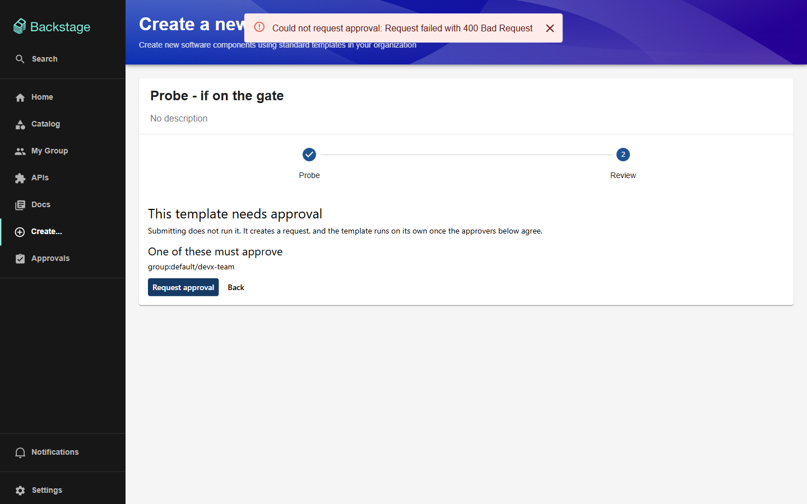

_08 — submitting `probe-if-gate`._ What the backend actually answered:

```json
{
  "error": {
    "name": "InputError",
    "message": "template:default/probe-if-gate has an unusable gate: 'approval:gate' must not carry an 'if:' condition; the runner skips a step whose condition is falsy, which would let the caller turn the gate off"
  }
}
```

The same happens with the secret-parameter probe ([10](browser-review/10-refused-secret-parameter.png)): the backend says "_its parameter(s) token are secret-typed, and a secret cannot survive the wait for an approval…_", and the toast says "Request failed with 400 Bad Request". On the request page, a malformed id shows only "Request failed with 400 Bad Request" ([43](browser-review/43-malformed-request-id.png)). The real message, "Invalid request id: must be a request id", appears only after expanding the panel ([43b](browser-review/43b-malformed-request-id-expanded.png)).

**Cause.** [`ApprovalsClient.ts:47-50`](../plugins/scaffolder-approvals/src/api/ApprovalsClient.ts#L47-L50) throws `ResponseError.fromResponse(response)`. That error's `message` is always the generic status line. The backend's sentence lives in `error.cause.message` (and `error.body.error.message`). Every catch site displays `error.message`:

- [`GatedReviewStep.tsx:147-148`](../plugins/scaffolder-approvals/src/components/GatedReviewStep/GatedReviewStep.tsx#L147-L148), on submit;
- [`RequestDetail.tsx:116`](../plugins/scaffolder-approvals/src/components/RequestDetail/RequestDetail.tsx#L116), [`:140`](../plugins/scaffolder-approvals/src/components/RequestDetail/RequestDetail.tsx#L140) and [`:168`](../plugins/scaffolder-approvals/src/components/RequestDetail/RequestDetail.tsx#L168), on decide, withdraw and resubmit.

The comment above the client's `throw` says it "carries the backend's own message through", and two of the catch sites carry comments promising to "show what it said". The component tests cannot see the problem, because they mock `approvalsApiRef` to throw a plain `new Error('…')`.

**What a user loses.** A requester whose template is refused cannot tell whether to fix their values, ask the template owner, or give up. An approver whose vote is refused cannot tell whether someone was faster, the request expired, or they are not an approver. Those are exactly the cases the review's C4 and S7 fixes made the backend explain.

**Fix.** Show `error.cause?.message` when the error is a `ResponseError`, in one helper that all four catch sites use. Alternatively, have the client rethrow with the backend's message while keeping the `ResponseError` as its cause. Then make one component test throw a real `ResponseError` built from a JSON body, so this cannot regress quietly.

### <a id="b2"></a>B2 — "Waiting on you" counts requests the viewer cannot decide

The inbox and the home card both list a request:

- **after the viewer has already voted on it.** Once alice approved `payments-api`, her inbox and card still counted it: 4, when 3 needed her;
- **when it is the viewer's own request and the gate forbids self-approval.** After the requester resubmitted `probe-fails`, their own card read 2 and their inbox listed their own request, although its page says "You cannot approve your own request".


_41 — the requester's home card counts their own request._

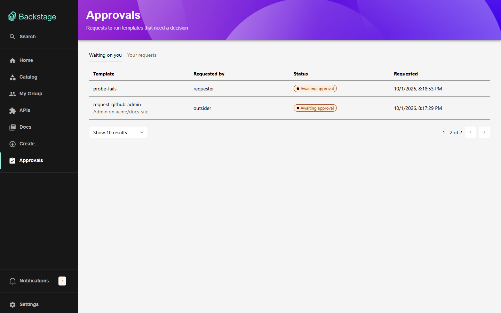

_42 — the first row is the viewer's own request._

**Cause.** The approver view filters by approver membership alone ([`ApprovalStore.ts:329-338`](../plugins/scaffolder-approvals-backend/src/database/ApprovalStore.ts#L329-L338), fed from [`router.ts:359-379`](../plugins/scaffolder-approvals-backend/src/service/router.ts#L359-L379)). It never consults the two checks that [`checkDecisionEligibility`](../plugins/scaffolder-approvals-common/src/eligibility.ts#L117-L166) applies. This is the code review's [C27](GATED_SCAFFOLDER_REVIEW.md#c27), which was rated a nit before anyone could see what it does to the home card.

**Why it matters more than it looks.** [`PendingApprovalsCard`](../plugins/scaffolder-approvals/src/components/PendingApprovalsCard/PendingApprovalsCard.tsx#L62) exists because "nothing notifies an approver a second time". A card that never reaches zero becomes background noise, and then the one request that does need someone waits until it expires.

**Fix.** For `role=approver`:

- exclude requests with a decision by the caller's user ref, a subquery on `approval_decisions`;
- exclude the caller's own requests when the frozen policy forbids self-approval. `selfApprove` currently lives only inside the `policy_snapshot` JSON, so this needs a column (with a backfill) or a row in the approvers table.

Then add a test asserting that every request the inbox returns is one `checkDecisionEligibility` allows for the same caller. The two must never disagree, which is the same argument the code already makes for sharing that function between the UI and the server.

### <a id="b3"></a>B3 — The gate's error message points at a page with no way to submit

Anyone who starts a gated template other than through the wizard is told:

> This template requires approval before it can run. Submit it from the **approvals page** instead of running it directly; it will start on its own once the request has been approved.

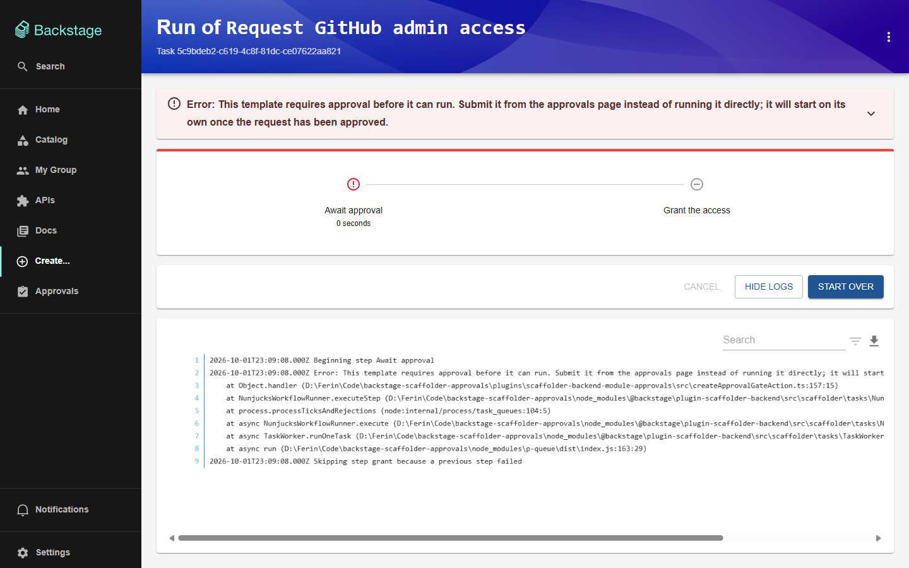

_13 — the gate holding, with the misleading instruction._

The approvals page lists requests but cannot create one. Requests are created from the template's own wizard, whose last step now says "Request approval". This is the sentence [G1](GATED_SCAFFOLDER_REVIEW.md#g1) and [D1](GATED_SCAFFOLDER_REVIEW.md#d1) complained about. D1 corrected the README, but the message itself, in [`createApprovalGateAction.ts:37-40`](../plugins/scaffolder-backend-module-approvals/src/createApprovalGateAction.ts#L37-L40), was not changed.

**Fix.** One string. For example: "_This template requires approval before it can run. Open it from Create… and finish the wizard: the last step asks for approval instead of running it, and the template starts on its own once the request is approved._" The scaffolder's **Start over** button on this same screen already takes the user to the wizard with their values filled in, so the message only has to point there.

---

## 5. What works

Each subsection says what was checked and what was seen. Screenshots are numbered in the order they were taken.

### 5.1 Navigation and the home-page card

The **Approvals** sidebar item is present for everyone and opens `/scaffolder-approvals`.

The home card shows a count and a sentence, plus a **Review them** link when the count is above zero. It renders as an ordinary card, not a card inside a card, which confirms commit `7a32a45`.

| Nothing waiting (requester, first sign-in) | Four waiting (alice)                               |
| ------------------------------------------ | -------------------------------------------------- |
| 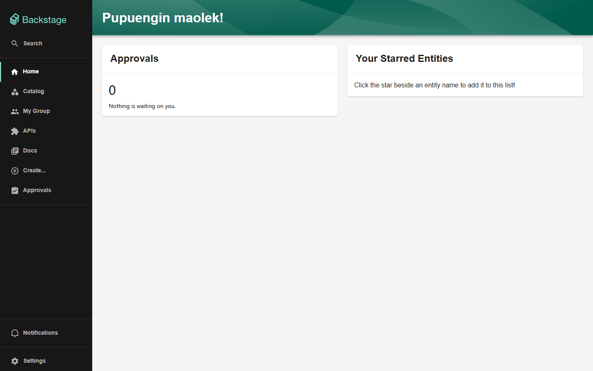 | 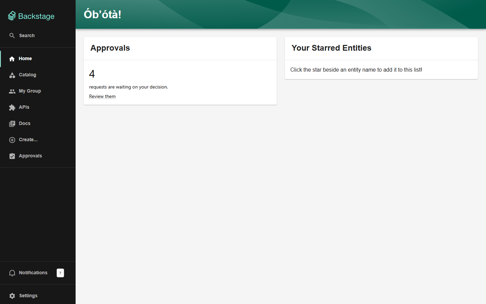 |

The count is right in the sense that it matches the inbox. What the inbox counts is [B2](#b2).

### 5.2 The approvals page

Two tabs, **Waiting on you** and **Your requests**. Paging happens on the server ("1 – 6 of 6"), and every row links to its request. Expired and withdrawn requests correctly drop out of the inbox. The empty state renders ([02](browser-review/02-approvals-inbox-empty.png); see [B15](#b15) for its scrollbar).

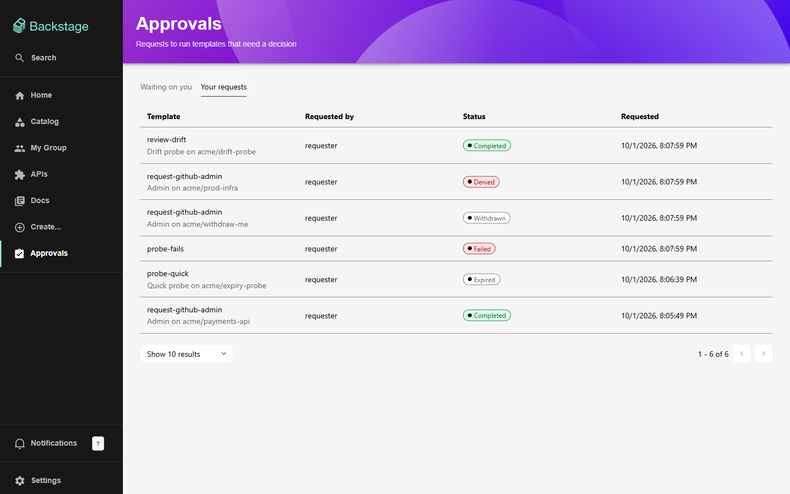

_38 — one requester's history, showing five of the six terminal statuses, each with its own pill: Completed, Denied, Withdrawn, Failed, Expired._


_16 — alice's inbox before she decides anything._

### 5.3 Submitting from the scaffolder's wizard

The gated template's wizard is the scaffolder's own form ([04](browser-review/04-gated-wizard-form.png)). Its last step is `GatedReviewStep`: it says the template needs approval, names who will be asked and how many of them, and offers **Request approval** instead of **Create**.

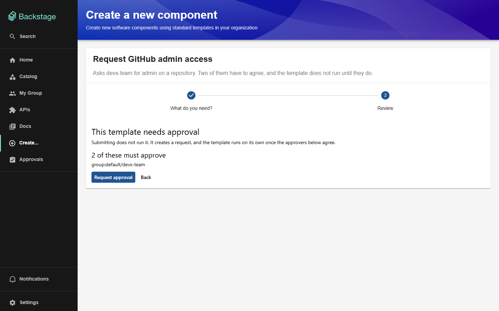

_05 — the review step for a gated template._

Pressing it creates the request and lands on its page, which is `pending`, with the summary rendered from the values ("Admin on acme/payments-api") and an expiry three days out:

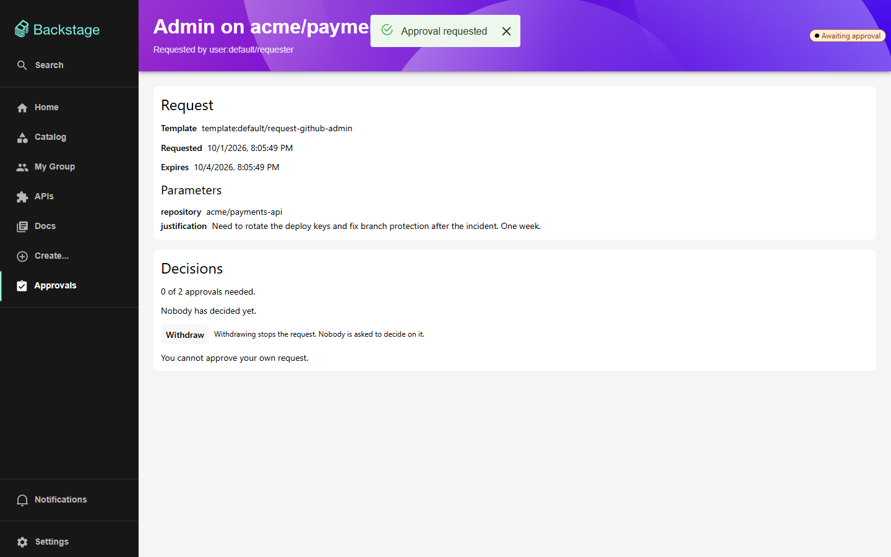

_06 — the requester's view: Withdraw is offered, and approving is not ("You cannot approve your own request")._

**Non-gated templates are untouched.** The example Node.js template still gets the scaffolder's own review table and **Create** button ([14](browser-review/14-ungated-template-normal-review.png)).

### 5.4 Duplicate collapse and value validation

Submitting the same values a second time returns the **same request id** with "You already have an identical request open" (Q13):

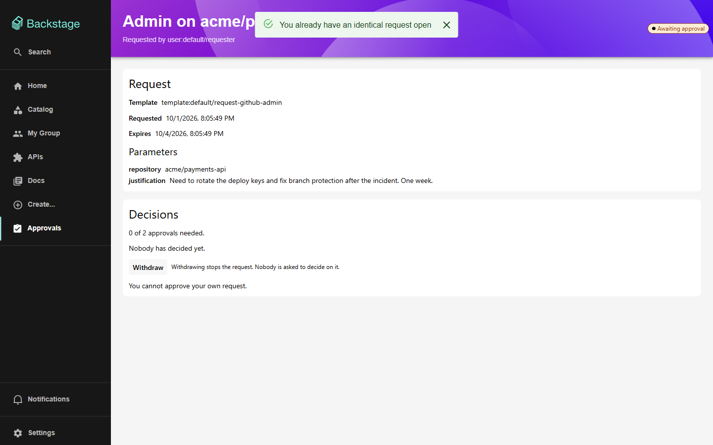

Values are validated against the template's parameter schema before anything is stored (Q3). A five-character justification on a template that requires ten is refused with 400 and "Submitted values do not match the template's parameters: /justification must NOT have fewer than 10 characters". The wizard enforces the same rule on its own side, so this is reachable only through the API, and through the API it is correct.

### 5.5 Template shapes that are refused

Both refused probes are turned away at submit with a 400, and nothing is stored:

- `probe-if-gate`, which has an `if:` on the gate ([08](browser-review/08-refused-if-on-gate.png));
- `probe-secret`, which declares a `ui:field: Secret` parameter ([10](browser-review/10-refused-secret-parameter.png)).

The backend's reasons are exact ([§2](#2-does-backstage-start) shows the matching catalog warnings). Only the UI's rendering of them is broken ([B1](#b1)). The wizard does not warn before the user fills the form in ([B8](#b8)).

### 5.6 Who may decide

| Case                                                  | UI                                                                                                    | API                                                |
| ----------------------------------------------------- | ----------------------------------------------------------------------------------------------------- | -------------------------------------------------- |
| The requester, on their own request                   | "You cannot approve your own request." ([06](browser-review/06-request-detail-requester-pending.png)) | —                                                  |
| `outsider`, who is in no approver group               | "You are not an approver for this request." ([36](browser-review/36-outsider-own-request.png))        | **403** "You are not an approver for this request" |
| alice, voting a second time                           | "You have already decided on this request." ([20](browser-review/20-alice-approved-1-of-2.png))       | **409** "You have already decided on this request" |
| alice and bob, through `group:default/devx-team` only | Approve and Deny offered ([18](browser-review/18-detail-alice-can-decide.png))                        | 200                                                |

Group membership worked through the token's ownership refs, as documented. Neither alice nor bob is named in the gate, only their group.

### 5.7 Approving, quorum and launch

Approve and Deny both go through a confirmation dialog whose copy says what the decision does. The comment is optional for an approval. The dialog's close button is labelled "Close" for screen readers.

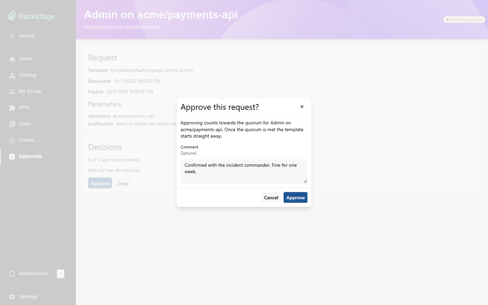

_19 — "Once the quorum is met the template starts straight away."_

With `quorum: 2`, alice's approval leaves the request pending at **1 of 2**, with her comment recorded under her name ([20](browser-review/20-alice-approved-1-of-2.png)). bob's approval meets the quorum. The page reads **Running** with a task link immediately, and **Completed** after a reload:

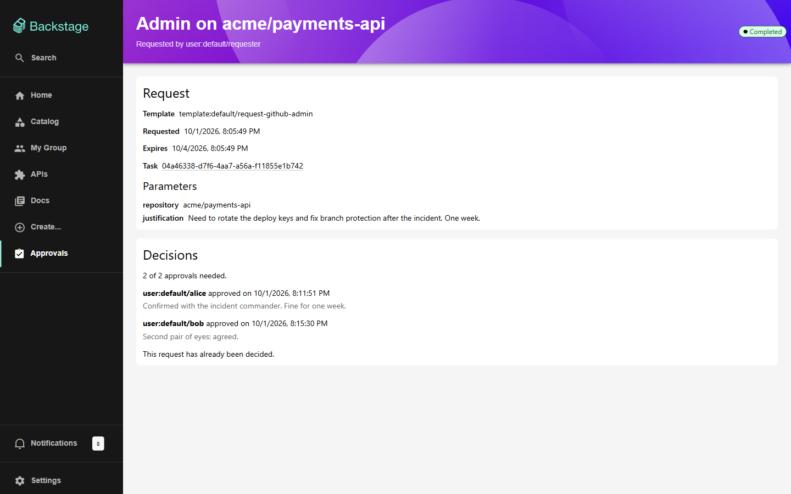

_31 — both decisions, both comments, and the task._

The task link opens the scaffolder's log, where the gate records who granted it and the next step prints the actors the gate published. This is the §10.1 promise that the real people are recorded even though the task runs as the plugin:

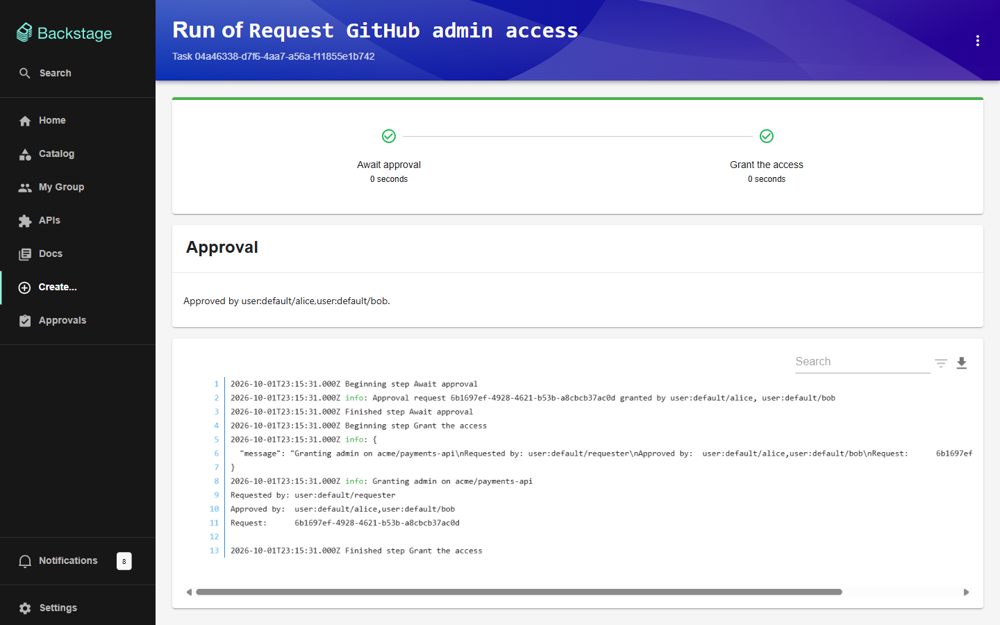

_32 — "Requested by: user:default/requester / Approved by: user:default/alice,user:default/bob"._

### 5.8 Denying

The deny dialog says plainly that a denial is final, and that the comment is all the requester will see ([33](browser-review/33-deny-dialog.png)). One denial rejects the request:

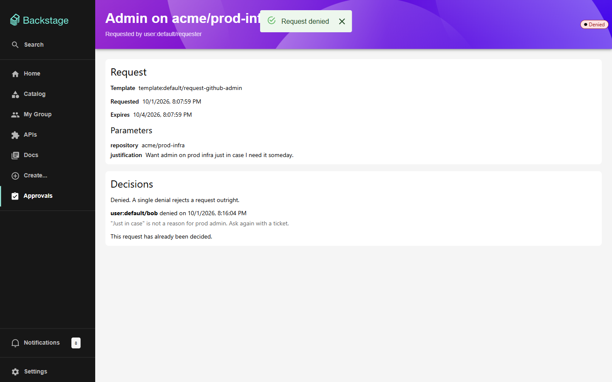

### 5.9 Withdrawing

The requester's **Withdraw** button moves a pending request to **Withdrawn** ([11](browser-review/11-withdrawn.png)). See [B4](#b4) for the wording on that page and [B11](#b11) for what approvers are not told.

### 5.10 A failed run, and Resubmit

`probe-fails` has quorum 1 and a second step that fails on purpose. alice's approval launched it at once ([22](browser-review/22-probe-fails-right-after-approval.png)). The task failed a second later, the request followed it to **Failed** through the scaffolder's task event, and both sides were notified. The task log shows the gate consumed the grant before the failure ([24](browser-review/24-probe-fails-task-log.png)).

On a failed request the requester gets **Resubmit**, which explains that the approval is spent:

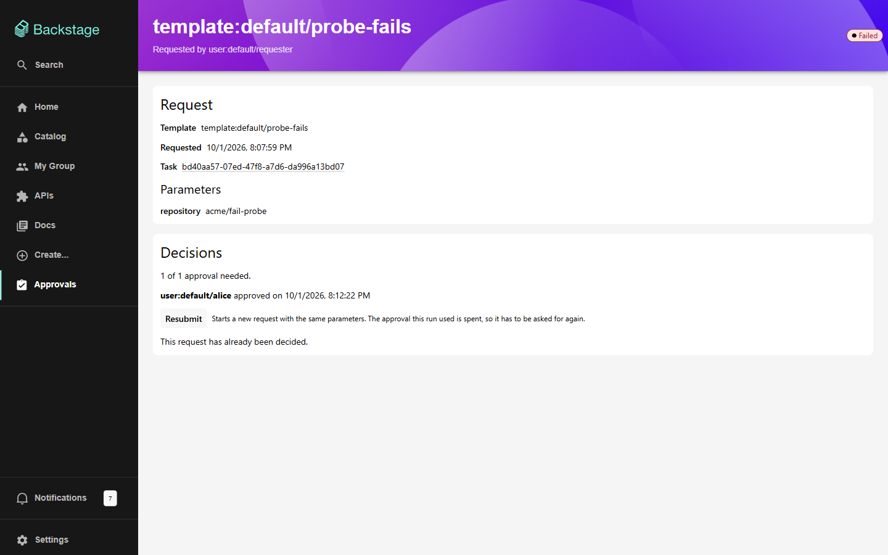

Resubmit created a _new_ request (`b66c3ed8`) with the same values, pending, with the original untouched ([40](browser-review/40-resubmitted-new-request.png)). This is Q5 as designed.

### 5.11 Expiry

`probe-quick` times out after one minute. The timeout sweep, on its five-minute cadence, moved it to **Expired** at 20:09:39 and notified the requester and both approvers ([17](browser-review/17-notifications-alice.png)). Its page says nobody decided ([21](browser-review/21-expired-request.png)), although with the wrong sentence beneath ([B4](#b4)). Between the deadline and the sweep, lists still call it "Awaiting approval" ([B9](#b9)).

### 5.12 Template drift

After a step was added to `review-drift` and the entity refreshed, the request's API response carried `templateDrift: { changed: true, reasons: ["steps"] }`. The page shows an alert above everything else, before the Approve button:

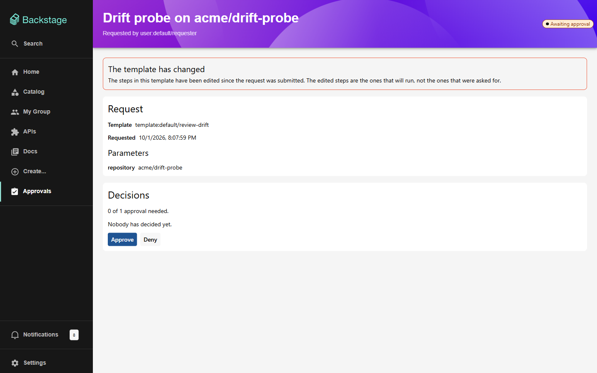

_25 — "The edited steps are the ones that will run, not the ones that were asked for."_

That warning is accurate. bob approved, and the run executed the step that had been added after submission ([35](browser-review/35-drifted-run-executed-new-step.png)). As documented, drift is shown and not enforced.

### 5.13 Notifications

All four v1 notifications arrived, scoped per request and action, each deep-linking to `http://localhost:3000/scaffolder-approvals/requests/<id>`:

| Notification             | Seen by                                                      | Screen                                              |
| ------------------------ | ------------------------------------------------------------ | --------------------------------------------------- |
| Approval requested       | alice and bob; never the requester for their own request     | [17](browser-review/17-notifications-alice.png)     |
| Request approved/denied  | the requester, once the request is decided, with the comment | [37](browser-review/37-notifications-requester.png) |
| Approved request failed  | the requester and both approvers                             | [37](browser-review/37-notifications-requester.png) |
| Approval request expired | the requester and both approvers                             | [17](browser-review/17-notifications-alice.png)     |

The requester is notified only when a decision _changes the request's status_ ([`ApprovalService.ts:388-421`](../plugins/scaffolder-approvals-backend/src/service/ApprovalService.ts#L388-L421)). A first approval out of two sends nothing, which is reasonable, but it contradicts the README ([B12](#b12)).

### 5.14 The derived catalog annotation

All six gated templates carry `scaffolder-approvals.backstage.io/gated: "true"`, including the two malformed probes, by design. The example Node.js template carries none.

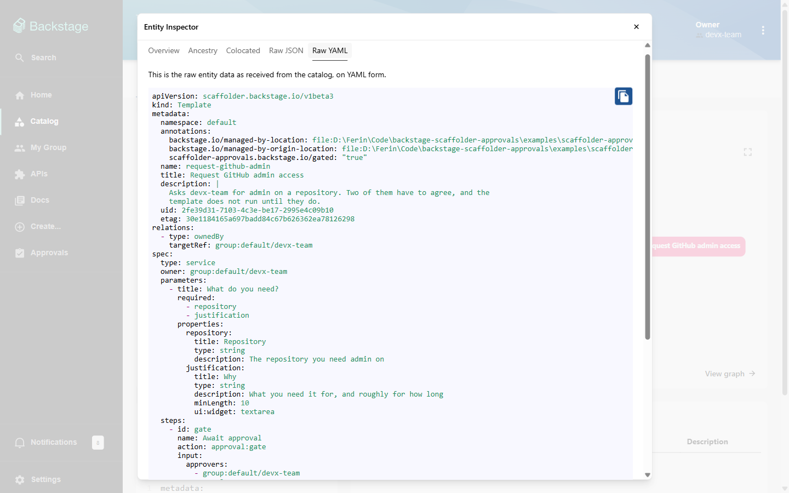

_26 — the annotation, derived. Nobody wrote it in the YAML._

### 5.15 The gate holds against a direct call

`POST /api/scaffolder/v2/tasks` for the gated template, as a signed-in user, with valid values and no approval:

```text
Starting up task with 2 steps
processing  gate   Beginning step Await approval
failed      gate   Error: This template requires approval before it can run. ...
skipped     grant  Skipping step grant because a previous step failed
Run completed with status: failed
```

The scaffolder's own task page shows the same: "Await approval" failed and "Grant the access" never ran ([13](browser-review/13-direct-run-blocked-by-gate.png)). The repository's own check agrees:

```text
$ ./scripts/verify-gate.sh
1. The gated annotation is derived, not authored            PASS
2. Values are validated before anything is stored           PASS
3. A valid request is stored as pending, policy snapshotted PASS
4. THE ONE THAT MATTERS: the scaffolder cannot be used to skip the gate
   PASS task failed / PASS it failed at the gate / PASS every later step was skipped
The gate holds.
```

### 5.16 Audit events and open reads

The backend logged an audit event at `high` severity for every decision, including the refused second vote ("You have already decided on this request"), and for every grant consume. The consume event's actor was `plugin:scaffolder`, and the scaffolder's task-create event's actor was `plugin:scaffolder-approvals`, which is the §10.1 identity model working as described.

`outsider` could read alice's and bob's request (`GET /requests/:id` → 200). That is Q12, reads open to any signed-in user.

### 5.17 Dark theme and mobile width

Every approvals screen is readable in the dark theme, and the status pills keep their contrast in the page header. That confirms the fix in commit `bc64c07`.

| Inbox                                 | Request                                        | Drift notice                                 | Home card                                 |
| ------------------------------------- | ---------------------------------------------- | -------------------------------------------- | ----------------------------------------- |
| 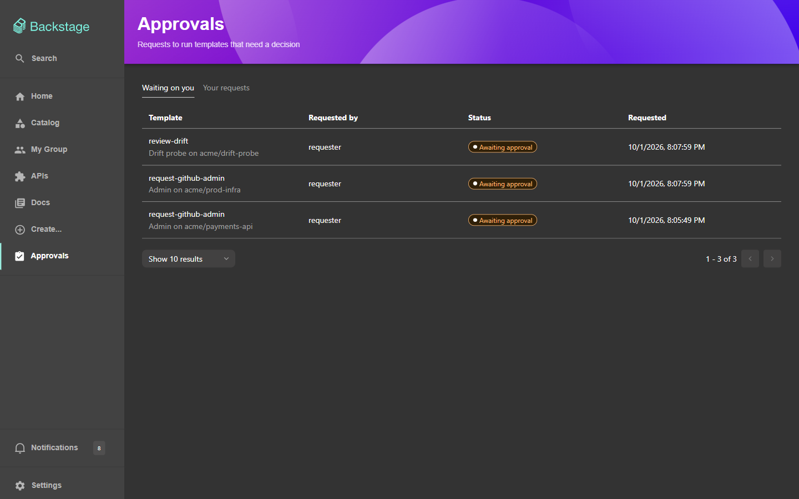 | 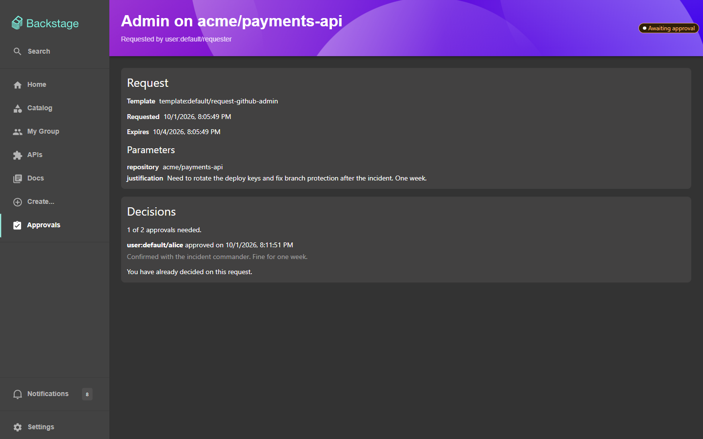 | 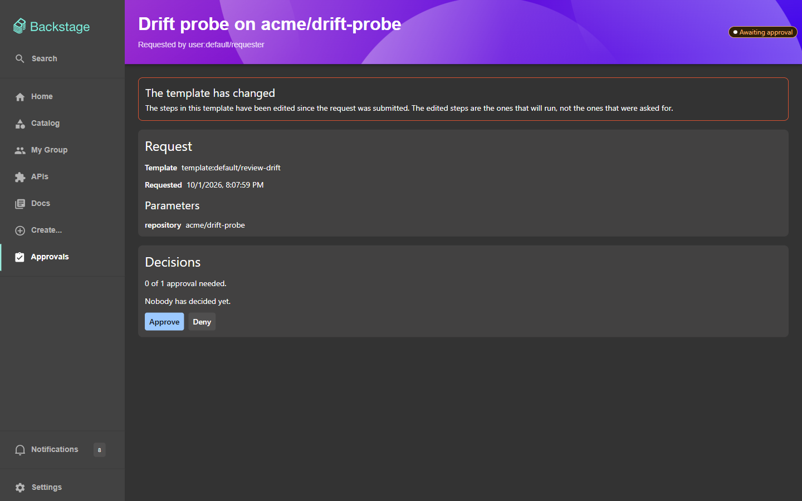 | 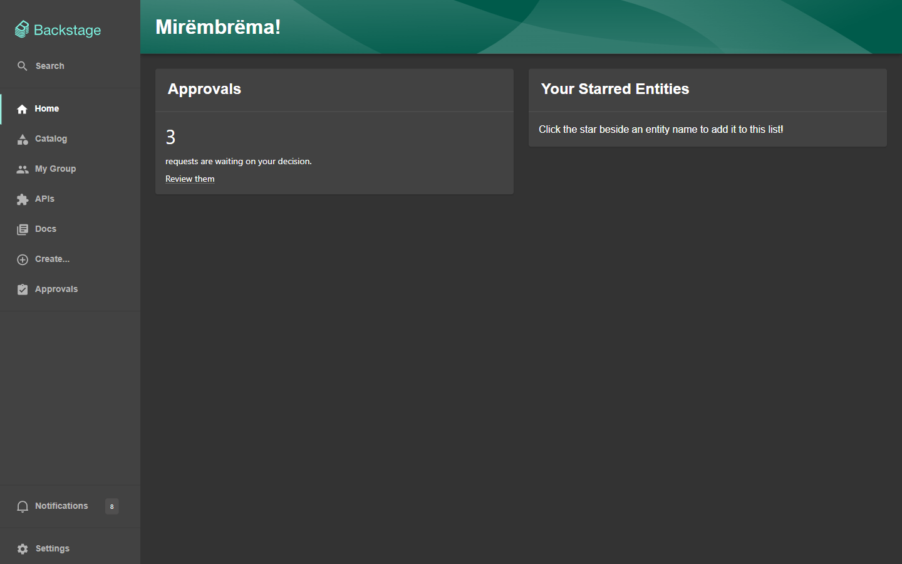 |

At 390 px wide neither page scrolls sideways, and the request page reads well ([45](browser-review/45-mobile-request-detail.png)). See [B14](#b14) for the header pill and the table.

### 5.18 The plugin's dev harness

`yarn start` inside `plugins/scaffolder-approvals` serves the page against its mock API. Both tabs and the request page render ([47](browser-review/47-dev-harness-inbox.png), [48](browser-review/48-dev-harness-detail.png)). See [B21](#b21) for why its decide flow cannot be tried there.

---

## 6. Fix soon

### <a id="b4"></a>B4 — Settled requests use the wrong words

- **"This request has already been decided."** appears on an **expired** request ([21](browser-review/21-expired-request.png)) and a **withdrawn** one ([11](browser-review/11-withdrawn.png)), where nobody decided anything. [`checkDecisionEligibility`](../plugins/scaffolder-approvals-common/src/eligibility.ts#L126-L128) returns `not-pending` for every non-pending status before it reaches the `expired` branch on line 136. The UI already has the right sentence for expiry ("This request timed out before anyone decided."), and it is never shown once the sweep has run.
- **"0 of 2 approvals needed."** stays on withdrawn and expired requests, and "2 of 2 approvals needed." on completed ones ([`RequestDetail.tsx:264`](../plugins/scaffolder-approvals/src/components/RequestDetail/RequestDetail.tsx#L264)). Once a request is settled, nothing is needed.
- **"Expires 10/4/2026"** is shown on completed, denied and withdrawn requests ([`RequestDetail.tsx:224`](../plugins/scaffolder-approvals/src/components/RequestDetail/RequestDetail.tsx#L224)), which reads as if they could still expire.

Fix: base the sentence and the progress line on `request.status`, and show **Expires** only while the request is pending.

### <a id="b5"></a>B5 — The request page never says who can approve

A requester sees "0 of 2 approvals needed" but not _whose_ approvals ([06](browser-review/06-request-detail-requester-pending.png)). They therefore cannot tell whom to chase, or notice that the gate names a group with nobody in it. The approvers, the quorum and the self-approval rule are all in `request.policySnapshot`. The review step shows them before submission, so the request page could show the same list afterwards.

### <a id="b6"></a>B6 — A missing or malformed request is a bare error bar

An unknown id ([44](browser-review/44-unknown-request-id.png)) or a malformed one ([43](browser-review/43-malformed-request-id.png)) renders a single red bar at the top of an otherwise empty screen, with no page header and no way back. [`RequestDetail.tsx:182-184`](../plugins/scaffolder-approvals/src/components/RequestDetail/RequestDetail.tsx#L182-L184) returns the error panel instead of rendering it inside the page.

Someone following an old notification link lands here. Render the panel inside the usual `Page`/`Header`/`Content`, and turn a 404 into "This request does not exist" with a link back to the approvals page.

### <a id="b7"></a>B7 — The gated review step hides what is being submitted

For an ordinary template the last wizard step is a table of the values about to be used ([14](browser-review/14-ungated-template-normal-review.png)). For a gated one it is replaced entirely, and the requester submits without seeing their values ([05](browser-review/05-gated-review-step.png)). Those values are what the approvers will judge, and what the grant will be bound to.

`GatedReviewStep` already receives `formData`. Render the same `ReviewState` table that [`packages/app/src/components/scaffolder/ReviewStep.tsx`](../packages/app/src/components/scaffolder/ReviewStep.tsx) uses, above "This template needs approval".

### <a id="b8"></a>B8 — The wizard offers "Request approval" for templates the backend will refuse

`probe-if-gate` and `probe-secret` both reach a review step that says "This template needs approval" and offers the button, and only then fail. The catalog has warned about both since ingestion. `GatedReviewStep` already reads the gate policy, so it could run the same shape checks (the ones the backend runs through `findGateStep`, plus the secret-field check) and say "_This template cannot be requested: …_" up front. At minimum, once [B1](#b1) is fixed the user will at least be told why.

### <a id="b9"></a>B9 — A request past its deadline is still "Awaiting approval" until the sweep

`probe-quick` expired at 20:07:39. At 20:08:30 the list still showed it as **Awaiting approval** ([12](browser-review/12-your-requests-tab.png)), and it stayed that way until the sweep ran at 20:09:39. The sweep runs every five minutes, so this can last up to five minutes.

The decide path already refuses such a request (fixed in the code review's [C4](GATED_SCAFFOLDER_REVIEW.md#c4)), so nothing unsafe happens. The pill is simply wrong for a while. When `expiresAt` is in the past, the list and the page can show **Expired** without waiting for the sweep.

### <a id="b10"></a>B10 — Pages do not update themselves

After alice approved `probe-fails`, the page said **Running**. The task failed a second later, and the page still said **Running** eight seconds after that, until it was reloaded ([22](browser-review/22-probe-fails-right-after-approval.png) → [23](browser-review/23-probe-fails-failed-with-task-link.png)). This is documented under "Not yet". The backend already broadcasts `{ action, requestId, status }` on the `scaffolder-approvals` channel, so the remaining work is a `useSignal` subscription that bumps the page's existing `reload` state.

### <a id="b11"></a>B11 — Withdrawing is silent and unconfirmed

- **No confirmation.** Approve and Deny both ask "are you sure?". Withdraw, which is just as final, does not.
- **Approvers are not told.** Their "Approval requested" notification for the withdrawn request stays unread in their inbox ([17](browser-review/17-notifications-alice.png), fourth row). Clicking it leads to a request they can no longer act on.

There is no withdrawal notification by design (Q20 settles on four). Marking the matching "requested" notification as done, or reusing its scope so that it is replaced, would keep approvers' inboxes honest without adding a fifth.

### <a id="b12"></a>B12 — The README's event table promises an event that partial approvals do not raise

[docs/README.md](README.md#events-and-signals) says `decided` is published when "an approver approves or denies". In fact a vote that does not change the request's status raises no event, no signal and no notification ([`ApprovalService.ts:412-422`](../plugins/scaffolder-approvals-backend/src/service/ApprovalService.ts#L412-L422)). outsider had no notifications at all after the requester approved their request as 1 of 2 ([49](browser-review/49-no-notification-for-partial-approval.png), [50](browser-review/50-partial-approval-still-pending.png)).

Not notifying a person about "1 of 2" is a reasonable choice. An event subscriber such as an audit pipeline or a Slack bot, though, would reasonably expect every vote. Either publish `decided` (with `status: 'pending'`) for every vote, or correct the table.

### <a id="b13"></a>B13 — Three migration tests still fail in a repository-wide run

This is the code review's [T6](GATED_SCAFFOLDER_REVIEW.md#t6), reproduced. `yarn test` from the root: **451 passed, 3 failed**. All three failures are the SQLite "a duplicate insert must be refused" tests in `migrations.test.ts`, each with "Received function did not throw". The same file run on its own passes 9/9. The constraint itself works in the running app: alice's second vote got a 409. But a green CI run here would be luck, as T6 says.

### <a id="b14"></a>B14 — Narrow screens

- On the request page, the status pill sits on top of the "Requested by …" subtitle ([45](browser-review/45-mobile-request-detail.png)).
- In the list, all four columns truncate, including the pills: "Awaiting a…", "Complete…" ([46](browser-review/46-mobile-requests-list.png)). On a narrow screen, hide **Requested by** and **Requested**, or stack the summary under the pill.

---

## 7. Polish

- <a id="b15"></a>**B15** — The empty inbox draws its empty state inside a scroll box with a visible scrollbar, and without column headers ([02](browser-review/02-approvals-inbox-empty.png)).
- <a id="b16"></a>**B16** — People and templates appear as raw entity refs everywhere: `user:default/requester`, `template:default/request-github-admin`, `group:default/devx-team`. None of them link to the catalog. `EntityRefLink` from `plugin-catalog-react`, already a dependency, would give names and links for free.
- <a id="b17"></a>**B17** — On **Create…**, nothing distinguishes a gated template from any other ([03](browser-review/03-create-template-list.png)). A requester learns it on the last wizard step. The derived annotation is there to read.
- <a id="b18"></a>**B18** — "**2 of these** must approve" above a single group reads oddly ([05](browser-review/05-gated-review-step.png)). For example, "2 approvals are needed, from:".
- <a id="b19"></a>**B19** — The home card's body uses BUI type, so it does not match the MUI card beside it ([01](browser-review/01-home-card-empty.png)). The legacy card also lacks the "Open" header link that `PendingApprovalsCard` defines, because the card extension renders only the content.
- <a id="b20"></a>**B20** — **Your requests** has a **Requested by** column, which is always the viewer ([38](browser-review/38-your-requests-all-statuses.png)).
- <a id="b21"></a>**B21** — The dev harness signs in as a guest who is not in `devx-team`, while every mock request names `devx-team`. So the harness's inbox lists a request its user cannot act on, and the approve and deny flow cannot be tried there ([48](browser-review/48-dev-harness-detail.png)).
- <a id="b22"></a>**B22** — The README says "press **Enter** to sign in as a guest"; sign-in is automatic.
- <a id="b23"></a>**B23** — The Approvals page logs one React Aria warning, "A `textValue` prop is required for `<Tag>` elements with non-plain text children". It comes from inside BUI's components rather than the plugin's own code, but it is worth checking against the BUI version before upstreaming.

---

## 8. Automated checks

| Check                      | Result                                                               |
| -------------------------- | -------------------------------------------------------------------- |
| `yarn tsc`                 | ✅ Clean                                                             |
| `yarn test` (whole repo)   | ⚠️ **451 / 454.** 31 suites, 30 pass. The 3 failures are [B13](#b13) |
| `migrations.test.ts` alone | ✅ 9 / 9                                                             |
| `scripts/verify-gate.sh`   | ✅ "The gate holds."                                                 |

Every suite in all six plugin packages passes except that one file, including `gate.integration.test.ts` and the frontend component tests. Run with `CI=true BACKSTAGE_TEST_DISABLE_DOCKER=1`, as the implementation guide recommends on Windows.

---

## 9. Not covered

- **The new frontend system** (`/alpha`). This app uses the legacy system, deliberately, so the alpha page, nav item and home widget were not rendered.
- **Postgres and MySQL.** Everything here ran on SQLite. The code review covered both engines in tests.
- **The retention sweep.** Its default window is 180 days.
- **Launch retry** ([C1](GATED_SCAFFOLDER_REVIEW.md#c1)) and **a grant lapsing before launch.** Both need the scaffolder to be unavailable at the moment of approval.
- **A real permission policy.** The app runs `permission.enabled: true` with the allow-all policy module, so neither a restrictive `scaffolderApprovals.request.decide` policy nor the `scaffolder.action.execute` defence in depth from the README was exercised.
- **Live updates through signals**, which are not built ([B10](#b10)).
- **Email or other notification channels.** Only the in-app notifications inbox was checked.
- **More than one backend replica.**
- **A screen-reader pass.** The accessibility notes here come from the accessibility tree and console warnings, not from assistive technology.

---

## Appendix: console noise that is not the plugin's

These appear on most pages and come from Backstage or its dependencies, not from the approvals plugins:

- `findDOMNode is deprecated`, from Material UI v4 in the sidebar and sign-in page;
- `The prop rows of ForwardRef(TextField) is deprecated`, from the scaffolder's textarea widget;
- React Router v7 future-flag warnings;
- `Support for defaultProps will be removed`, from `material-table` on the Notifications page;
- `WebSocket connection to 'ws://localhost:7007/api/signals' failed`, only while the backend was restarting between identities;
- the `ui:field: Secret` input renders no field in this app's wizard ([09](browser-review/09-secret-probe-form.png)). That is the scaffolder's field registration, not the plugin's, and it does not change the outcome, since the backend refuses the template whatever is typed.
