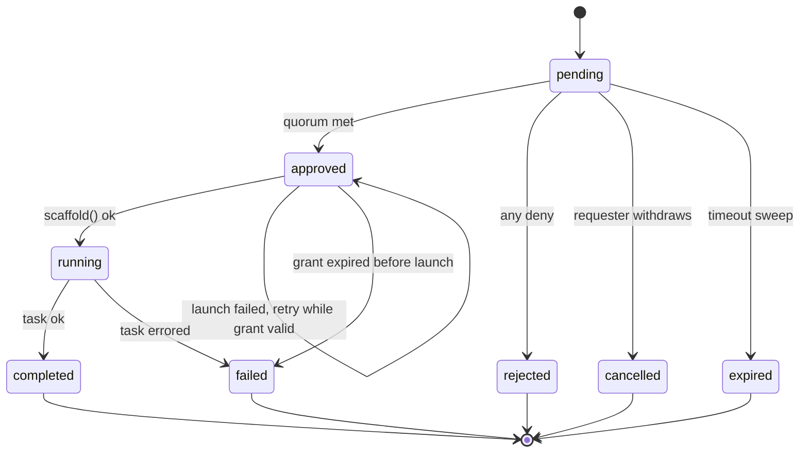

# Gated Scaffolder Workflows

**Approval gates for Backstage software templates** — so `Request GitHub Admin Access` waits for
`devx-github-team` to say yes, and every request has a state someone can see.

|                    |                                                                    |
| ------------------ | ------------------------------------------------------------------ |
| **Target package** | `@backstage-community/plugin-scaffolder-approvals`                 |
| **Backstage**      | 1.54.5+                                                            |
| **Status**         | Design settled — 24 decisions recorded in §13. Ready to implement. |
| **Date**           | 11 Sep 2026                                                        |

---

## Recommendation

**Build a new community plugin. Do not fork or patch core scaffolder.**

A pre-execution gate — approval decided _before_ the template runs — is fully buildable today on
public, stable APIs. The mid-workflow variant (pause at step 5, resume days later) is **not**, and
attempting it means forking `scaffolder-backend`.

Crucially, the gate must be enforced **inside the template's catalog entity**, not in the frontend.
Backstage's `scaffolder.task.create` permission carries no template reference, so no permission
policy can say "deny running template X". A frontend-only gate is bypassable with one `curl`.

A gate is declared as an `approval:gate` step in the template YAML. A catalog processor derives the
`gated` annotation from the presence of that step, so authors declare one thing and the annotation
can never drift out of sync.

| Approach                  | Core changes  | Est. effort             |
| ------------------------- | ------------- | ----------------------- |
| New workspace, 6 packages | None required | 4–6 weeks to production |

---

## 1. What already exists upstream

This is not a novel idea. It is the **most-requested unbuilt scaffolder feature in Backstage**, open
continuously since February 2023. Understanding why it has never shipped is the most useful input to
the design, because every previously-rejected approach failed for a reason that still applies.

| Date       | Item                                                                                                  | Outcome                                                                                                                                                                                                                        |
| ---------- | ----------------------------------------------------------------------------------------------------- | ------------------------------------------------------------------------------------------------------------------------------------------------------------------------------------------------------------------------------ |
| 2022-09-22 | [#13809 — Approvals for template steps](https://github.com/backstage/backstage/issues/13809)          | **Closed.** Proposed `approval:request` wrapping `onApprove` steps. The author hit the exact wall you would: the public API does not let a plugin manipulate a template's action execution.                                    |
| 2023-02-27 | [#16622 — Gated Scaffolder Workflows](https://github.com/backstage/backstage/issues/16622)            | **Still open.** Filed by maintainer `taras`. 50 comments over three and a half years, repeatedly rescued from the stale bot. Described in Oct 2025 as "the single most coveted scaffolder workflow enhancement."               |
| 2024-04-03 | [#23967 — Workflow-Orchestration Plugin](https://github.com/backstage/backstage/issues/23967)         | **Closed, not planned.** Rejected on the grounds that the scaffolder is not a workflow engine. _Read this as a scoping constraint:_ narrow, linear gating is acceptable upstream; DAGs and branching are not.                  |
| 2024-05-21 | [#24846 — `debug:wait` capped at 30s](https://github.com/backstage/backstage/issues/24846)            | **Closed.** Maintainer verdict: long waits "hold up workers unnecessarily." Any polling-based design has to answer this.                                                                                                       |
| 2024-12-02 | Maintainer sketches the shape                                                                         | `benjdlambert`: rely on the events backend for an HTTP ingress to resume jobs, plus "some way to mark jobs as pending and paused." Invited a BEP. Twice.                                                                       |
| 2025-04    | [#30429 — RFC: Gated Scaffolder Workflows](https://github.com/backstage/backstage/issues/30429)       | **Closed** with a request to resubmit through the formal BEP process.                                                                                                                                                          |
| 2026-07-24 | [PR #34966 — BEP-0016: Gated Scaffolder Workflows](https://github.com/backstage/backstage/pull/34966) | **Open, draft, `provisional`.** By `spiffaz`. Durable `waiting` task state, `ctx.suspend()` with worker release, permission-gated resume endpoint. Under detailed review by `acierto`. **No maintainer co-owner. Not merged.** |
| 2026-08-21 | [PR #35224 — promote task recovery](https://github.com/backstage/backstage/pull/35224)                | **Merged.** BEP-0016's blocking dependency: stable `scaffolder.taskRecovery` config, persisted step outputs, completed-step skipping, pluggable workspace persistence. The substrate finally exists.                           |

### The finding that decides the approach

BEP-0016 explicitly carves out an **"interim approval plugin in community-plugins, no core changes"**
as the right answer for adopters who need this now — built on `scaffolderServiceRef.scaffold()`. The
BEP calls it "the pragmatic answer for adopters, and for access-grant flows with no MR to merge."
That is precisely the GitHub-admin use case, and precisely the plan below.

### What the commercial ecosystem does

No plugin in `backstage/community-plugins` offers approval gating today — the space is genuinely
open. The nearest production system is [Red Hat's Orchestrator](https://www.rhdhorchestrator.io/) for
Developer Hub, which does support human-in-the-loop approvals, but by running **SonataFlow** as a
separate serverless workflow engine on OpenShift, with Knative eventing and its own Data Index
service. It is a second execution model and a heavy operational dependency; templates become
SonataFlow workflows rather than scaffolder templates. For an org already running 100+ scaffolder
templates, that is a migration, not a feature.

---

## 2. Why core cannot pause a task today

Three facts in `scaffolder-backend`, verified against `master`, jointly make "pause mid-template"
impossible from a plugin.

### 2.1 The status union is closed and public

```ts
// plugins/scaffolder-common/.../TaskStatus.model.ts
// AUTOGENERATED from the OpenAPI spec — @public
export type TaskStatus =
  'cancelled' | 'completed' | 'failed' | 'open' | 'processing' | 'skipped';
```

There is no `waiting`, `paused` or `pending`. Adding one widens a public type, which is why it needs
a BEP rather than a PR.

### 2.2 Only `open` tasks are claimable

```ts
// DatabaseTaskStore.claimTask()
const [task] = await tx('tasks').where({ status: 'open' }).limit(1)...
await tx('tasks').where({ id: task.id, status: 'open' })
  .update({ status: 'processing', last_heartbeat_at: now() });
```

A parked task needs a status the claim query ignores — and `createTask()` hardcodes `status: 'open'`.
Both are internal to core.

### 2.3 A running task owns a worker slot for its whole life

`TaskWorker` runs tasks on a bounded `PQueue`, and `runOneTask` awaits `workflowRunner.execute(task)`
to completion before releasing the slot. Nothing lets an action yield. This is why the maintainers
capped `debug:wait` at 30 seconds, and why "just poll a flag in a long-running action" is a rejected
design rather than a clever workaround — a hundred pending access requests would exhaust the worker
pool.

> **Consequence.** A **pre-execution** gate sidesteps all three: nothing is ever parked, because no
> task exists until approval lands. That is why it is buildable today, and why it is the right first
> target.

---

## 3. The enforcement problem

This is the part most designs get wrong. The obvious implementation is: detect a gated template in
the frontend, show "Request approval" instead of "Create", and POST to your plugin. **That is UX, not
a gate.**

The natural fix would be a permission policy that denies task creation for gated templates. It does
not work:

```ts
// plugins/scaffolder-common/src/permissions.ts
export const taskCreatePermission = createPermission({
  name: 'scaffolder.task.create',
  attributes: { action: 'create' },
  // ← no resourceType. No template ref. No input.
});
```

`taskCreatePermission` is a _basic_ permission. A `PermissionPolicy` sees the user and the permission
name — nothing about which template is being launched. Per-template denial is not expressible.

So any user who can create _any_ task can create a _gated_ one, by posting the template ref and
values straight to `POST /api/scaffolder/v2/tasks`. For a template that grants GitHub admin, that is
a complete bypass of the approval process.

### The one thing a user cannot forge

A task's `steps` come from the Template entity in the catalog. The caller supplies only `values` and
`secrets`. **Therefore the gate must be a step on the catalog entity.** That is the only surface in
the system that is both plugin-controlled and user-tamper-proof.

Verified mechanism:

```
POST /v2/tasks
  → authorizeTemplate()
      → findTemplate({ catalog })            # the catalog-served entity
  → taskSpec.steps = template.spec.steps.map(...)   # router.ts:617
```

Because the steps are read from the catalog rather than from the request, whatever the catalog serves
is what executes.

Every gated template's first step is `approval:gate`, supplied by the plugin. It demands proof of
approval and throws without it.

| Path                          | What happens                                                                                                                                                                  | Outcome       |
| ----------------------------- | ----------------------------------------------------------------------------------------------------------------------------------------------------------------------------- | ------------- |
| **Normal** (via approvals UI) | Request stored → approvers decide → backend mints a single-use grant → calls `scaffold()` with the grant as a secret → `approval:gate` validates and consumes it, then no-ops | template runs |
| **Bypass** (direct API call)  | No grant secret present. `approval:gate` throws on step 1, before any real step executes                                                                                      | fails closed  |

The grant is a 256-bit random token, stored hashed, bound to `(request_id, template_ref, values_hash)`,
single-use, with a configurable TTL defaulting to one hour. The action validates it with an
authenticated backend-to-backend call, which also gives an audit record of exactly which task
consumed which approval.

### Accepted risk: a template owner can remove their own gate

Because the gate lives in template YAML rather than in deployment-controlled config, **anyone who can
merge to the template repo can delete the gate**. For an access-granting template owned by the team
requesting access, the control is then only as strong as review on that repo.

This was raised, and declining a config-side `requireGate` allowlist was a deliberate decision
(Q17). Operational mitigations that do not require a code change:

- Protect gated template files with CODEOWNERS requiring platform-team review.
- Watch for the `approval.gate_removed` signal: the derived annotation disappearing from a Template
  entity is observable, and worth alerting on.
- Optional defence in depth via `actionExecutePermission`, which _is_ a resource permission carrying
  the action id and resolved input, with rules `hasActionId` / `hasStringProperty` /
  `hasNumberProperty` / `hasBooleanProperty`. A conditional policy can refuse high-blast-radius
  actions outright unless the run carries an approval marker.

---

## 4. Architecture

```text
== CATALOG INGESTION (at entity processing) =============
  Template entity  →  approvals catalog processor
      does spec.steps contain an `approval:gate` step?
        → stamp annotation  gated: 'true'   (derived, never authored)
  The processor only DERIVES; it never injects or rewrites steps.

== REQUESTER ============================================
  Opens gated template → fills form → Request access
        |
        |  scaffolderApiRef decorator sees the gated
        |  annotation and diverts the submit
        v
== scaffolder-approvals-backend =========================
  POST /requests
    → validate values against template parameter schema
    → collapse onto an identical pending request if one exists
    → row in approval_requests   pending
        |
        +--> notificationService.send(...)   → approver inbox
        +--> signals.publish(...)            → live UI update
        +--> events.publish('approval.requested')
        |
== APPROVER =============================================
  Approvals inbox → Approve / Deny + comment
        |
        v
  decision recorded (append-only) → quorum met? → mint grant
        |
        v
  scaffolderService.scaffold({ templateRef, values,
      secrets: { APPROVAL_GRANT: <token> } })   → taskId
        |
== scaffolder-backend (unmodified core) =================
  step 1  approval:gate  → consume grant, verify values_hash
                         → inject requestedBy / approvedBy
  step 2  github:repo:collaborator:add
  step 3  catalog:register                        completed
        |
        v
  scaffolder.task events + reconciliation sweep
    → approval_requests.status tracks the task
```

Three things to notice:

1. **Core scaffolder is untouched** — it runs an ordinary template with an ordinary first step.
2. **The approvals backend is the system of record**; the scaffolder task is downstream of it, which
   is what makes the state model coherent.
3. **The frontend decorator is convenience only** — remove it and the gate still holds.

### The frontend seam

Two supported options, in order of preference:

- **Decorate `scaffolderApiRef`** in the app's `apis.ts`. Wrap the default client so `scaffold()`
  checks for the gated annotation and diverts to the approvals API. One override, covers every entry
  point — wizard, embedded workflow, deep links.
- **Custom `ReviewStepComponent`** via the scaffolder's `components` prop. `ReviewStepProps` gives
  you `formData` and `handleCreate`, so you can render "Request access" and call your own API
  instead. Narrower, but useful for a gated-specific review screen showing who will be asked.

---

## 5. Request lifecycle

The _request_ is the entity that carries state; the scaffolder task is joined to it once one exists.



| State       | Meaning                                                | Who can act                            |
| ----------- | ------------------------------------------------------ | -------------------------------------- |
| `pending`   | Awaiting decision. Quorum not yet met.                 | Approvers decide; requester withdraws  |
| `approved`  | Quorum met, grant minted, launch in flight or retrying | System only                            |
| `running`   | Scaffolder task exists and is executing                | Cancel via scaffolder                  |
| `completed` | Task finished successfully                             | Terminal                               |
| `failed`    | Task ran and errored, or the grant lapsed pre-launch   | Terminal — resubmit needs new approval |
| `rejected`  | Any approver denied, with optional comment             | Terminal                               |
| `cancelled` | Requester withdrew before a decision                   | Terminal                               |
| `expired`   | Timeout swept it before quorum                         | Terminal                               |

### Quorum semantics

- `approvers` accepts `group:` and `user:` refs, mixed freely. Group refs expand to members at
  decision time, so membership changes take effect immediately rather than being frozen at submit.
- `quorum` is the number of **distinct approving principals** required.
  `UNIQUE (request_id, approver_ref)` makes double-voting impossible, and a user who belongs to two
  listed groups still counts once.
- **The first deny rejects the request outright.** A quorum is a threshold for assent, not a tally.
  Record the denying approver and comment.
- `selfApprove: false` refuses a decision from `requester_ref`, even when they are a member of an
  approver group. This is the four-eyes control and is the recommended default.

### Failure is terminal; launch failure is not

Two different failures, deliberately treated differently:

- **The task ran and failed** (step 4 threw). The approval is spent. `failed` is terminal and a retry
  requires a **fresh approval** — there is no retry counter and no re-minting. The UI offers
  "Resubmit", which creates a new request pre-filled with the previous values.
- **The launch never happened** (`scaffold()` threw, or the backend died between decision and
  launch). Nothing executed and the grant is unconsumed, so the reconciliation sweep **retries the
  launch** while the grant is still valid. If the grant lapses first, the request moves to `failed`
  with a message saying the approval expired before launch.

---

## 6. Data model

Three tables. Migrations live in a top-level `migrations/` directory (the dominant convention — 12
plugins use it, only `announcements` uses `db/migrations`). Everything must work on SQLite, Postgres
and MySQL, so avoid partial indexes and native JSON column types — store JSON as `text`.

### `approval_requests`

`id` uuid pk · `template_ref` · `values` text · `values_hash` · `requester_ref` · `status` ·
`summary` · `policy_snapshot` text · `task_id` null · `created_at` · `updated_at` · `expires_at` null
· `decided_at` null · `redacted_at` null

The system of record. `policy_snapshot` freezes the resolved approver refs, `quorum` and
`selfApprove` _at submit time_, so editing the template later cannot alter the terms of an in-flight
request. Indexes: `(status, expires_at)` for the timeout sweep, `(status, created_at)` for the inbox,
`(requester_ref)` for "my requests", and `(requester_ref, template_ref, values_hash, status)` for
duplicate collapse.

### `approval_decisions`

`id` · `request_id` fk cascade · `approver_ref` · `decision` · `comment` null · `created_at`

Append-only; never updated. Supports quorum > 1 and carries the audit trail.
`UNIQUE (request_id, approver_ref)` stops double-voting.

### `approval_grants`

`id` · `request_id` fk cascade · `token_hash` · `values_hash` · `expires_at` · `consumed_at` null ·
`consumed_by_task_id` null

Store the SHA-256, never the token. `values_hash` binds the grant to exactly the values that were
approved, so a leaked token cannot unlock a run with different inputs — the gate action recomputes
the hash from the running task's parameters and refuses on mismatch.

### Concurrency: compare-and-set everywhere

Grant consumption and state transitions need compare-and-set, not read-then-write, or two backend
replicas will race:

```sql
UPDATE approval_grants
   SET consumed_at = now(), consumed_by_task_id = ?
 WHERE request_id = ? AND token_hash = ? AND values_hash = ?
   AND consumed_at IS NULL AND expires_at > now();
-- affected rows must be exactly 1, else reject the task
```

Same shape for `pending → approved`: guard on `WHERE status = 'pending'` so a decision and a timeout
sweep racing on the same row produce exactly one winner.

### Retention

A scheduled sweep **redacts rather than deletes**: after a configurable window (default 180 days from
`decided_at`, or `created_at` for terminal-without-decision states) it nulls `values` and `summary`
and stamps `redacted_at`. The request row and every decision are kept indefinitely, so "who approved
what, when" survives for audit while the personal-data payload does not.

---

## 7. Packages

One workspace, created with `yarn create-workspace` from the repo root.

```text
workspaces/scaffolder-approvals/
├── plugins/
│   ├── scaffolder-approvals-common/         # types, permissions, state enum
│   ├── scaffolder-approvals-node/           # service ref + launch interface
│   ├── scaffolder-approvals-backend/        # db, router, state machine, sweeps
│   │   └── migrations/
│   ├── scaffolder-backend-module-approvals/ # the approval:gate action
│   ├── catalog-backend-module-approvals/    # derives the `gated` annotation
│   └── scaffolder-approvals/                # frontend: page, nav, home card, decorator
├── packages/
│   └── backend/                             # real dev backend (no packages/app)
└── backstage.json  bcp.json  package.json
```

Structural notes:

- The gate action **must** live in its own `scaffolder-backend-module-*` package, because scaffolder
  actions register through `scaffolderActionsExtensionPoint` on the scaffolder backend.
- The annotation-deriving processor likewise needs `catalogProcessingExtensionPoint` on the catalog
  backend, so it is a separate `catalog-backend-module-*` package. Both read shared types from
  `-common`.
- `-common` must stay isomorphic — no Node imports — since the frontend consumes the permission
  definitions and types from it.
- **Keep the launch call behind a single interface in `-node`.** That is the one seam that changes if
  BEP-0016 lands (§12).

### Backend conventions (verified against the repo)

```ts
import {
  DatabaseService,
  resolvePackagePath,
} from '@backstage/backend-plugin-api';

const migrationsDir = resolvePackagePath(
  '@backstage-community/plugin-scaffolder-approvals-backend',
  'migrations',
);

const client = await database.getClient();
if (!database.migrations?.skip) {
  await client.migrate.latest({ directory: migrationsDir });
}
```

Permissions register via `coreServices.permissionsRegistry` + `permissionsRegistry.addPermissions()`
(11 workspaces use this; only 3 still use the legacy `createPermissionIntegrationRouter`).

---

## 8. API and permissions

| Endpoint                      | Purpose                                       | Permission                 |
| ----------------------------- | --------------------------------------------- | -------------------------- |
| `POST /requests`              | Submit a gated request                        | `approvals.request.create` |
| `GET /requests`               | List, filtered and paginated                  | `approvals.request.read`   |
| `GET /requests/:id`           | Detail with decision history                  | `approvals.request.read`   |
| `POST /requests/:id/decision` | Approve or deny, with comment                 | `approvals.request.decide` |
| `POST /requests/:id/cancel`   | Requester withdraws                           | `approvals.request.cancel` |
| `POST /grants/consume`        | Service-to-service, called by the gate action | service principal only     |

`GET /requests` accepts `status`, `role` (`requester` | `approver`), `templateRef`, `requesterRef`,
`limit`, `offset`; returns `{ items, totalItems }` ordered by `created_at DESC`.

### Authorization

Reads are open to any signed-in user, matching the scaffolder's own task list. Decisions are gated by
a registered resource permission rule over resource type `scaffolder-approval-request`:

```ts
// -common
export const requestDecidePermission = createPermission({
  name: 'scaffolderApprovals.request.decide',
  attributes: { action: 'update' },
  resourceType: RESOURCE_TYPE_APPROVAL_REQUEST,
});

// -backend
export const isDesignatedApprover = createApprovalPermissionRule({
  name: 'IS_DESIGNATED_APPROVER',
  resourceType: RESOURCE_TYPE_APPROVAL_REQUEST,
  paramsSchema: z.object({ userRefs: z.array(z.string()) }),
  apply: (request, { userRefs }) =>
    request.policySnapshot.approvers.some(a => userRefs.includes(a)),
  toQuery: () => ({}), // no-op — reads are unrestricted
});
```

Routing the check through the permission framework rather than hard-coding it means
`scaffolderApprovals.request.decide` appears in your RBAC plugin as a manageable permission, and
adopters can layer policy you never anticipated — a security-team break-glass rule, or extra
restrictions on production-tagged templates — without forking.

Also registered: `isNotRequester` (enforces `selfApprove: false`) and `hasTemplateRef` (scopes policy
to particular templates).

**Group membership resolution** uses `credentials.principal.ownershipEntityRefs` as the fast path —
already resolved at sign-in, no catalog call. On no match, fall back to one catalog read of the
caller's `User` entity and its `memberOf` relations, cached ~1 minute, so a freshly-added approver is
not locked out until their next login.

### Notifications

Four in v1, each carrying a deep link to the request page:

| Event       | Recipients            |
| ----------- | --------------------- |
| Submitted   | Approvers             |
| Decided     | Requester             |
| Task failed | Requester + approvers |
| Expired     | Requester + approvers |

Deliberately **not** shipped in v1: "launched" (redundant with "decided") and "expiring soon" (needs
a scheduler tick and is easy to get wrong). `notificationService.send()` with
`recipients: { type: 'entity', entityRef: ['group:default/devx-github-team'] }` fans out to every
member and picks up email — or Slack, if that processor is ever added — for free.

---

## 9. Declaring a gate

A gate is one extra step at the top of the template. Nothing else changes, and there is no
annotation to write — the processor derives it.

```yaml
apiVersion: scaffolder.backstage.io/v1beta3
kind: Template
metadata:
  name: request-github-admin
  title: Request GitHub Admin Access
spec:
  type: access-request
  parameters:
    - title: Access details
      required: [repository, justification]
      properties:
        repository: { type: string, title: Repository }
        justification: { type: string, title: Why do you need this? }

  steps:
    - id: gate
      name: Await approval
      action: approval:gate
      input:
        approvers:
          - group:default/devx-github-team
          - user:default/platform-lead
        quorum: 2
        selfApprove: false
        timeout: { hours: 72 }
        summary: 'Admin on ${{ parameters.repository }}'

    - id: grant
      name: Grant admin
      action: github:repo:collaborator:add
      input:
        repoUrl: 'github.com?repo=${{ parameters.repository }}&owner=acme'
        username: '${{ user.entity.metadata.name }}'
        permission: admin
```

Notes:

- **No `if:` conditions on the real steps.** The gate throws on an unapproved run, so nothing
  downstream executes.
- **No `gated` annotation to write.** The catalog processor scans `spec.steps` for an `approval:gate`
  action and stamps `scaffolder-approvals.backstage.io/gated: 'true'` itself. One source of truth
  means the annotation and the gate cannot drift apart.
- `summary` is nunjucks-templated normally, because it lives in template YAML rather than in
  app-config (where `${...}` environment substitution would mangle it).

### App config

Only two global settings; all gate policy is per-template.

```yaml
scaffolderApprovals:
  grantTtl: { hours: 1 }
  retention: { redactAfter: { days: 180 } }
```

---

## 10. The hard problems

### 10.1 The launched task runs as the plugin, not the requester

**Decision: launch with the plugin's own service credentials** (`auth.getOwnServiceCredentials()`).

`AuthService` exposes `getOwnServiceCredentials()` and `getPluginRequestToken({ onBehalfOf })`, but
`onBehalfOf` requires credentials you already hold. There is no supported way to mint credentials for
an arbitrary user from an entity ref, and the approval lands days later with no requester request in
flight — so impersonating the requester is off the table entirely.

Running as the _approver_ is technically possible, since their credentials are live at decision time,
and is **rejected**: it misattributes the work in every downstream audit trail, breaks the moment an
approver lacks the target access, and makes a task's identity depend on which approver clicked first.

What that costs, and how it is covered:

- `task.createdBy` is the service principal, so the requester will not see the task in an
  `isTaskOwner`-scoped "my tasks" view. **The approvals request page is the canonical view** and deep
  links to the task log.
- The gate action injects `requestedBy` and `approvedBy` into the running task when it consumes the
  grant, so templates and downstream systems have the real actors.
- `requester_ref`, every `approver_ref`, and `consumed_by_task_id` live in your own tables. That, not
  `createdBy`, is the audit trail — and a better one, since it records the decision as well as the
  execution.

### 10.2 User OAuth tokens do not survive the wait

The `RepoUrlPicker`'s `requestUserCredentials` option deposits a short-lived user token into task
`secrets`. Across a 72-hour approval window that token is long dead. **Gated templates must not depend
on `${{ secrets.USER_OAUTH_TOKEN }}`** and should use server-side integration credentials instead.
The processor can warn when it gates a template whose steps reference user-credential secrets.

### 10.3 Template drift across the wait

`values` and `policy_snapshot` are frozen at submit, but the template itself loads live from git. A
template edited between request and approval runs in its edited form. Store the template's
`metadata.uid` plus a hash of its spec at submit, and warn the approver if it changed.

### 10.4 A template owner can remove their own gate

See §3. Accepted risk, mitigated operationally via CODEOWNERS and by alerting on the derived
annotation disappearing.

---

## 11. Build plan

### P0 — Open the proposal issue (do this first)

The community-plugins acceptance process has a mandatory **14-day feedback window**, and final
acceptance happens at a Community Plugins SIG meeting after it closes. Start that clock while you
build. Evidence of demand is unusually strong: link #16622 with its 50 comments, #13809, #23967 and
BEP-0016. Also comment on [PR #34966](https://github.com/backstage/backstage/pull/34966) — a real
adopter saying "we are building the interim plugin the BEP describes" is exactly the signal that BEP
needs to attract a maintainer co-owner.

See [`docs/contributing-new-plugin.md`](docs/contributing-new-plugin.md) for acceptance criteria.

### P1 — Backend core: make the gate actually hold

The security-critical phase.

- [ ] `yarn create-workspace`, scaffold the six packages, delete the generated `packages/app`
- [ ] Migrations for the three tables; verify on SQLite, Postgres and MySQL
- [ ] Request state machine with compare-and-set transitions
- [ ] Quorum: group expansion, distinct-principal counting, first-deny-rejects, `selfApprove`
- [ ] Submit-time validation of values against the template parameter schema
- [ ] Duplicate collapse on `(requester_ref, template_ref, values_hash, pending)`
- [ ] REST router, permissions, and the `isDesignatedApprover` / `isNotRequester` rules
- [ ] `approval:gate` action, plus grant mint and `values_hash`-bound consume
- [ ] Catalog processor deriving the `gated` annotation from step presence
- [ ] **Test the bypass path** — a direct `POST /v2/tasks` must fail at step 1
- [ ] **Test grant binding** — a grant must not unlock a run with altered values

### P2 — Frontend

Dual-shipped (legacy `.` + `./alpha`), BUI for components inside core-components page chrome.

- [ ] Approvals page with Inbox / My requests tabs, plus request detail
- [ ] Homepage card showing pending count
- [ ] `scaffolderApiRef` decorator diverting gated submits
- [ ] Hand-rolled status pill — BUI's `Badge`/`Tag` have no colour prop; follow
      `argo-workflows`' `WorkflowStatusBadge` recipe using `--bui-fg-success|danger|info` tokens
- [ ] `dev/index.tsx` harness via `createDevApp` (auto-injects BUI CSS)

### P3 — Awareness

The four notifications, Signals for live request-page updates, and events
(`approval.requested`, `approval.decided`, `approval.launched`) for external subscribers.

### P4 — Hardening

Timeout, retention-redaction and reconciliation sweeps via `coreServices.scheduler` with per-tick
batch caps. Launch-retry for `approved`-with-no-`task_id`. Auditor events on every decision.

### P5 — Upstream

API reports, changesets, Apache-2.0 headers, README with a worked example, CODEOWNERS, and an org
membership request. Expect first review feedback in two to three weeks.

---

## 12. Living alongside BEP-0016

If BEP-0016 lands, this plugin does not become obsolete — the BEP says so itself. Core would ship
only the _primitive_ (`waiting` state, `ctx.suspend`, resume route). Approval records, approver
routing, quorum, comments, notifications and the entire UI are declared non-goals.

The migration is one seam. Today:

```ts
scaffolderService.scaffold({ templateRef, values, secrets }); // launch a new task
```

Once core ships suspend and resume:

```
POST /api/scaffolder/v2/tasks/:taskId/resume                  // resume a parked task
```

Data model, permissions, rules, notifications and UI are unchanged — which is why the launch call
lives behind a single interface in `-node`.

The upgrade also buys the thing a pre-execution gate cannot do: gating _mid_-template, so step 5 of 9
can wait while steps 1–4 have already run.

---

## 13. Decision record

All 24 decisions, settled across four rounds of design review.

### Scope and approach

| #      | Decision                 | Answer                                                                            |
| ------ | ------------------------ | --------------------------------------------------------------------------------- |
| R0a    | Gate shape               | **Pre-execution only.** Mid-workflow needs core `ctx.suspend`; out of scope.      |
| R0b    | Distribution             | **Upstream to `backstage/community-plugins`.**                                    |
| R0c    | Policy source            | **Template YAML**, not a new catalog Kind.                                        |
| R0d    | Available infrastructure | Permission framework + RBAC, Notifications, Signals, Events backend all present.  |
| Q1     | Workspace name           | **`scaffolder-approvals`** → `@backstage-community/plugin-scaffolder-approvals`.  |
| ~~Q2~~ | ~~Config gate matching~~ | ~~Exact `templateRef` only~~ — **superseded by Q8**; there is no config matching. |

### Backend behaviour

| #   | Decision                    | Answer                                                                                                                           |
| --- | --------------------------- | -------------------------------------------------------------------------------------------------------------------------------- |
| Q3  | Validate values at submit   | **Yes.** Reject with 400. An approval is never spent on a request that was never runnable.                                       |
| Q4  | Task status sync            | **Both** — subscribe to `scaffolder.task` events for liveness, plus a low-frequency reconciliation sweep as backstop.            |
| Q5  | Retry after a failed run    | **Fresh approval always.** `failed` is terminal; no retry counter. UI offers "Resubmit" as a new request.                        |
| Q6  | Retention                   | **Configurable, redact-not-delete, default 180 days.** Null `values`/`summary`; keep request and decisions forever.              |
| Q7  | Grant TTL                   | **Configurable, default 1 hour.** Single-use consumption is the real control; TTL is defence in depth.                           |
| Q8  | Where gates are declared    | **In the template YAML**, not app-config. Config holds only `grantTtl` and `retention`. _Reverses the earlier injection design._ |
| Q9  | Launch failure              | **Auto-retry the launch** on the sweep while the grant is valid; `failed` only once the grant lapses. Distinct from Q5.          |
| Q10 | Grant binding               | **Bind to `values_hash`.** A grant unlocks only a run whose values match what was approved.                                      |
| Q11 | Group membership resolution | **Ownership refs fast path**, catalog `User`/`memberOf` fallback, ~1 minute cache.                                               |
| Q12 | Visibility                  | **Everything readable by any signed-in user**, matching the scaffolder task list. Easy to tighten later.                         |
| Q13 | Duplicate pending requests  | **Collapse** on `(requester_ref, template_ref, values_hash, pending)`, returning the existing request with 200.                  |
| Q17 | What config enforces        | **Nothing beyond `grantTtl` / `retention`.** No `requireGate` allowlist — see §3 accepted risk.                                  |
| Q18 | The `gated` annotation      | **Derived** by the catalog processor from the presence of an `approval:gate` step. Authors declare one thing.                    |
| Q19 | Authorization for `decide`  | **Registered resource permission rule** `isDesignatedApprover`, logic in-code inside `apply`, `toQuery` a no-op.                 |
| Q20 | Notifications               | **Four in v1**: submitted→approvers, decided→requester, failed→both, expired→both. No "launched", no "expiring soon".            |
| Q21 | List API                    | `status` + `role` + `templateRef` + `requesterRef` + `limit`/`offset`, `totalItems`, `created_at DESC`.                          |

### Frontend

| #   | Decision          | Answer                                                                                                            |
| --- | ----------------- | ----------------------------------------------------------------------------------------------------------------- |
| Q14 | Frontend system   | **Dual-ship** — legacy default export plus `./alpha`. Matches 66 of 104 frontend plugins; maximises adoptability. |
| Q15 | UI kit            | **BUI (`@backstage/ui`)**, avoiding volunteering for the MUI→BUI migration later.                                 |
| Q16 | Dev environment   | **`dev/index.tsx` harness plus a real `packages/backend`**, no `packages/app`.                                    |
| Q22 | Extension surface | **Page + nav item + homepage card.** No entity card in v1; additive later.                                        |
| Q23 | Test strategy     | **Components tested once** with `@backstage/test-utils`; both plugin definitions smoke-tested for construction.   |
| Q24 | Page chrome       | **core-components chrome** (`Page`/`Header`/`Content`/`EmptyState`) with BUI inside, for visual consistency.      |

---

## 14. Verified facts

Established by reading source, not assumed. Each of these load-bears a design decision.

| Fact                                                                                                                     | Why it matters                                                           |
| ------------------------------------------------------------------------------------------------------------------------ | ------------------------------------------------------------------------ |
| `claimTask()` parses secrets before nulling the column and returns them in-memory; `TaskManager.secrets` reads that      | `ctx.secrets.APPROVAL_GRANT` works — grant delivery is sound             |
| Scaffolder publishes to topic `scaffolder.task` with `{ id, status, createdBy, ... }`                                    | Status sync can be push, not polling (Q4)                                |
| `taskSpec.steps` is built from the catalog-served entity via `authorizeTemplate` → `findTemplate({ catalog })`           | A catalog processor can influence what executes; users cannot            |
| `taskCreatePermission` is a basic permission with no `resourceType`                                                      | Per-template denial is not expressible — the gate must be a step         |
| `CatalogProcessor.preProcessEntity(entity) → Promise<Entity>` can mutate entities                                        | Annotation derivation (Q18) is supported                                 |
| `AuthService` cannot mint credentials for an arbitrary user from an entity ref                                           | The launched task runs as a service principal (§10.1)                    |
| Top-level `migrations/` is used by 12 plugins; `db/migrations` by 1                                                      | Corrects an earlier assumption drawn from `announcements`                |
| `coreServices.permissionsRegistry` used by 11 workspaces; `createPermissionIntegrationRouter` by 3                       | Use the registry                                                         |
| 66 of 104 frontend plugins export both legacy and `./alpha`; no alpha-only plugin exists                                 | Dual-ship is the convention (Q14)                                        |
| BUI 0.17.1 exports a full `Table` with sorting, pagination, row-click, selection and empty state, plus a `useTable` hook | The inbox is well served by BUI (Q15)                                    |
| BUI `Badge`/`Tag` have **no** colour or status prop; status colours exist only as `--bui-fg-*` tokens                    | Status pills are hand-rolled per `argo-workflows`' `WorkflowStatusBadge` |
| BUI has no toast/snackbar and no `EmptyState`                                                                            | Global feedback via `alertApiRef`; `EmptyState` from core-components     |
| BUI needs no provider — theming is pure CSS variables; `BUIProvider` is analytics-only, zero usages in the repo          | No wrapper needed in the dev harness                                     |
| `createDevApp()` auto-injects `@backstage/ui/css/styles.css`                                                             | The dev harness gets BUI styling for free                                |

---

## Sources

- [#16622 — Gated Scaffolder Workflows](https://github.com/backstage/backstage/issues/16622)
- [#13809 — Approvals for template steps](https://github.com/backstage/backstage/issues/13809)
- [#23967 — Workflow-Orchestration Plugin](https://github.com/backstage/backstage/issues/23967)
- [#24846 — debug:wait 30s cap](https://github.com/backstage/backstage/issues/24846)
- [#30429 — RFC: Gated Scaffolder Workflows](https://github.com/backstage/backstage/issues/30429)
- [PR #34966 — BEP-0016](https://github.com/backstage/backstage/pull/34966)
- [PR #35224 — promote task recovery](https://github.com/backstage/backstage/pull/35224)
- [RHDH Orchestrator](https://www.rhdhorchestrator.io/)

Code references verified against `backstage/backstage@master` and `community-plugins@main`,
September 2026.
