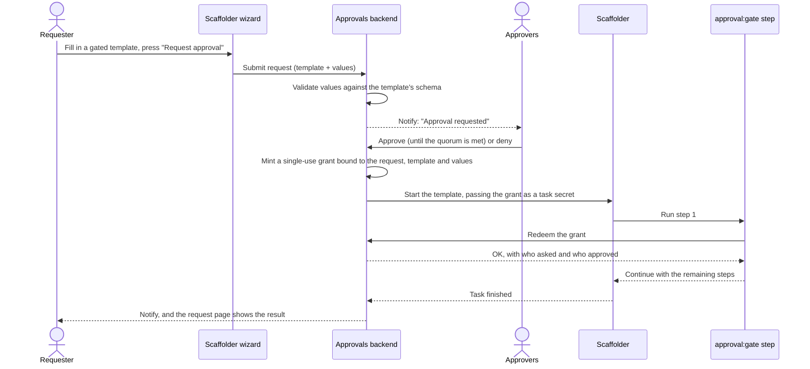
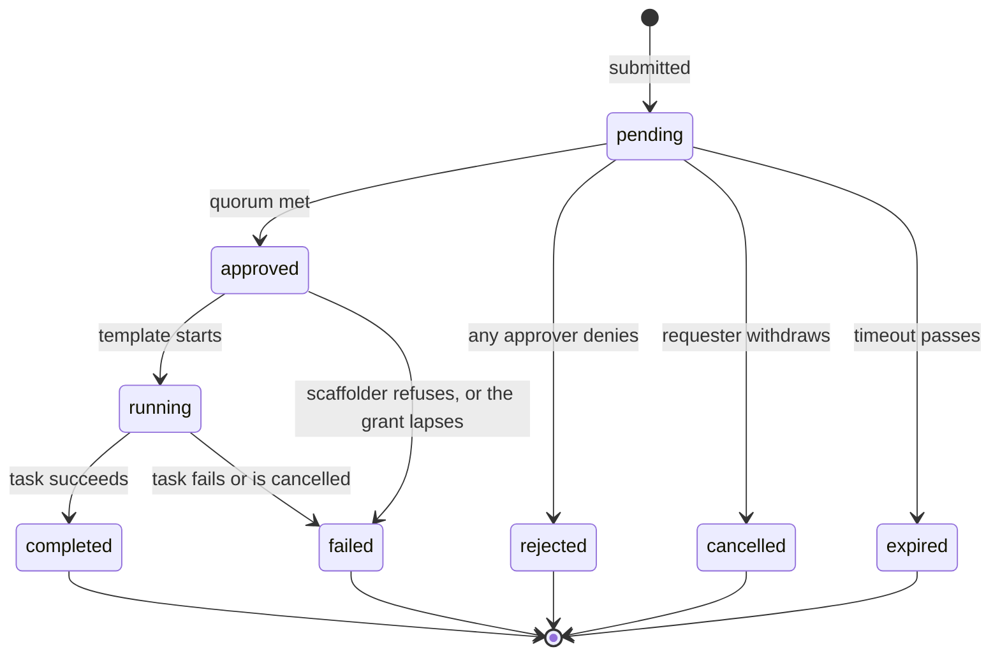
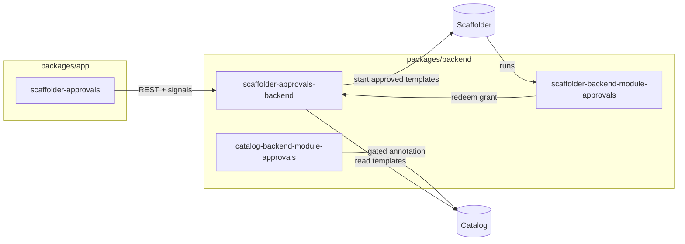

# Scaffolder Approvals documentation

Scaffolder Approvals adds **approval gates** to Backstage software templates. A gated template does not run when someone submits it. It creates an **approval request**, the people named in the template approve or deny it, and the template runs on its own once enough of them agree. If anyone denies it, it never runs.

## Start here

Pick the guide that matches what you are doing:

| I want to…                                              | Read                                                             |
| ------------------------------------------------------- | ---------------------------------------------------------------- |
| Understand what this is and how it works                | [Overview](#overview), below                                     |
| Install it in my Backstage app                          | [Getting started](getting-started.md)                            |
| Change the defaults (grant lifetime, data retention)    | [Configuration](configuration.md)                                |
| Make one of my templates need approval                  | [Writing gated templates](writing-gated-templates.md)            |
| Ask for, approve, deny or withdraw a request            | [User guide](user-guide.md)                                      |
| Know what the gate protects against, and write policies | [Security model and permissions](security-model.md)              |
| Hook Slack, audit or other tools into approval events   | [Notifications, events and signals](notifications-and-events.md) |
| Call the REST API                                       | [API reference](api-reference.md)                                |
| Fix something that is not working                       | [Troubleshooting](troubleshooting.md)                            |
| Run this repository locally, test changes, or release   | [Contributing](../CONTRIBUTING.md)                               |

## Overview

### Why it exists

The scaffolder runs a template from start to finish. It has no way to stop and wait for a person to say yes. That makes templates that grant access, create production resources or spend money hard to offer as self-service, because there is nowhere to put a second pair of eyes.

Gated workflows have been one of the most requested missing scaffolder features since [February 2023](https://github.com/backstage/backstage/issues/16622). Backstage core still has no way to pause a task: [BEP-0016](https://github.com/backstage/backstage/pull/34966) proposes one but has not been merged, and it names an interim community plugin as the right answer until then. This is that plugin.

### What you get

- **A gate you add to a template in one step.** Add an `approval:gate` step as the first step and say who approves, how many must agree, whether requesters may approve their own requests, and how long the request may wait.
- **A real gate, not a UI check.** The gate is a step inside the template, so calling the scaffolder API directly does not skip it. A gated template started any way other than through an approval fails at step one, before anything else runs.
- **Approvals bound to exactly what was asked.** An approval unlocks one run, of one template, with exactly the parameters that were approved.
- **An approvals page.** Approvers get an inbox of requests waiting on them; requesters see everything they have asked for and what happened to it; each request has its own page with who asked, who agreed, and the task log.
- **A smooth path in the scaffolder.** Gated templates show their approvers on the **Create…** page, and the wizard's last step says **Request approval** instead of **Create**.
- **A home-page card** showing how many requests are waiting on you.
- **Notifications, live updates and events.** Approvers and requesters are notified through the Backstage notifications plugin, pages update themselves through signals, and every state change is published on the events bus.
- **An audit trail.** Every request and every decision is kept, even after the submitted values are redacted for retention.
- **Permissions** that a policy can use to narrow who may submit, read, decide on or withdraw requests.

### How it works

1. A template author adds an `approval:gate` step to the template. A catalog module notices the step and marks the template as gated; nothing else needs to change.
2. A requester fills in the template as usual. On the last step they press **Request approval**, and an approval request is created instead of a task.
3. The approvers named in the gate are notified. Each one approves or denies, optionally with a comment. A single denial rejects the request.
4. When enough approvers agree, the approvals backend starts the template itself, handing it a **single-use grant**.
5. The template's first step, `approval:gate`, redeems that grant. The grant only works for this request, this template and these exact values. The step then lets the rest of the template run.
6. The request page follows the run through `running` to `completed` or `failed` and links to the task log.

A gated template started any other way, for example by calling the scaffolder API directly, has no grant. Its first step fails and every later step is skipped. The [security model](security-model.md) explains why that holds and the few template shapes the plugin refuses because it would not.

### Request lifecycle

The UI uses friendlier labels than the API:

| API status  | Shown as          | Meaning                                                                |
| ----------- | ----------------- | ---------------------------------------------------------------------- |
| `pending`   | Awaiting approval | Waiting for approvers                                                  |
| `approved`  | Starting          | The quorum was met and the template is being started; usually brief    |
| `running`   | Running           | The scaffolder task is running                                         |
| `completed` | Completed         | The task finished successfully                                         |
| `failed`    | Failed            | Approved, but the task failed, was refused, or could not start in time |
| `rejected`  | Denied            | An approver denied it                                                  |
| `cancelled` | Withdrawn         | The requester withdrew it before a decision                            |
| `expired`   | Expired           | Nobody decided before the gate's timeout                               |

`completed`, `failed`, `rejected`, `cancelled` and `expired` are final. To try again, submit a new request; a failed request has a **Resubmit** button that does that with the same values.

## Packages

The feature is split into six npm packages, following the [Backstage plugin package conventions](https://backstage.io/docs/overview/architecture-overview#package-architecture). You install four of them; the other two come in as dependencies.

| Package                                                                                                           | Role              | Install in               | What it does                                                                        |
| ----------------------------------------------------------------------------------------------------------------- | ----------------- | ------------------------ | ----------------------------------------------------------------------------------- |
| [`@ferin79/backstage-plugin-scaffolder-approvals`](../plugins/scaffolder-approvals)                               | Frontend plugin   | `packages/app`           | The approvals page, home-page card, gated review step and gated template card       |
| [`@ferin79/backstage-plugin-scaffolder-approvals-backend`](../plugins/scaffolder-approvals-backend)               | Backend plugin    | `packages/backend`       | Stores requests and decisions, mints grants, starts approved templates, runs sweeps |
| [`@ferin79/backstage-plugin-scaffolder-backend-module-approvals`](../plugins/scaffolder-backend-module-approvals) | Scaffolder module | The scaffolder's backend | Provides the `approval:gate` action                                                 |
| [`@ferin79/backstage-plugin-catalog-backend-module-approvals`](../plugins/catalog-backend-module-approvals)       | Catalog module    | The catalog's backend    | Marks templates with a gate as gated, and warns about gates that cannot work        |
| [`@ferin79/backstage-plugin-scaffolder-approvals-common`](../plugins/scaffolder-approvals-common)                 | Common library    | (dependency)             | Shared types, permissions and helpers, safe for frontend and backend                |
| [`@ferin79/backstage-plugin-scaffolder-approvals-node`](../plugins/scaffolder-approvals-node)                     | Node library      | (dependency)             | Backend helpers shared by the backend plugin and both modules                       |

## Compatibility

| Requirement     | Supported                                                                                                                                                                                                |
| --------------- | -------------------------------------------------------------------------------------------------------------------------------------------------------------------------------------------------------- |
| Backstage       | Built and tested on **1.55** (`@backstage/plugin-scaffolder-backend` 4.2)                                                                                                                                |
| Backend system  | The **new backend system** (`createBackend`) only                                                                                                                                                        |
| Frontend system | **Legacy** frontend system: everything. **New** frontend system: the approvals page and home-page widget, but not the gated review step or template card ([why](getting-started.md#new-frontend-system)) |
| Database        | PostgreSQL and SQLite (CI runs PostgreSQL 18 and SQLite). Migrations run on start-up                                                                                                                     |
| Node.js         | 22 or 24                                                                                                                                                                                                 |

## Limitations

These are known and deliberate for now:

- **The gate must be the first step.** A template cannot pause halfway through. That needs a suspend/resume primitive in Backstage core ([BEP-0016](https://github.com/backstage/backstage/pull/34966)).
- **Approved runs act as the plugin, not the requester.** `${{ user.* }}` is empty in an approved run, and the requester's OAuth token is not available. See [Writing gated templates](writing-gated-templates.md#what-an-approved-run-can-and-cannot-see).
- **Gated templates cannot have secret fields.** The scaffolder does not keep secrets long enough to survive the wait.
- **Every signed-in user can read every request**, as with the scaffolder's own task list.
- **No entity card on Template pages** yet; the approvals page and the home-page card are the UI.

## Design records

Background reading for contributors and reviewers. They were written while the plugins lived in a `backstage/community-plugins` workspace, so paths such as `workspaces/scaffolder-approvals/plugins/...` in them are `plugins/...` in this repository.

- [Design and decision record](GATED_SCAFFOLDER_WORKFLOWS.md): the problem, the options considered, and the decisions (Q1–Q23)
- [Implementation guide](GATED_SCAFFOLDER_IMPLEMENTATION.md): how the packages are built, file by file
- [Review](GATED_SCAFFOLDER_REVIEW.md): the code review the plugins went through
