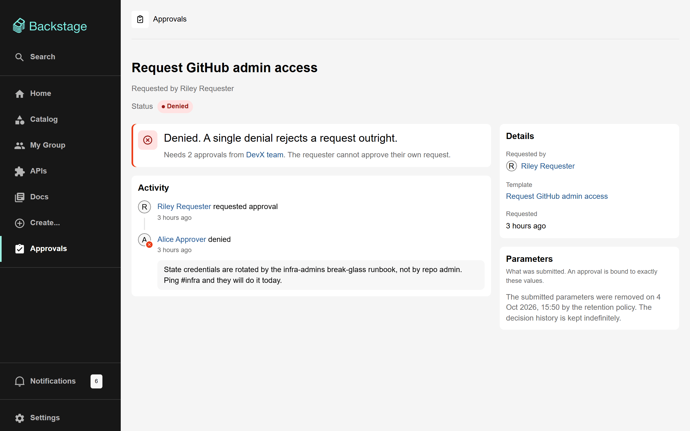

# Configuration

Scaffolder Approvals works with no configuration at all. This page covers the few settings it has, and the Backstage settings it depends on.

> [!NOTE] > **Gate policy is not configured here.** Who approves, how many must agree, whether requesters can approve their own requests, and how long a request may wait are all set in each template's `approval:gate` step. The people who own a template own its gate. See [Writing gated templates](writing-gated-templates.md).

## `app-config.yaml` reference

The complete configuration, with every default:

```yaml
scaffolderApprovals:
  # How long an approval stays usable once granted.
  grantTtl: { hours: 1 }

  retention:
    # How long submitted values are kept before being redacted.
    redactAfter: { days: 180 }

  # Which service principals may redeem an approval grant.
  grantConsumers: ['plugin:scaffolder']
```

| Key                                         | Default                 | What it controls                                                                                                     |
| ------------------------------------------- | ----------------------- | -------------------------------------------------------------------------------------------------------------------- |
| `scaffolderApprovals.grantTtl`              | `{ hours: 1 }`          | How long the single-use grant minted on approval stays redeemable. It only has to survive the launch of the template |
| `scaffolderApprovals.retention.redactAfter` | `{ days: 180 }`         | How long after a request is settled its submitted values and summary are kept before being redacted                  |
| `scaffolderApprovals.grantConsumers`        | `['plugin:scaffolder']` | The service principals allowed to call `POST /grants/consume`. Only change this for a split deployment (see below)   |

### Durations

`grantTtl` and `redactAfter` accept any of Backstage's usual duration forms:

| Form               | Example                                                 |
| ------------------ | ------------------------------------------------------- |
| An object of units | `{ hours: 1 }`, `{ days: 90 }`, `{ weeks: 2, days: 3 }` |
| A string           | `'1h'`, `'90 days'`                                     |
| ISO 8601           | `'PT1H'`, `'P180D'`                                     |

Both are checked when the backend starts. A misspelt unit such as `{ hour: 1 }`, a bare number, or a duration of zero stops the backend with an error naming the key. That is on purpose: read as zero, a grant lifetime would make every approved request fail to launch, and a retention window would redact every request at once.

> [!WARNING] > **Use the string form when overriding a duration in another config file.** Backstage merges config objects key by key, so `{ hours: 12 }` in `app-config.production.yaml` on top of `{ days: 180 }` in `app-config.yaml` becomes 180 days **and** 12 hours, not 12 hours. A string replaces the value outright: `redactAfter: '12h'`.

### `grantTtl`: how long an approval stays usable

When the last needed approval lands, the backend mints a grant and starts the template straight away. The grant only has to last until the template's first step redeems it, which normally takes seconds.

The hour of slack covers a scaffolder that is briefly down or busy: the backend retries a launch that did not happen every two minutes until the grant expires. If the grant expires first, the request moves to **Failed** with "the approval grant expired before the template could start", and the requester has to submit again.

Keep it short. A grant is a capability to run the template, and a long-lived one is only useful to someone who should not have it.

### `retention.redactAfter`: how long submitted values are kept

Submitted values can carry personal data, such as an access justification. Once a request has been settled for this long, a sweep that runs every six hours clears its **values** and **summary**.

What is kept indefinitely: the request itself, who asked, the template, the status, every decision with its comment, the task id, and a hash of the values. That is the audit trail this feature exists to produce.

Redaction cannot be turned off. To keep values longer, set a long window, for example `{ years: 7 }`.



### `grantConsumers`: split deployments

Redeeming a grant is restricted to the scaffolder's own service principal, `plugin:scaffolder`. A grant cannot be forged, but a service that had _seen_ one could spend it, and a spent grant makes the legitimate task fail at its gate.

You only need to change this if the scaffolder presents a different subject to the approvals backend, for example because it runs in a separate deployment with a renamed plugin id, or behind a gateway. The refused subject is logged when this happens, so you can see what to add:

```yaml
scaffolderApprovals:
  grantConsumers: ['plugin:scaffolder', 'plugin:scaffolder-eu']
```

## Settings this plugin depends on

These are ordinary Backstage settings, listed because the plugin relies on them.

| Setting              | Why it matters                                                                                                                                                                                                           |
| -------------------- | ------------------------------------------------------------------------------------------------------------------------------------------------------------------------------------------------------------------------ |
| `app.baseUrl`        | Notification links are built from it: `<app.baseUrl>/scaffolder-approvals/requests/<id>`                                                                                                                                 |
| `backend.database`   | Requests, decisions and grants are stored in the plugin's own database, like any Backstage plugin's, and its tables are created and migrated on start-up                                                                 |
| `permission.enabled` | Must be `true` for any permission policy to apply. With it unset, every request is allowed, but the gate's own rules (approvers, quorum, self-approval) still apply. See [Security model](security-model.md#permissions) |
| `auth.providers.*`   | Approvers are matched by the user entity ref and group refs in their Backstage token, so sign-in must resolve to catalog users with `memberOf`                                                                           |

### Scheduled jobs

The backend runs three jobs through the Backstage scheduler. Their schedules are fixed; in a multi-instance deployment each run happens on one instance only.

| Job id                           | Every     | What it does                                                                                                                           |
| -------------------------------- | --------- | -------------------------------------------------------------------------------------------------------------------------------------- |
| `scaffolder-approvals-reconcile` | 2 minutes | Retries a launch that did not happen, recovers a lost task id, fails a request whose grant expired unused, and picks up finished tasks |
| `scaffolder-approvals-timeouts`  | 5 minutes | Expires pending requests that nobody decided on before the gate's `timeout`                                                            |
| `scaffolder-approvals-retention` | 6 hours   | Redacts the values and summary of long-settled requests                                                                                |

Each run handles a capped batch, so a backlog built up during an outage drains steadily instead of hitting the scaffolder all at once.

The jobs can be triggered by hand through the scheduler's API, which is useful when testing:

```sh
curl -X POST -H "Authorization: Bearer $TOKEN" \
  "$BACKSTAGE_URL/api/scaffolder-approvals/.backstage/scheduler/v1/tasks/scaffolder-approvals-retention/trigger"
```

## Optional integrations

The backend starts and works whether or not these are installed. Install them for a better experience.

| Plugin                | With it                                                                                                              | Without it                                                               |
| --------------------- | -------------------------------------------------------------------------------------------------------------------- | ------------------------------------------------------------------------ |
| Notifications backend | Approvers and requesters get [notifications](notifications-and-events.md#notifications)                              | Nobody is told; people have to look at the approvals page                |
| Signals backend       | Request pages, the inbox and the home-page card update live                                                          | Pages show what they loaded until reloaded                               |
| Events backend        | Task status updates immediately; [approval events](notifications-and-events.md#events) are published for other tools | Status updates on the next reconciliation run, at most two minutes later |

Failed notification or signal deliveries are logged and never undo a decision that has already been recorded.
