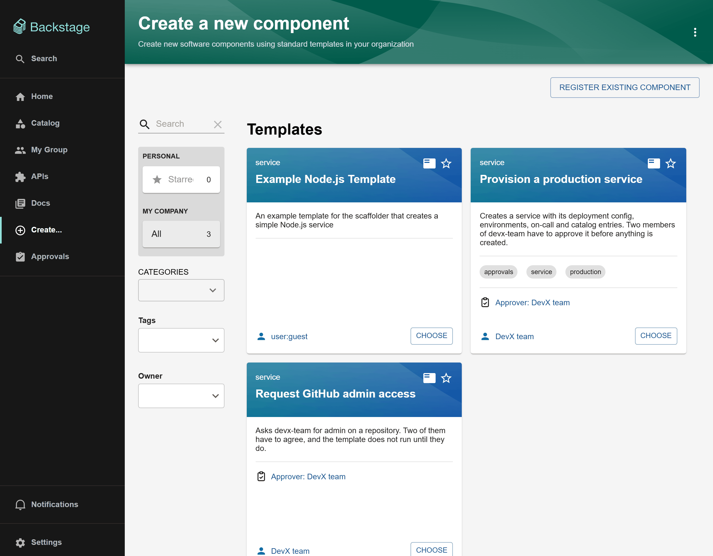
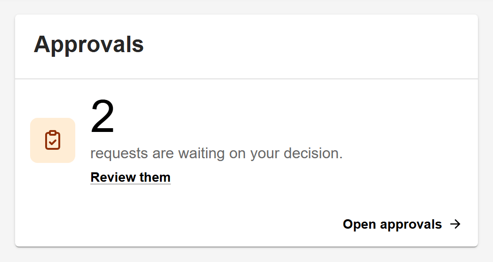

# Getting started

This guide installs Scaffolder Approvals in an existing Backstage app and gates your first template. Allow about 20 minutes.

You will:

1. [Check the prerequisites](#1-check-the-prerequisites)
2. [Install the backend packages](#2-install-the-backend-packages)
3. [Install the frontend package](#3-install-the-frontend-package)
4. [Gate a template](#4-gate-a-template)
5. [Check that it works](#5-check-that-it-works)

If your app uses the **new frontend system**, follow [New frontend system](#new-frontend-system) instead of step 3.

> [!TIP]
> Want to see it working before installing it? This repository is a complete Backstage app with everything wired up and two example gated templates. See [Contributing](../CONTRIBUTING.md#run-the-app) for how to run it.

## 1. Check the prerequisites

| You need                                                                                           | Why                                                                                             |
| -------------------------------------------------------------------------------------------------- | ----------------------------------------------------------------------------------------------- |
| A Backstage app on the **new backend system** (`createBackend` in `packages/backend/src/index.ts`) | The backend packages are new-backend-system plugins and modules                                 |
| Backstage **1.55** or close to it                                                                  | It is built and tested against 1.55 and scaffolder backend 4.2                                  |
| The **scaffolder** and **catalog** backends                                                        | Gated templates are scaffolder templates stored in the catalog                                  |
| `@backstage/plugin-catalog-backend-module-scaffolder-entity-model`                                 | Without it the catalog silently drops every `Template` entity                                   |
| A user sign-in that resolves to catalog users with group membership                                | Approvers are usually named as groups; their members are found from the signed-in user's groups |

Recommended, but optional:

| Plugin                                                                   | What it adds                                                                                                              |
| ------------------------------------------------------------------------ | ------------------------------------------------------------------------------------------------------------------------- |
| [Notifications](https://backstage.io/docs/notifications/)                | Approvers are told about new requests; requesters are told about decisions and failures                                   |
| [Signals](https://backstage.io/docs/notifications/#optional-add-signals) | Request pages, the inbox and the home-page card update without a reload                                                   |
| [Events](https://backstage.io/docs/plugins/events/) backend              | Task status arrives immediately instead of on the next two-minute sweep, and other tools can subscribe to approval events |
| [Home](https://backstage.io/docs/getting-started/homepage)               | Somewhere to put the "waiting on you" card                                                                                |

Without them everything still works: there are just no notifications, pages need a reload to show changes, and task status can take up to two minutes to appear.

## 2. Install the backend packages

### Add the packages

From your Backstage root directory:

```sh
yarn --cwd packages/backend add \
  @ferin79/backstage-plugin-scaffolder-approvals-backend \
  @ferin79/backstage-plugin-scaffolder-backend-module-approvals \
  @ferin79/backstage-plugin-catalog-backend-module-approvals
```

### Register them

Add them to `packages/backend/src/index.ts`, next to the scaffolder and catalog:

```ts
// packages/backend/src/index.ts
import { createBackend } from '@backstage/backend-defaults';

const backend = createBackend();

// Scaffolder, and the approval:gate action it runs
backend.add(import('@backstage/plugin-scaffolder-backend'));
backend.add(
  import('@ferin79/backstage-plugin-scaffolder-backend-module-approvals'),
);

// Catalog, the Template kind, and the module that marks gated templates
backend.add(import('@backstage/plugin-catalog-backend'));
backend.add(
  import('@backstage/plugin-catalog-backend-module-scaffolder-entity-model'),
);
backend.add(
  import('@ferin79/backstage-plugin-catalog-backend-module-approvals'),
);

// Approval requests, decisions, grants and the REST API
backend.add(import('@ferin79/backstage-plugin-scaffolder-approvals-backend'));

// Optional: notifications, live updates and events
backend.add(import('@backstage/plugin-notifications-backend'));
backend.add(import('@backstage/plugin-signals-backend'));
backend.add(import('@backstage/plugin-events-backend'));

// ...your other plugins

backend.start();
```

| Package                               | Where it must go                                                               |
| ------------------------------------- | ------------------------------------------------------------------------------ |
| `scaffolder-approvals-backend`        | Any backend. In a split deployment it must be reachable through discovery      |
| `scaffolder-backend-module-approvals` | The **same backend as the scaffolder**: the gate is a step the scaffolder runs |
| `catalog-backend-module-approvals`    | The **same backend as the catalog**: it is a catalog processor                 |

The approvals backend creates its own database tables and runs its migrations on start-up. It uses the same database configuration as the rest of your backend, so there is nothing to set up.

### Optional: configure it

Nothing needs configuring. The defaults are a one-hour grant lifetime and a 180-day retention window for submitted values. To change them, see [Configuration](configuration.md).

## 3. Install the frontend package

These steps are for the **legacy frontend system**, which most apps still use (an `App.tsx` with `<FlatRoutes>`). The gated review step and template card only work there.

```sh
yarn --cwd packages/app add @ferin79/backstage-plugin-scaffolder-approvals
```

### 3.1 Add the approvals page

Mount the page at `/scaffolder-approvals`:

```tsx
// packages/app/src/App.tsx
import { ApprovalsIndexPage } from '@ferin79/backstage-plugin-scaffolder-approvals';

const routes = (
  <FlatRoutes>
    {/* ...other routes */}
    <Route path="/scaffolder-approvals" element={<ApprovalsIndexPage />} />
  </FlatRoutes>
);
```

> [!IMPORTANT]
> Use the path `/scaffolder-approvals`. Links in notifications are built as `<app.baseUrl>/scaffolder-approvals/requests/<id>`, so a page mounted anywhere else works but every notification link points at a 404.

### 3.2 Add a sidebar item

So that approvers can find their inbox:

```tsx
// packages/app/src/components/Root/Root.tsx
import ApprovalsIcon from '@material-ui/icons/AssignmentTurnedIn';

<SidebarItem icon={ApprovalsIcon} to="scaffolder-approvals" text="Approvals" />;
```

### 3.3 Let requesters submit from the scaffolder

Without this step, a requester who presses **Create** on a gated template gets a failed task telling them the template needs approval. With it, the wizard's last step shows who will be asked and its button says **Request approval**.


The scaffolder lets an app replace its review step, but it does not export its built-in one. So you provide a complete review step (the values table plus **Back** and **Create**) and wrap it in `GatedReviewStep`. Create this file:

```tsx
// packages/app/src/components/scaffolder/ReviewStep.tsx
import { GatedReviewStep } from '@ferin79/backstage-plugin-scaffolder-approvals';
import type { ReviewStepProps } from '@backstage/plugin-scaffolder-react';
import {
  ReviewState,
  type ParsedTemplateSchema,
} from '@backstage/plugin-scaffolder-react/alpha';
import { Button, Flex } from '@backstage/ui';

/** The scaffolder's usual last step: the values, then Back and Create. */
const DefaultReviewStep = (props: ReviewStepProps) => (
  <>
    <ReviewState
      formState={props.formData}
      schemas={props.steps as ParsedTemplateSchema[]}
    />
    <Flex justify="end" mt="4" gap="2">
      <Button
        variant="tertiary"
        onPress={props.handleBack}
        isDisabled={props.disableButtons}
      >
        Back
      </Button>
      <Button
        variant="primary"
        onPress={props.handleCreate}
        isDisabled={props.disableButtons}
      >
        Create
      </Button>
    </Flex>
  </>
);

/** Gated templates ask for approval; every other template is unchanged. */
export const ReviewStep = (props: ReviewStepProps) => (
  <GatedReviewStep {...props}>
    <DefaultReviewStep {...props} />
  </GatedReviewStep>
);
```

It needs `@backstage/plugin-scaffolder-react` and `@backstage/ui` in `packages/app`, which most apps already have. If you already have a custom review step, wrap that instead of `DefaultReviewStep`.

Then pass it to the scaffolder page:

```tsx
// packages/app/src/App.tsx
import { ReviewStep } from './components/scaffolder/ReviewStep';

<Route
  path="/create"
  element={<ScaffolderPage components={{ ReviewStepComponent: ReviewStep }} />}
/>;
```

`GatedReviewStep` renders your review step untouched for every template that is not gated.

> [!NOTE]
> This is a convenience, not the enforcement. Remove it and gated templates are still gated: started any other way, they fail at their first step.

### 3.4 Show approvers on the Create page

`GatedTemplateCard` is the scaffolder's own template card with an "Approver: …" link added to gated templates, so people know before they start that a template needs approval. Other templates' cards are unchanged.



```tsx
// packages/app/src/App.tsx
import {
  ApprovalsIndexPage,
  GatedTemplateCard,
} from '@ferin79/backstage-plugin-scaffolder-approvals';

<Route
  path="/create"
  element={
    <ScaffolderPage
      components={{
        ReviewStepComponent: ReviewStep,
        TemplateCardComponent: GatedTemplateCard,
      }}
    />
  }
/>;
```

### 3.5 Add the home-page card

Nothing reminds an approver twice, so a request that arrives while someone is away can sit until it expires. The card puts the count where people already look.



```tsx
// packages/app/src/components/home/HomePage.tsx
import { PendingApprovalsHomePageCard } from '@ferin79/backstage-plugin-scaffolder-approvals';

<Grid item xs={12} md={6}>
  <PendingApprovalsHomePageCard />
</Grid>;
```

It is a [home plugin card extension](https://backstage.io/docs/getting-started/homepage), so it also works in a customizable home page grid.

### 3.6 Check the stylesheet and font

The plugin's pages are built with [Backstage UI](https://ui.backstage.io) (BUI). Make sure your app loads BUI's stylesheet; apps created from recent templates already do:

```tsx
// packages/app/src/index.tsx
import '@backstage/ui/css/styles.css';
```

BUI draws text in `system-ui`, while Backstage's Material UI themes use Helvetica Neue and Roboto. To make the approvals pages match the rest of an MUI-themed app, load this stylesheet after BUI's:

```css
/* packages/app/src/bui-theme.css, imported after '@backstage/ui/css/styles.css' */
:root,
[data-theme-mode] {
  --bui-font-regular: 'Helvetica Neue', Helvetica, Roboto, Arial, sans-serif;
}
```

### 3.7 Optional: notifications and signals in the frontend

If you installed the notifications and signals backends, add their frontends as their own docs describe. In a legacy app that is:

```tsx
// packages/app/src/App.tsx
import { NotificationsPage } from '@backstage/plugin-notifications';
import { SignalsDisplay } from '@backstage/plugin-signals';

<Route path="/notifications" element={<NotificationsPage />} />;

// In the root, next to <AlertDisplay />:
<SignalsDisplay />;
```

and a `NotificationsSidebarItem` in `Root.tsx`. The approvals pages pick up signals by themselves.

## New frontend system

If your app is built with `createApp` from `@backstage/frontend-defaults`, install the package and add the plugin from its `/alpha` entry point:

```ts
// packages/app/src/App.tsx
import approvalsPlugin from '@ferin79/backstage-plugin-scaffolder-approvals/alpha';

export default createApp({
  features: [approvalsPlugin],
});
```

You get:

- the approvals page at `/scaffolder-approvals`, with its own sidebar entry, **Approvals**;
- the home-page widget, listed in the widget catalogue as **Approvals**.

You do **not** get the gated review step or the template card. In Backstage 1.55, the new frontend system's scaffolder page takes field extensions and layouts but no review-step component, so there is nowhere to install `GatedReviewStep`. A requester who presses **Create** on a gated template gets a failed task explaining that the template needs approval. The gate still holds; only the convenient way in is missing. This is why this repository's own app uses the legacy frontend system.

## 4. Gate a template

Add an `approval:gate` step as the **first** step of a template:

```yaml
apiVersion: scaffolder.backstage.io/v1beta3
kind: Template
metadata:
  name: request-github-admin
  title: Request GitHub admin access
spec:
  type: service
  owner: group:default/devx-team
  parameters:
    - title: What do you need?
      required: [repository, justification]
      properties:
        repository:
          title: Repository
          type: string
        justification:
          title: Why
          type: string
          minLength: 10
  steps:
    - id: gate
      name: Await approval
      action: approval:gate
      input:
        approvers: [group:default/devx-team]
        quorum: 2
        timeout: { hours: 72 }
        summary: 'Admin on ${{ parameters.repository }}'
        values: ${{ parameters }} # required, exactly like this

    - id: grant
      name: Grant the access
      action: debug:log # replace with the action that does the real work
      input:
        message: |
          Admin on ${{ parameters.repository }}
          for ${{ steps.gate.output.requestedBy }},
          approved by ${{ steps.gate.output.approvedBy }}
```

That is all. You do not add an annotation: the catalog module sees the step and marks the template as gated.

[Writing gated templates](writing-gated-templates.md) covers every gate option, what an approved run can and cannot use, and the template shapes the plugin refuses.

## 5. Check that it works

Restart the backend, give the catalog a minute to process the template, then:

1. **The template is marked gated.** Its catalog entity has the annotation `scaffolder-approvals.backstage.io/gated: 'true'`. (Open the template in the catalog and choose **Inspect entity**.)
2. **The Create page names the approvers** (if you installed `GatedTemplateCard`).
3. **The wizard asks for approval.** Fill the template in as one user and press **Request approval**. You land on the request's page.
4. **An approver can approve.** Sign in as a member of the approver group who is not the requester. The request is in **Approvals → Waiting on you**. Approve it.
5. **The template runs.** Once the quorum is met the request moves to **Running** and then **Completed**, with a link to the task log.
6. **The gate cannot be skipped.** Start the template straight through the scaffolder API, with your own Backstage token and values that fit the template:

   ```sh
   curl -X POST "$BACKSTAGE_URL/api/scaffolder/v2/tasks" \
     -H "Authorization: Bearer $TOKEN" -H 'Content-Type: application/json' \
     -d '{"templateRef": "template:default/request-github-admin",
          "values": {"repository": "acme/test", "justification": "checking the gate"}}'
   ```

   Open the returned task at `/create/tasks/<id>`. It has failed at **Await approval** with "This template requires approval before it can run", and every later step is skipped.

   In this repository, [`scripts/verify-gate.sh`](../scripts/verify-gate.sh) runs that check, and three more, against the example template.

If something is not working, see [Troubleshooting](troubleshooting.md).

## Next steps

- [Writing gated templates](writing-gated-templates.md): gate options and patterns
- [User guide](user-guide.md): share with the people who will request and approve
- [Security model and permissions](security-model.md): what the gate protects, and how to lock down high-risk actions
- [Configuration](configuration.md): grant lifetime, retention, split deployments
