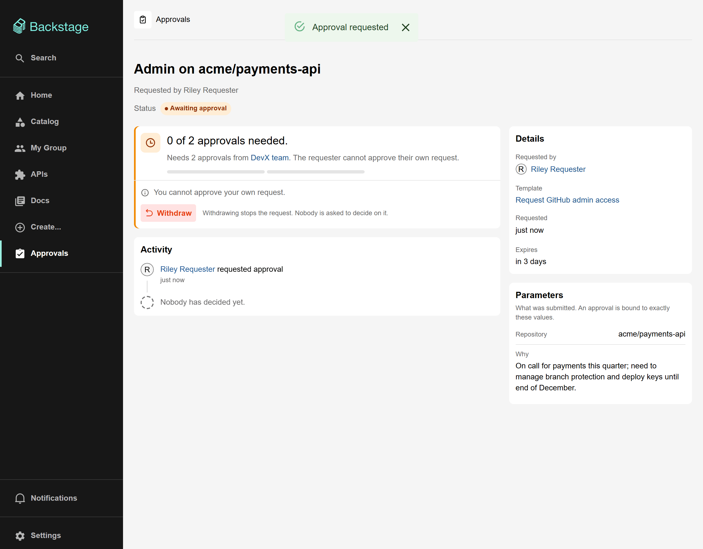
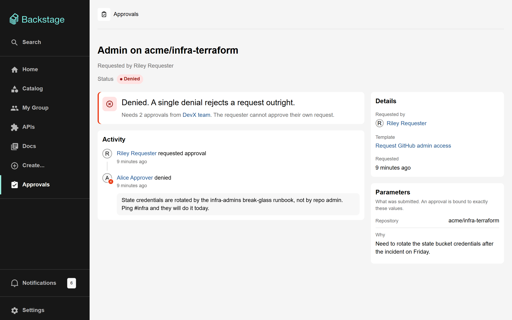
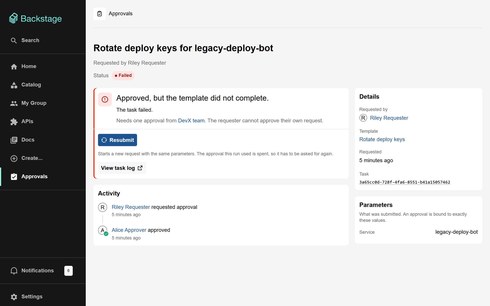
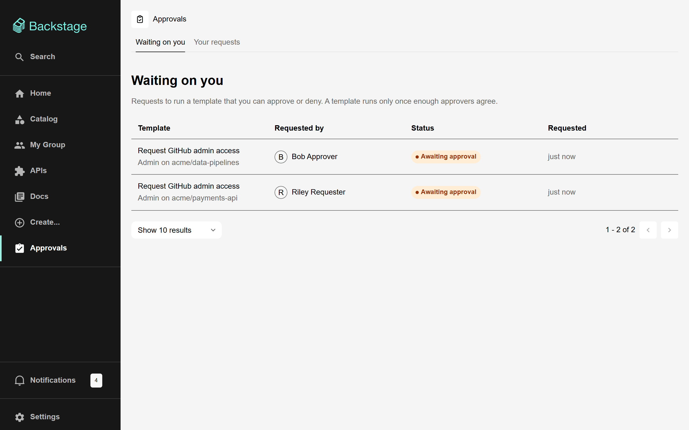
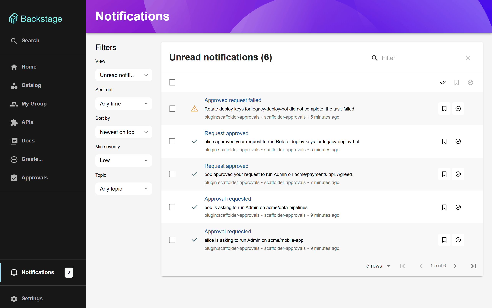
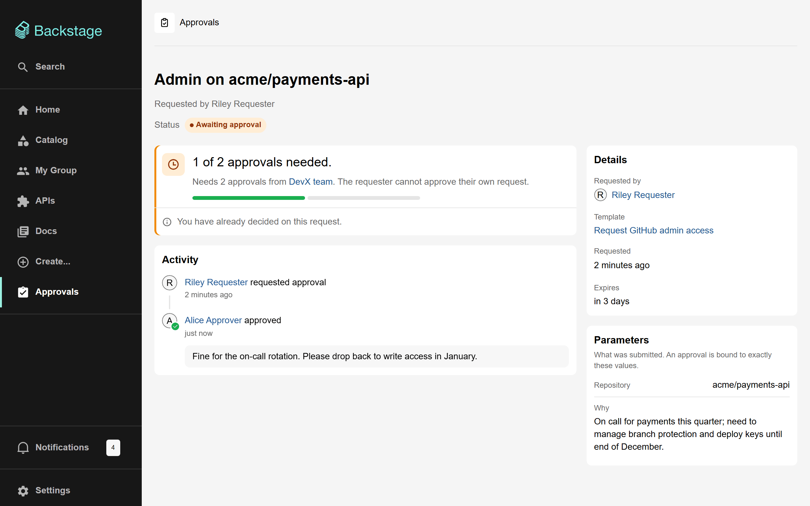
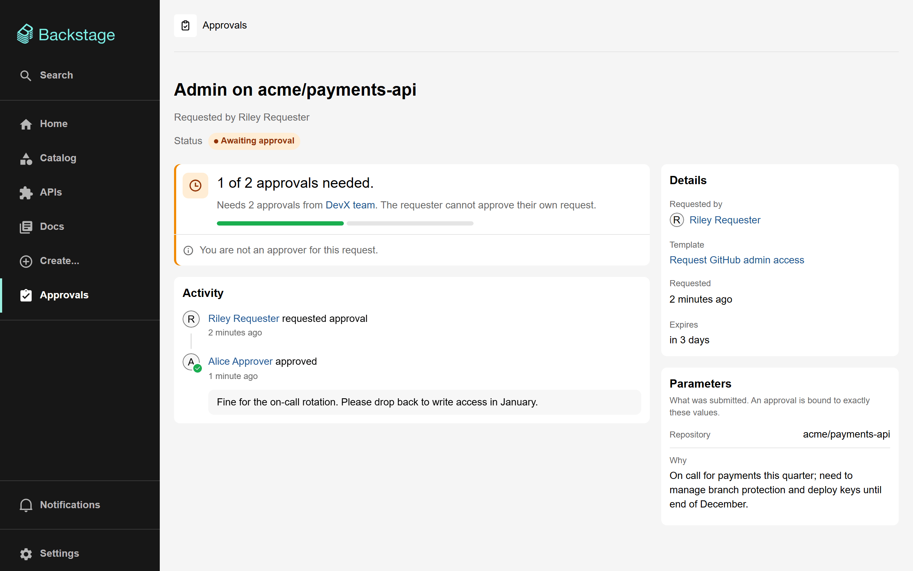

# User guide

This guide is for the people who use gated templates: **requesters**, who ask for something, and **approvers**, who decide. It assumes your Backstage administrators have [installed the plugin](getting-started.md) and someone has gated a template.

- [For requesters](#for-requesters)
  - [Find a gated template](#find-a-gated-template)
  - [Submit a request](#submit-a-request)
  - [Follow your request](#follow-your-request)
  - [Withdraw a request](#withdraw-a-request)
  - [If your request is denied, expires or fails](#if-your-request-is-denied-expires-or-fails)
- [For approvers](#for-approvers)
  - [Find requests waiting on you](#find-requests-waiting-on-you)
  - [Review a request](#review-a-request)
  - [Approve or deny](#approve-or-deny)
  - [Why can't I approve?](#why-cant-i-approve)
- [Request statuses](#request-statuses)

## For requesters

### Find a gated template

Gated templates are on the **Create…** page with every other template. A gated template's card names who approves it, for example **Approver: DevX team**. Select the name to see who is in that group.

### Submit a request

1. Choose the template and fill in the form as usual.
2. On the last step, check your answers. A box tells you the template needs approval, who will be asked and how many of them must agree.
3. Press **Request approval**.

Nothing runs yet. Your answers are checked against the template straight away, so a request that could never run is refused now rather than after people have spent time on it. You land on your request's page, and the approvers are notified.

The request page shows:

- **The status** and how many approvals it has, for example "0 of 2 approvals needed".
- **Who can approve.** Select the group name to see its members.
- **Activity:** who asked, and each approval or denial with its comment.
- **Details:** the template, when you asked, and when the request expires if nobody decides.
- **Parameters:** exactly what you submitted. An approval applies to exactly these values; if you need something different, submit a new request.

Submitting the same template with the same answers again, while your first request is still waiting, does not create a duplicate. You are taken to the request you already have.

### Follow your request

**Approvals → Your requests** lists everything you have asked for and what happened to it.

You are notified when your request is approved, denied, fails or expires. With live updates enabled, an open request page changes by itself as approvers decide and the template runs.

Once approved, the template starts on its own. The request moves to **Running**, then **Completed** or **Failed**, and **View task log** opens the scaffolder's log of the run.

> [!NOTE]
> An approved template runs as the approvals plugin, not as you, so it does **not** appear in the scaffolder's own "My tasks" list. The approvals page is where to follow it.

### Withdraw a request

While a request is still **Awaiting approval**, its page has a **Withdraw** button. Withdrawing stops it: approvers are no longer asked to decide, and their "Approval requested" notification is replaced. A withdrawn request cannot be reopened; submit a new one if you change your mind.

### If your request is denied, expires or fails

| Status      | What happened                                                                       | What to do                                                                           |
| ----------- | ----------------------------------------------------------------------------------- | ------------------------------------------------------------------------------------ |
| **Denied**  | An approver said no. One denial is enough, whatever the number of approvals         | Read their comment in **Activity**. Fix what they asked for and submit a new request |
| **Expired** | Nobody decided before the template's time limit                                     | Submit again, and consider telling the approvers directly                            |
| **Failed**  | It was approved, but the template did not complete. The reason is shown on the page | Open **View task log** to see why. Once the cause is fixed, press **Resubmit**       |

**Resubmit** starts a _new_ request with the same answers. The original approval was used up by the failed run, so the approvers have to agree again. If the failure was in the template itself, ask its owners to fix it first.

The reasons a failed request can show:

| Reason shown                                               | Meaning                                                                                                                                     |
| ---------------------------------------------------------- | ------------------------------------------------------------------------------------------------------------------------------------------- |
| the task failed                                            | A step after the gate failed. The task log says which                                                                                       |
| the task was cancelled                                     | Someone cancelled the running task in the scaffolder                                                                                        |
| the approval grant expired before the template could start | The scaffolder could not be reached for longer than an approval stays valid (an hour by default)                                            |
| the scaffolder refused to start the template (…)           | The scaffolder's own answer follows. For example, the template's form changed so your answers no longer fit it, or the template was removed |
| the scaffolder no longer has a record of the task          | The task was deleted from the scaffolder while it ran                                                                                       |

## For approvers

### Find requests waiting on you

You will hear about a request in up to three places:

- a **notification**, "Approval requested", when it is submitted;
- the **Approvals** card on the home page, which counts requests waiting on you;
- **Approvals → Waiting on you** in the sidebar.

**Waiting on you** lists only requests you can act on now: pending requests naming you or one of your groups, that you have not already decided on, and that you did not submit yourself (unless the template allows self-approval).

### Review a request

Open the request and check:

- **What is being asked for**: the title and the **Parameters** panel. An approval covers exactly these values and nothing else.
- **Who is asking** and why, in the parameters the template collects.
- **Who else has decided**, in **Activity**, with their comments.
- **Warnings at the top of the page.** If the template has changed since the request was made, you are told how:

  

  | Warning                                     | What it means for your decision                                                                                                    |
  | ------------------------------------------- | ---------------------------------------------------------------------------------------------------------------------------------- |
  | The steps in this template have been edited | If you approve, the **edited** steps run, not the ones that existed when the request was made. Check the template's recent changes |
  | The template was deleted and recreated      | It has the same name as the one requested, and nothing else in common                                                              |
  | The template is no longer in the catalog    | Approving will fail: there is nothing left to run                                                                                  |
  | The parameters have changed                 | The answers no longer fit the template, so approving will fail. Deny it, and ask the requester to submit again                     |

### Approve or deny

Press **Approve** or **Deny**. A dialog asks you to confirm and lets you add a comment, which the requester and the other approvers will see.

- **Approve** counts towards the number of approvals needed. When the last one needed arrives, the template starts straight away; there is no separate "run" button.
- **Deny** rejects the request outright, whatever the number of approvals so far. Say why in the comment so the requester can fix it.
- **You cannot change your decision**, and you can only decide once per request.

### Why can't I approve?

When the buttons are missing, the request page says why:

| Message                                   | Why                                                                                                                                                                              |
| ----------------------------------------- | -------------------------------------------------------------------------------------------------------------------------------------------------------------------------------- |
| You are not an approver for this request. | You are not one of the users, or a member of one of the groups, the template names. You must be a **direct** member of the group; membership of a group inside it does not count |
| You cannot approve your own request.      | You submitted it, and the template does not allow self-approval                                                                                                                  |
| You have already decided on this request. | You approved or denied it already. Decisions cannot be changed                                                                                                                   |
| This request has already been decided.    | It is no longer waiting: it was approved, denied, withdrawn or expired                                                                                                           |

**Just added to the approver group?** Sign out and back in. Your groups are read when you sign in, so a new membership counts from your next sign-in.

## Request statuses

| Status shown          | Meaning                                                              | Final? |
| --------------------- | -------------------------------------------------------------------- | ------ |
| **Awaiting approval** | Waiting for approvers                                                | No     |
| **Starting**          | Approved; the template is being started. Usually lasts a few seconds | No     |
| **Running**           | The template is running                                              | No     |
| **Completed**         | The template ran successfully                                        | Yes    |
| **Failed**            | Approved, but the template did not complete                          | Yes    |
| **Denied**            | An approver denied it                                                | Yes    |
| **Withdrawn**         | The requester withdrew it                                            | Yes    |
| **Expired**           | Nobody decided in time                                               | Yes    |

A request's values and summary are removed after a retention period (180 days by default). The request, who asked and who decided are kept for good, and the page explains that the values were removed.
