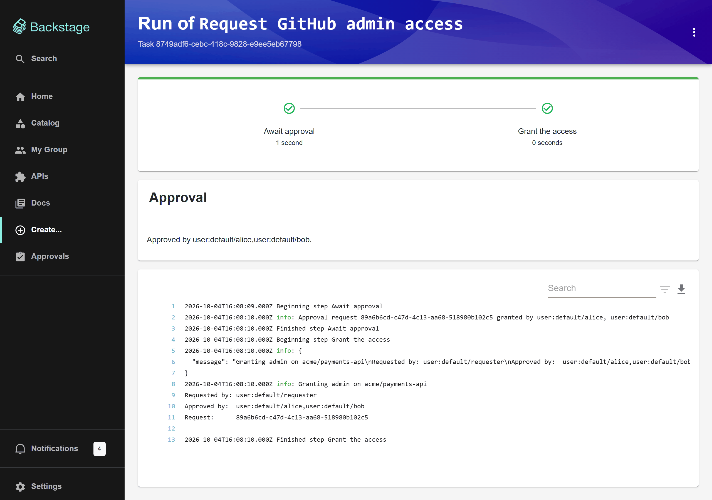
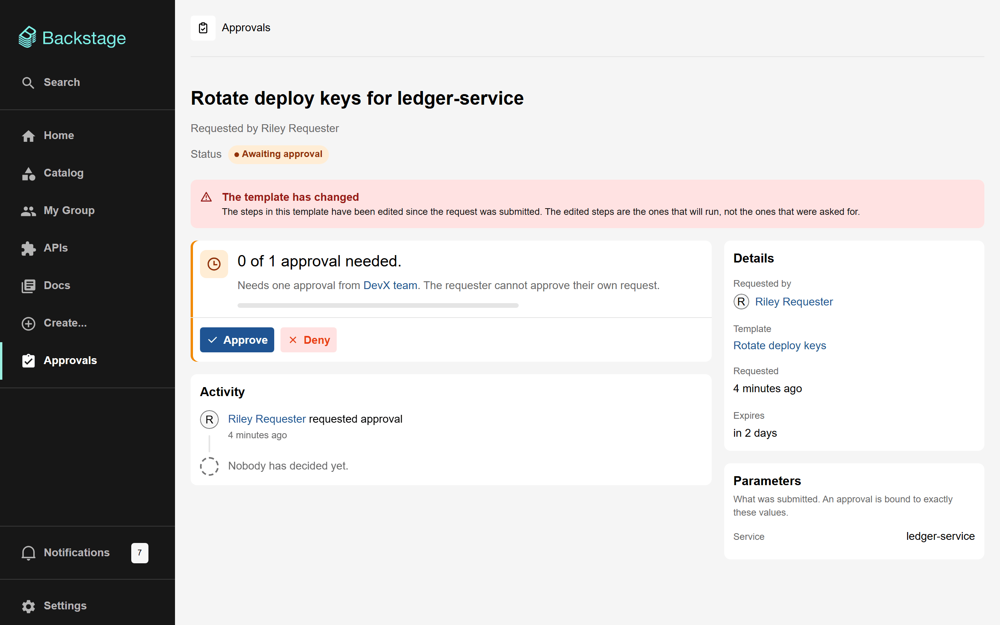

# Writing gated templates

A gated template is an ordinary scaffolder template whose **first step** is `approval:gate`. This page covers the gate's options, what a template can and cannot rely on once it is gated, and the shapes the plugin refuses.

If you have not installed the plugin yet, start with [Getting started](getting-started.md).

## The smallest gated template

```yaml
apiVersion: scaffolder.backstage.io/v1beta3
kind: Template
metadata:
  name: request-github-admin
  title: Request GitHub admin access
  description: Asks devx-team for admin on a repository. Two of them have to agree.
spec:
  type: service
  owner: group:default/devx-team

  parameters:
    - title: What do you need?
      required: [repository, githubUsername, justification]
      properties:
        repository:
          title: Repository
          type: string
        githubUsername:
          title: Your GitHub username
          type: string
        justification:
          title: Why
          type: string
          minLength: 10
          ui:widget: textarea

  steps:
    # 1. The gate. Always first, and only one.
    - id: gate
      name: Await approval
      action: approval:gate
      input:
        approvers:
          - group:default/devx-team
        quorum: 2
        selfApprove: false
        timeout: { hours: 72 }
        summary: 'Admin on ${{ parameters.repository }}'
        values: ${{ parameters }}

    # 2. Everything after the gate runs only once the request is approved.
    #    `acme:github:grant-admin` stands for whichever action does the real
    #    work: a custom action of yours, or one from a module you installed.
    - id: grant
      name: Grant admin
      action: acme:github:grant-admin
      input:
        repository: ${{ parameters.repository }}
        username: ${{ parameters.githubUsername }}
        requestedBy: ${{ steps.gate.output.requestedBy }}
        approvedBy: ${{ steps.gate.output.approvedBy }}
```

There is nothing else to add. You do not write an annotation: the catalog module sees the `approval:gate` step and marks the template with `scaffolder-approvals.backstage.io/gated: 'true'` itself, and removes the annotation if the step goes away.

Two complete examples live in this repository:

- [`request-github-admin.yaml`](../examples/scaffolder-approvals/request-github-admin.yaml): the small one, which runs `debug:log` in place of a real grant so it can be tried without credentials.
- [`provision-service/template.yaml`](../examples/scaffolder-approvals/provision-service/template.yaml): a production-shaped template with four pages of form inputs (every kind except secrets), conditional fields, and 15 steps after the gate.

## `approval:gate` reference

### Input

| Field         | Required | Default              | Description                                                                                                                                                  |
| ------------- | -------- | -------------------- | ------------------------------------------------------------------------------------------------------------------------------------------------------------ |
| `approvers`   | Yes      |                      | Group or user entity refs whose members may decide, such as `group:default/devx-team` or `user:default/alice`. See [Choosing approvers](#choosing-approvers) |
| `values`      | Yes      |                      | Always exactly `${{ parameters }}`. See [Why `values` is required](#why-values-is-required)                                                                  |
| `quorum`      | No       | `1`                  | How many **different people** must approve. It may be larger than the number of entries in `approvers`, because one group can contain many people            |
| `selfApprove` | No       | `false`              | Whether the requester may approve their own request (if they are also an approver)                                                                           |
| `timeout`     | No       | No timeout           | How long the request may wait for a decision, such as `{ hours: 72 }` or `{ days: 7 }`. After that it moves to **Expired**                                   |
| `summary`     | No       | The template's title | One line shown to approvers in their inbox and as the request's title. May use `${{ parameters.<field> }}`                                                   |

### Output

An approved template is started by the approvals plugin, not by the requester, so the task itself cannot say who asked. The gate publishes that instead:

| Output                                 | Example                                      | Description                                          |
| -------------------------------------- | -------------------------------------------- | ---------------------------------------------------- |
| `${{ steps.gate.output.requestId }}`   | `89a6b6cd-c47d-4c13-aa68-518980b102c5`       | The approval request that unlocked this run          |
| `${{ steps.gate.output.requestedBy }}` | `user:default/requester`                     | Entity ref of the person who asked                   |
| `${{ steps.gate.output.approvedBy }}`  | `['user:default/alice', 'user:default/bob']` | Entity refs of the people who approved, oldest first |

Use these anywhere a later step would otherwise use the current user, for example in a commit message, a ticket, an audit log entry or a notification:

```yaml
- id: notify
  name: Tell the requester
  action: notification:send
  input:
    recipients: entity
    entityRefs: ['${{ steps.gate.output.requestedBy }}']
    title: 'Admin granted on ${{ parameters.repository }}'
```



## Rules a gated template must follow

The plugin checks these when a request is submitted and refuses the request with a clear message if one is broken. The catalog module also logs a warning when the template is ingested, so authors usually find out before requesters do.

| Rule                                                                               | Why                                                                                                                       |
| ---------------------------------------------------------------------------------- | ------------------------------------------------------------------------------------------------------------------------- |
| The gate is the **first** step                                                     | Any step before it would run before anyone approved                                                                       |
| There is **exactly one** gate                                                      | Two gates would make it unclear which policy applies, and the second could never pass                                     |
| The gate's `values` is exactly `${{ parameters }}`                                 | It is how the gate checks the run against what was approved. See below                                                    |
| The gate has **no `if:`**                                                          | The scaffolder skips a step whose condition is false, so whoever starts the task could turn the gate off                  |
| The gate has **no `each:`**                                                        | A loop over an empty list runs the gate zero times and reports success                                                    |
| No later step uses `if: ${{ always() }}` or `${{ failure() }}`                     | Those run even after the gate fails, so they would run without an approval                                                |
| The gate carries every `backstage:permissions.tags` value any other step carries   | Otherwise a step-read permission policy could hide the gate while keeping a real step                                     |
| No parameter uses `ui:field: Secret`                                               | The scaffolder keeps secrets only for the task that is started at submit time, so they cannot survive the wait. See below |
| `approvers` are fixed group or user refs, never `${{ … }}` expressions             | The approvers are read before anyone fills in the form, so there is nothing to template                                   |
| `approvers` entries include the kind, such as `group:` or `user:`                  | `devx-team` on its own is not a valid ref. The namespace defaults to `default`                                            |
| `quorum` is a whole number of at least 1; `timeout` is an object greater than zero | A zero timeout would expire every request on the first sweep                                                              |

On the Create page and in the wizard, a template that breaks one of these shows **Needs approval** without approvers, and the wizard's last step explains what is wrong instead of offering to submit.

### Why `values` is required

When a request is submitted, the backend stores a hash of the submitted values and binds the eventual grant to it. When the approved template runs, the gate hashes `values` again and the backend only accepts the grant if the two match. That is what stops an approval for one set of inputs from unlocking a run with different ones.

So `values` has to be the whole parameters object. Anything narrower, such as `${{ parameters.repository }}`, could not match, and a missing `values` would mean the gate had nothing to check. In both cases the gate could never pass, so the backend refuses requests for that template up front rather than collecting approvals for a run that cannot happen.

## Choosing approvers

```yaml
approvers:
  - group:default/devx-team
  - user:default/security-on-call
quorum: 2
```

- **Anyone matching any entry may decide.** A person qualifies if their own user ref, or a group in their Backstage sign-in token, is listed.
- **Groups match direct members only.** Backstage's sign-in resolvers put a user's _direct_ groups in their token, not those groups' parents. With `approvers: [group:default/platform]`, a member of `platform`'s child group `devx-team` is **not** an approver. Name the groups whose members should decide, or use a custom sign-in resolver that adds parent groups.
- **Membership changes take effect at the next sign-in.** Group refs come from the token minted at sign-in, so someone just added to an approver group can decide after they sign out and back in.
- **The quorum counts people, not entries.** `quorum: 2` with one group needs two different members of that group. A person who matches two entries still counts once.
- **One denial rejects the request**, whatever the number of approvals. The quorum is a threshold for agreement, not a vote count.
- **Requesters cannot approve their own requests** unless `selfApprove: true`. If the requester is a member of the approver group, the quorum still needs that many _other_ members.
- **Make sure the quorum is reachable.** If the group has two members and one of them is usually the requester, `quorum: 2` can never be met. The request page says who can approve, so a gate like that is visible on its first request.
- **The approver list is the real access control** for a gated template: an approved run can do more than the requester could do alone (see [below](#what-an-approved-run-can-and-cannot-see)). Choose it accordingly.

For an emergency "break-glass" path, add the break-glass group to `approvers` and control its membership where you control your other emergency access. A permission policy cannot add approvers; see [Security model](security-model.md#break-glass).

## Writing the summary

`summary` is what approvers see in their inbox and at the top of the request. Make it say what is being asked for, not what the template is called:

```yaml
summary: 'Admin on ${{ parameters.repository }} for ${{ parameters.githubUsername }}'
```

The scaffolder's own templating has not run when an approver reads a request, so the plugin fills in `${{ parameters.<path> }}` itself. Nested paths such as `${{ parameters.service.name }}` work, for text, number and true/false values. It is deliberately not a full template engine: filters, `${{ user.* }}`, other expressions, and parameters holding a list or object are shown exactly as written.

## What an approved run can and cannot see

An approval can land days after a request was made, when the requester is long gone. Backstage has no way to act as an arbitrary user from their entity ref, so **an approved template runs as the approvals plugin's own service principal.** In practice:

| In an approved run…                                          | What happens                                                         | Do this instead                                                        |
| ------------------------------------------------------------ | -------------------------------------------------------------------- | ---------------------------------------------------------------------- |
| `${{ user.entity.metadata.name }}`, `${{ user.ref }}`        | Render **empty**. The step still succeeds, silently writing nothing  | Use `${{ steps.gate.output.requestedBy }}`                             |
| `${{ secrets.USER_OAUTH_TOKEN }}` (`requestUserCredentials`) | The requester's token expired long ago                               | Use the backend's integration credentials (`integrations.github` etc.) |
| `ui:field: Secret` parameters                                | Refused at submit; there would be nothing to pass                    | Use the deployment's own credentials                                   |
| Calls to other Backstage plugins                             | Made as the approvals plugin, not as the requester                   | Pass `requestedBy` explicitly if the callee needs to know              |
| Permission policies on steps, parameters and actions         | **Not applied.** Backstage allows everything for a service principal | Choose approvers carefully; see [Security model](security-model.md)    |
| The scaffolder's "My tasks" list                             | The task does not appear there, because it has no `createdBy`        | Follow the request on the approvals page, which links to the task      |

The catalog module warns when a gated template's later steps use `${{ user.* }}` or `secrets.USER_OAUTH_TOKEN`.

## When a template changes while requests wait

When a request is submitted, its **values** and **gate policy** are frozen: editing the template's `approvers` or `quorum` does not change the terms of requests already waiting.

The **steps are not frozen.** The scaffolder reads the template from the catalog when the task starts, so an approved request runs the template as it is at that moment. To make that visible, the request page compares the template now with the template at submit time and warns the approver:

| What changed                                                                                                  | What the approver sees                                                  |
| ------------------------------------------------------------------------------------------------------------- | ----------------------------------------------------------------------- |
| The steps were edited                                                                                         | "The template has changed": the edited steps are the ones that will run |
| The template was deleted, or deleted and re-created                                                           | A warning that the template is missing or has been replaced             |
| The parameters changed so the submitted values no longer fit (a field became required, an option was removed) | Approving will fail; the requester needs to submit again                |
| Anything else (description, owner, tags, compatible parameter edits)                                          | Nothing                                                                 |



Drift is shown, not enforced: failing every waiting request whenever its template got an unrelated commit would make gates unusable. A run that started after a drift is also logged by the backend.

## Things to avoid

- **Task recovery.** Do not set `EXPERIMENTAL_recovery` with `EXPERIMENTAL_strategy: startOver` on a gated template. A recovered task runs its gate again, and the grant was already spent by the first attempt, so it fails. A failed run needs a new request.
- **Dry runs** never pass the gate: a dry run has no grant. Test the steps after the gate in an ungated copy of the template.
- **Relying on the gate alone for dangerous actions.** Whoever can edit the template's YAML can remove the gate. For actions with real blast radius, also deny them to users through a permission policy; see [Defence in depth](security-model.md#defence-in-depth-deny-dangerous-actions-to-users).

## Catalog warnings

The catalog module logs these at ingestion. They never stop a template from being ingested: an error that hid the template would make _deleting the gate_ the way to make it reappear.

| Warning                                                                                                | What to do                                                                |
| ------------------------------------------------------------------------------------------------------ | ------------------------------------------------------------------------- |
| `has an unusable gate: 'approval:gate' must be the first step…`                                        | Move the gate to the top                                                  |
| `has an unusable gate: Template declares 2 'approval:gate' steps…`                                     | Keep one gate                                                             |
| `has an unusable gate:` about `values`                                                                 | Set `values: ${{ parameters }}`                                           |
| `has an unusable gate:` about `if:`, `each:`, `always()` / `failure()` or `backstage:permissions.tags` | Remove the condition or loop, or add the missing tags to the gate         |
| `has an unusable gate policy:` …                                                                       | Fix `approvers`, `quorum`, `selfApprove` or `timeout` as the message says |
| `cannot be gated: its parameter(s) … are secret-typed`                                                 | Remove the secret field; use integration credentials                      |
| `is gated but a later step uses secrets.USER_OAUTH_TOKEN`                                              | Use integration credentials                                               |
| `is gated but a later step reads '${{ user.* }}'`                                                      | Use `${{ steps.gate.output.requestedBy }}`                                |

## Checklist

Before publishing a gated template:

- [ ] `approval:gate` is the first and only gate step, with no `if:` or `each:`
- [ ] `values: ${{ parameters }}`
- [ ] `approvers` are fixed `group:` or `user:` refs whose direct members should decide
- [ ] `quorum` can be met without the requester
- [ ] `timeout` is set, so forgotten requests expire
- [ ] `summary` says what is being asked for
- [ ] No `ui:field: Secret`, no `secrets.USER_OAUTH_TOKEN`, no `${{ user.* }}` after the gate
- [ ] Later steps use `steps.gate.output.requestedBy` and `approvedBy` where they record who did what
- [ ] The template file is protected by CODEOWNERS, so the gate cannot be removed quietly
- [ ] No warnings for the template in the catalog's logs
